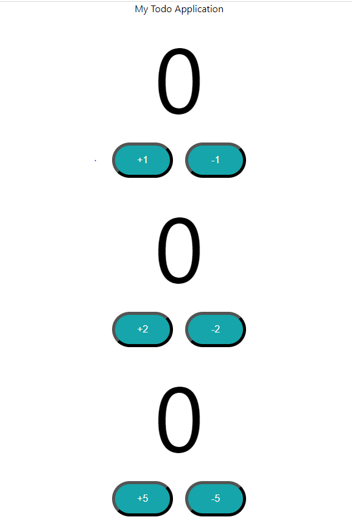
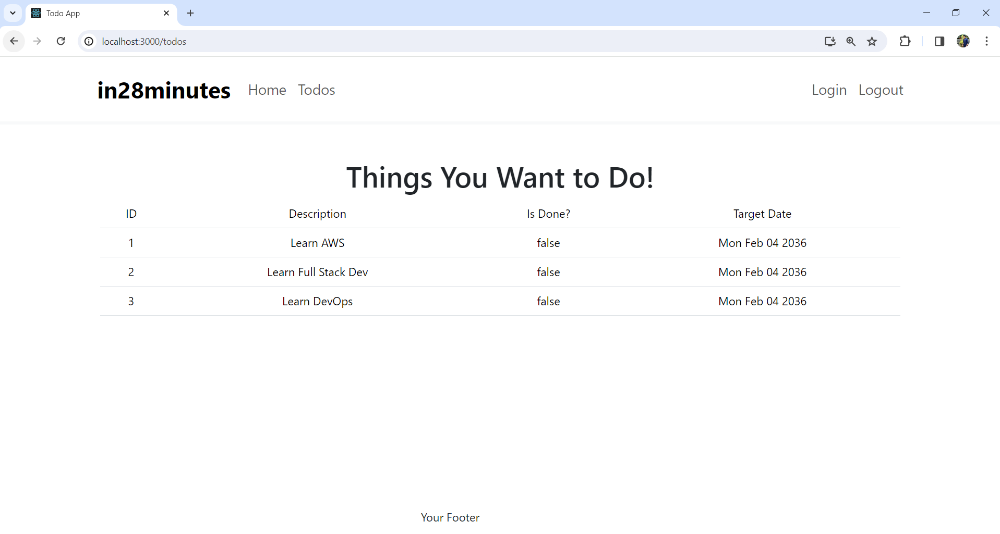

## Lecture 182/9:07 - Exploring important nodejs commands - Create React App

- npm start: Runs the app in development mode
    - Recommendation: Use Google Chrome
- npm test: Run unit tests
- npm run build: Build a production deployable unit
    - Minified
    - Optimized for performance
- npm install --save react-router-dom: Add a dependency to your project


## Lecture 183/9:08 - Exploring Visual Studio Code and Create React App

- Toggle Explorer: ctrl+B or cmd+B
- Toggle Explorer
    - Ctrl + B or Cmd + B
- Explore Left Hand Side Bar
    - Search etc
- Make a change to index.html
    - Change Title
- Make a change to App.js
    - Remove everything in App div
    - Add My Todo Application
- How is the magic happening?
    - Create React App
    - Automatically builds and renders in the browser

## Lecture 184/9:09 - Exploring Create React App Folder Structure

- Goal: Get a 10,000 feet overview of folder structure
- README.md: Documentation
- package.json: Define dependencies (similar to Maven pom.xml)
- node_modules: Folder where all the dependencies are downloaded to
- **React Initialization**
    - public/index.html: Contains root div
    - src/index.js: Initializes React App. Loads App component.
        - src/index.css - Styling for entire application
    - src/App.js: Code for App component
        - src/App.css - Styling for App component
        - src/App.test.js-Unit tests for App component
            - Unit test is written along side production code (Different to Java approach)
- Remember: Syntax might look little complex
    - Different from typical Java code (imports, ...)


## Lecture 185/9:10 - Getting started with React ComponentS

- Why do we need React Components?
- Web applications have complex structure
    - Menu, Header, Footer, Welcome Page, Login Page, Logout Page, Todo Page etc
- Components help you modularize React apps
    - Create separate components for each page element
        - Menu Component
        - Header Component
        - Footer Component
        - .....
    - Why?
        - Modularization
        - Reuse
- Understanding React Components
- First component typically loaded in React is
    - Apps: App Component
- Parts of a Component
    - View (JSX or JavaScript)
    - Logic (JavaScript)
    - Styling (CSS)
    - State (Internal Data Store)
    - Props (Pass Data)
- (Remember) React component names must always start with a capital letter

## Lecture 186/9:11 - Creating Your First React Component and more

- The app.js file contains the actual content which is getting loaded into our page. All the components that we will be creating will be the child components of the AppComponent present in here.
- Currently our app.js looks as shown below.
- ```js
    import './App.css';

    function App() {
    return (
        <div className="App">
        My Todo Application
        </div>
    );
    }

    export default App;
  ```
- Let's write the code for our first react component just below the App() function ends. Typically whenever we want to return something from our component we would put it into parenthesis () and that's why after the *return* in the above code we have opened the parenthesis.
- So within the parenthesis we would define what we want to return back from a component. Whatever you return back is shown as the part of that specific component. So our new *FirstComponent* can be created as shown below.
- ```js
    import './App.css';

    function App() {
    return (
        <div className="App">
        My Todo Application
        </div>
    );
    }
    function FirstComponent(){
        return (
            <div class="FirstComponent">
                <h4>First Component</h4>
            </div>
        )
    }

    export default App;
  ```
- Now we have created our new component but this won't be visible in our page because it should be included in the hierarchy of the AppComponent. So the App Component will have a FirstComponet tag inside its return statement as shown below.
- ```js
     function App() {
    return (
        <div className="App">
        My Todo Application
        <FirstComponent></FirstComponent>
        </div>
    );
    }
  ```
- Similarly we can have a SecondComponent. We are making use of functions as the component and that's the reason why these things are called *Function Components*
- In react there are class components as well, an example of class component is shown below
- ```js
    import { Component } from 'react';
    class ThirdComponent extends Component{
        render(){
            return (
            <div class="ThirdComponent">Third Component</div>
            )
        }
    }
  ```
- In the class component we have to make use of *render* function and inside that function we can write the return statement. Also the class components needs to extend the Component which is imported from react library.

## Lecture 187/9:12 - Getting started with State in React- useState hook

- We will start with writing the code in one module that is in the App.js
- When should you use a function component and when should you use the class component?
- Understanding State in React
    - Each of the component that we build in react can have *State*
    - **State** - Built-in React object used to contain data information about the component
    - **(Remember)** In earlier versions of React, ONLY class Components can have state
        - AND implementing state was very complex!
    - **Hooks were introduced in React 16.8**
        - Hooks are very easy to use
        - **useState** hook allows adding state to Function Components
    - So whenever you are using a React version greater than 16.8 then everytime you will use the function component.

## Lecture 188/9:13 - Exploring JSX - React Views

- So the question number 2 i.e why are we using the parenthesis after the return statement in the below code?
- ```js
    function FirstComponent(){
        return (  // here why are we using the parenthesis?
            <div class="FirstComponent">
                <h4>First Component</h4>
            </div>
        )
    }
  ```
- React Projects use JSX for presenetation (*JSX- Javascript xml*)
- **Stricter than HTML**
    - Close tags are mandatory
    - **Only one top level tag allowed:**
        - Cannot return multiple top-level JSX tags
        - Wrap into a shared parent  
            - ```js
                class FourthComponent extends Component {
                    render(){
                        return(
                            <div>    // So this parent tags is necessary
                                <div class="FourthComponent">Fourth Component</div>
                                <div class="FourthComponent">Fourth Component</div>
                                // so if we keep only the above two div tags and not the parent div for these both div's then it will throw error and will demand for a parent div tag
                                // Because these are two separate tags and it is not allowed as part of component view
                            </div>
                        )
                        }
                }
              ```
            - Adjacent JSX elements must be wrapped in an enclosing tag.
            - You should have a closing div tag, if you have a opening div tag.
            - So the above can also be done using empty wrapper i.e removing div
            - ```js
                class FourthComponent extends Component {
                    render(){
                        return(
                            <>    // So this empty wrapper as a parent will also work
                                <div class="FourthComponent">Fourth Component</div>
                                <div class="FourthComponent">Fourth Component</div>                
                            </>
                        )
                        }
                }
              ```
- **How is JSX enabled in a React Project?**
    - Different browsers have different levels of support for modern JS features (ES2015,...,ES2022,..)
    -   - How to ensure backward compatability for your JS code?
        - Solution: Babel
        - Babel converts JSX to JS
        - So whatever code you write in jsx it will be converted into browser compatible javascript
    - Let's Play with Babel and JSX
        - Let's try Babel: https://babeljs.io/repl
    - wrapping the code in *Parenthesis ()* makes returning complex JSX values easier, because if we remove the parenthesis then the line which is adjacent to *return* statement will only get executed and the other which are written below the return statement will not be considered.
    - Custom Components should start with upper case letter
        - For HTML you should use small case
    - Specify CSS class - className
    - We have used **className** when we created a component in the div tag. If it was plain HTML then we would have written **class** only
    - ```html
        <div className="FirstComponent"></div>  <!-- This is JSX format->
        <div class="FirstComponent"></div>  <!-- This is HTML format->
      ```
        
## Lecture 189/09:14 -Following Javascript best practices - Refactoring to Modules

- 1: Each component in its **own file (or module)**
    - src\components\learning-examples\FirstComponent.jsx
    - We have created a new react component in the newly created folder *learning-examples* as the *FirstComponent.jsx* and we have cut pasted the FirstComponent function from App.js to FirstComponent.jsx
    - ```js
        // FirstComponent.jsx
        function FirstComponent(){
        return (
            <div class="FirstComponent">
                <h4>First Component</h4>
            </div>
        )
        }
      ```
    - upon running the application we will get an error saying *FirstComponent is defined but never used*
    - So we need to make an import in the App.js to make use of FirstComponent.
        - *import FirstComponent from './components/learning-examples/FirstComponent'*
    - Even after importing we will get an error saying- *export 'default' (imported as 'FirstComponent') was not found in './components/learning-examples/FirstComponent'*
    - What it is saying that we are not exporting out *FirstComponent*. The way we can export out is 
    - ````js
        export default function FirstComponent(){
            return ( 
                <div class="FirstComponent">
                    <h4>First Component</h4>
                </div>
            )
        }
      ```
    - Similar can be done for the SecondComponent. In case of ThirdComponent and the FourthComponent we have to write an extra import statement because these two components are class components and they both extends component
        - ```js
            import { Component } from "react"

            export default class ThirdComponent extends Component {
                render(){
                return(
                    <div class="ThirdComponent">Third Component</div>
                )
                }
            }
          ```
    - *import { Component } from "react"* in this statement we are making use of braces {} while importing Component. In case of *import FirstComponent from './components/leraning-examples/FirstComponent'* we are not making use of braces {} while importing FirstComponent. WHY?
    - So let's say we have created a new Component named as *FifthComponent* in the FirstComponent itself as shown below and imported it in the App.js
    - ```js 
        export default function FirstComponent(){
        return (
            <div class="FirstComponent">
                <h4>First Component</h4>
            </div>
        )
        }

        // this is the new created component inside the FirstComponent
        export default function FifthComponent(){
            return (
                <div class="FifthComponent">
                    <h4>Fifth Component</h4>
                </div>
            )
        }
      ```
    - We have two default components in the *FirstComponent* and this will give error because a component can only have one default export. So we need to remove the word default from the FifthComponent i.e. *export function FifthComponent(){ ...}*
    - Now we can make an import of it in the App.js *import FifthComponent from './components/leraning-examples/FirstComponent'*.
    - But by not making use of {} braces while importing the FifthComponent we will only get whatever is written in the default component i.e. in this case we will get contents written in the *FirstComponent* and NOT from *FifthComponent*
    - So to get what is written in the FifthComponent we need to make use of {} braces while importing it and now the import statement will look as shown below.
        - *import {FifthComponent} from './components/leraning-examples/FirstComponent'*
    - So to make use of the components which are written inside some parent component and which are not the default ones we need to make use of braces {}
- Now we can see that App.js is very crowded with imports. So let's create a LearningComponent and make every component to get imported in it and then export the LearningComponent and then import LearningComponent in the App.js as shown below.
- ```js
    // LearningComponent
    import FirstComponent from "./FirstComponent";
    import SecondComponent from "./SecondComponent";
    import ThirdComponent from "./ThirdComponent";
    import FourthComponent from "./FourthComponent";
    import { FifthComponent } from "./FirstComponent";

    export default function LearningComponent() {
        return (
        <div className="LearningComponent">
            <FirstComponent></FirstComponent>
            <SecondComponent></SecondComponent>
            <ThirdComponent/>
            <FourthComponent/>
            <FifthComponent />
        </div>
        );
    }

    // App.js
    import './App.css';
    import LearningComponent from './components/leraning-examples/LearningComponent';

    function App() {
    return (
        <div className="App">
        <LearningComponent />
        </div>
    );
    }
    export default App;
  ```
- Now we can see that App.js looks more clean.

## Lecture 190/09:15 - Exploring JavaScript further

- let's create a new Component -> LearningJavascript.jsx.
- ```js
    const person = {
        name: 'Saeel Dhatrak',
        address: {
            line1: 'Balaji chowk Pashan',
            city: 'Pune',
            country: 'India',
        },
        profiles: ['twitter', 'instagram', 'linkedin'],
        printProfile: () => {
            person.profiles.map(
                profile => console.log(profile)         
            )
        }
    }

    export default function LearningJavascript() {
        return(
            <>
                <div>{person.name}</div>
                <div>{person.address.line1}</div>
                <div>{person.printProfile()}</div>
            </>
        )
    }
  ```
- Add the import to the LearningComponent.JSX and all the things will work in the App.js

# 10 - Exploring React Components with Counter Example

## Lecture 191/ 10:01 - Exploring React Components with Counter Example

- Parts of a Component
    - View (JSX or Javascript)
    - Logic (Javascript)
    - Styling (CSS)
    - State (Internal Data Store)
    - Props (Pass Data)
- Let's learn more about each of these building in another simple example
    - A counter App

## Lecture 192/ 10:02 -  Getting Started with React Application - Counter

- Let's add our components in our application's *components/counter* folder with name Counter.jsx
- ```js
    export default function Counter(){

        function incrementCounterFunction(){
            console.log('increment clicked')
        }

        return (
            <div className="Counter">
                <span className="count">0</span>
                <div>
                    <button className="counterButton" onClick={incrementCounterFunction}>+1</button>
                </div>
            </div>

        )
    }
  ```
- here in the above button we have used the onClick in which we are calling the function incrementCounterFunction inside the curly braces without using the parenthesis ().
- So it is the syntax of the jsx for *onClick* in which we need to write the name of the function inside the braces {} which are gonna get called upon clicking of that particular button.

## Lecture 192/10:03 - Getting Started with React Application - Counter - 2

- Options of styling your react components
    - 1: style
        - Error: button style={border-radius:30px}
        - Correct Syntax: button style={{border-radius:"30px"}}
        - Another way is to write the styling in the javascript format in a constant variable and then used that variable in the style section which braces as shown below.
        - ```js
            export default function Counter(){

                const buttonStyle = {
                    fontSize:"16px",
                    backgroundColor: "#00a5ab",
                    width: "100px",
                    margin: "10px",
                    color: "white",
                    padding: "15px",
                    borderRadius: "30px"
                };

                function incrementCounterFunction(){
                    console.log('increment clicked')
                }

                return (
                    <div className="Counter">
                        <span className="count">0</span>
                        <div>
                            <button className="counterButton" 
                                    onClick={incrementCounterFunction}
                                    style = {buttonStyle}
                            >+1</button>
                        </div>
                    </div>
                )
            }
          ```
        - In the above code we can see that the styling property are not separated by hyphen rather they are in the camelcasing format because we are writing styling in the javascript itself.
        - Also if we had not written the button style separately then in the style tag itself we would had to make use of two curly braces and the hyphen in the styling property
        - ```js
            // it would have look something like this
            <button className="counterButton" 
                    onClick={incrementCounterFunction}
                    style = {{background-color: "white"}}
            >+1</button>
          ```
    - 2: className
        - Define the css Class in your component's CSS file
        - But now as we can see the jsx file is crowded, so let's create a Counter.css file in the same counter folder and shift this css code over there and make a import of this css file in jsx file
        - ```js
            // This is Counter.css
            .counterButton{
                    font-size: 16px;
                    background-color: #00a5ab;
                    width: 100px;
                    margin: 10px;
                    color: white;
                    padding: 15px;
                    border-radius: 30px;
                    border-color: black;
                    border-width: 5px;
                }

                .count{
                    font-size: 150px;
                    padding: 20px;
                }
            // This is Counter.jsx
            import './Counter.css'
            export default function Counter(){

                function incrementCounterFunction(){
                    console.log('increment clicked')
                }

                return (
                    <div className="Counter">
                        <span className="count">0</span>
                        <div>
                            <button className="counterButton" 
                                    onClick={incrementCounterFunction}
                            >+1</button>
                        </div>
                    </div>
                )
            }
          ```

## Lecture 194/10:04 - Exploring React State with useState hook - Adding State to counter

- **State** - Built-in react object used to contain data or information about the component
- In earlier version of react ONLY class components can have state and implementing state was very complex
- **Hooks** were introduced in React 16.8
    - Hooks are very easy to use
    - **useState** hook - allows adding state to *Function Component*
        - **useState** - returns two things
            - 1: current State
            - 2: A function to update state
    - Each instance of component has it's own state
    - How to share state between components?
        - Move State "upwards" (to a parent component)
- ```js
    const state = useState(0);

    function incrementCounterFunction(){
        console.log(state)
        console.log('increment clicked')
    }
    // so when the increment button gets clicked the useState would return two things 
    // 1) the value which is 0 here
    // 2) the function to update the state
    // i.e. [0, f]
  ```
- so the above code can be modified as below
- ```js
    // also remember to import use state  
    // import { useState } from 'react'
    const [count, setCount] = useState(0);
    // here we are taking the array which us coming back i.e. [0,f]
    // and we are taking each of those values and we're mapping it to another array
    // count is mapped to the first element which is returned by useState which is the current value of the state that is 0
    // setCount will be mapped to the function to update the state
    function incrementCounterFunction(){
        setCount(count + 1)
        console.log(count)
    }
  ```
- And this value of the count can be further updated in our span where we have hard coded it as 0
- ```js
    import { useState } from 'react'
    import './Counter.css'
    export default function Counter(){

        const [count, setCount] = useState(0);
        function incrementCounterFunction(){
            setCount(count + 1)
            console.log(count)
        }

        return (
            <div className="Counter">
                <span className="count">{count}</span>  // So here we have used the value of count instead of hard coded value
                <div>
                    <button className="counterButton" 
                            onClick={incrementCounterFunction}
                    >+1</button>
                </div>
            </div>
        )
    }
  ```
- 
- So what is happening here is useState returns the array back, the first element in the array is the count value and the second element is the function and that's what is being returned back.
- And when we want to update the state, we are calling the function and adding 1 to the current state value.

## Lecture 195/10:05 - Exploring react State - what is happening in background?

- Similar to increment button we can have a decrement button also.
- ```js
    function decrementCounterFunction(){
        setCount(count - 1)
        console.log(count)
    }
    <button className="counterButton" 
            onClick={decrementCounterFunction}
    >-1</button>
  ```
- So we can see that upon updation of the state even the view is getting updated i.e we can see in the browser the increment and decrement.
-  What's happening in the background with react?
    - We updated the state => React updated the view
        - How can you update an HTML element?
            - A HTML page is represented by DOM (Document Object Model)
            - Each element in a HTML page is a node in the DOM
            - You need to update the DOM to update the element
            - HOWEVER, writing code to upgarde the DOM can be complex and slow!
        - React takes a different approach:
            - **Virtual DOM: "virtual"** representation of a UI (kept in memory)
                - React code updates Virtual DOM
            - React identifies changes and synchronizes them to HTML pages
                - 1: react creates virtual; DOM v1 on load of page
                - 2: You perform and action (you update the state)
                    - 3: react creates virtual DOM v2 as a result of your action
                    - 4: React performs a diff between v1 and v2
                    - 5: React synchronizes changes (updates HTML page)
            - Summary: We are NOT updating the DOM directly!
                - React identifies changes and efficiently updates the DOM

## Lecture 196/10:06 - Exploring React Props - Setting Counter increment value

- Let's create multiple counter buttons with their own state. So let's just add the counter component two more times in the App.js
- ```js
    function App() {
        return (
            <div className="App">
            My Todo Application // Now what we want want is that 
            <Counter></Counter> // this counter should always be incrementing by 1 and decrementing by 1
            <Counter></Counter> // this counter should always be incrementing by 2 and decrementing by 2
            <Counter></Counter> // this counter should always be incrementing by 5 and decrementing by 5
            </div>
        );
    }
  ```
- But right now all the three counters are incrementing by 1 and decrementing by 1. We need to avoid this duplication and that's where props comes in.
- Each component can be associated with a number of properties. *Props* are used for things that remain a constant during lifetime of a component
    - Example increment value of a specific component
- Let's create a functional component named `PlayingWithProps` in the App.js as shown below.
- ```js
    import './App.css';
    import Counter from './components/counter/Counter';

    function App() {
        return (
            <div className="App">
                My Todo Application
                <Counter></Counter>
                <Counter></Counter>
                <Counter></Counter>
                <PlayingWithProps property1="value1" property2="value2"/>
            </div>
        );
    }

    function PlayingWithProps(properties){
        console.log(properties)
        console.log(properties.property1)
        console.log(properties.property2)
        return(
            <div>Props</div>
        )
    }
    export default App;
  ```
- Now here we will get back {property1: 'value1', property2: 'value2'} in the first console, value1 in the second console.log and value2 in the third console.
- So we can see that the values that we are passing as the values of property in the Component name can be retrieved back in the function as the parameter.
- Other way that we can get back the values is
- ```js
    function PlayingWithProps({property1, property2}){
        console.log(property1)
        console.log(property2)
        return(
            <div>Props</div>
        )
    }
  ```
- So now let's do the same with the Counter component, we will use the property name as *by* and will have values as 1,2, 5 as the values of these *by* in the props.
- ```js
    function App() {
    return (
        <div className="App">
            My Todo Application
            <Counter by="1"/>
            <Counter by="2"/>
            <Counter by="5"/>
        </div>
    );
    }
  ```
- Now we need to access these values in the Counter component also.
- ```js
    import './Counter.css'
    import { useState } from 'react'
    export default function Counter({by}){  // we have use the property name as by

        const[count, setCount] = useState(0);

        function incrementCounterFunction(){
            setCount(count + by);  // used it here also
        }

        function decrementCounterFunction(){
            setCount(count - by); // used it here also
        }

        return (
            <div className="Counter">
                <span className="count">{count}</span>
                <div>
                    <button className="counterButton" 
                            onClick={incrementCounterFunction}
                    >+{by}</button>
                    <button className="counterButton" 
                            onClick={decrementCounterFunction}
                    >-{by}</button>
                </div>
            </div>
        )
    }
  ```
- But right now it is doing a string append rather than mathematical addition

## Lecture 197/10:0 - Creating Multiple Counter Buttons

- We need to pass in the number within the braces as shown below.
- ```js
    function App() {
        return (
            <div className="App">
            My Todo Application
            <Counter by={1}/>
            <Counter by={2}/>
            <Counter by={5}/>
            </div>
        );
    }
  ```
- Now what if I want to add a constraint on the property to accept only certain type of values. This can be achieved by using prop types.
- So in the Counter.jsx we can set a prop type for your counter *import {PropTypes} from 'prop-types'* 
- ```js
    // Counter.jsx
    Counter.propTypes = {
        by: PropTypes.number // here by is the property name that we have used
    }
  ```
- So now if we provide the string in the App.js while making use of the Counter Component then it will run and give warning that string is provided and number was needed.
- In addition we can also give the default values to your properties.
- ```js
    //Counter.jsx
    Counter.defaultProps = {
    by: 1
    }
    // And if we don't provide any of the values to property in App.js
    // App.js
    function App() {
        return (
            <div className="App">
            My Todo Application
            <Counter /> // So if we remove by={1} from here then also the increment and decrement will happen by 1 because we have setted the defaultProps value as 1
            <Counter by={2}/>
            <Counter by={5}/>
            </div>
        );
    }
  ```
- 

## Lecture 198/10:08 - Moving React State Up - Setting up Counter and Counter Button

- 1: Let's create multiple counter buttons   --- done
- 2: Let's have a different increment value for each button   --- done
- 3: Let's have common state for all our buttons  --- pending
    - Right now every button has it's own state i.e each button has it's own counter display. What we want is common state i.e 6 button but single state means displaying counter number should only be single.
    - Right now all the counter are defined in App.js So each of the individual counter have there own state.
    - We want to have state at a level above the counter itself, we would want to have a global state
    - **Moving State up and More....**
        - How can we have one state for all counters?
            - 1: Rename Counter to CounterButton
                - Right now what we're calling a counter is actually a CounterButton and we will create a new Counter class to have the real counter
                - So our code looks like this
                - ```js
                    // App.js
                    import './App.css';
                    import CounterButton from './components/counter/Counter'; // changed named here

                    function App() {
                        return (
                            <div className="App">
                            My Todo Application
                            <CounterButton />
                            <CounterButton by={2}/>
                            <CounterButton by={5}/>
                            </div>
                        );
                    }
                    export default App;

                    // Counter.jsx
                    import './Counter.css'
                    import { useState } from 'react'
                    import {PropTypes} from 'prop-types'

                    export default function CounterButton({by}){  // changed name here

                        const[count, setCount] = useState(0);

                        function incrementCounterFunction(){
                            setCount(count + by);
                        }
                        function decrementCounterFunction(){
                            setCount(count - by);
                        }
                        return (
                            <div className="Counter">
                                <span className="count">{count}</span>
                                <div>
                                    <button className="counterButton" 
                                            onClick={incrementCounterFunction}
                                    >+{by}</button>
                                    <button className="counterButton" 
                                            onClick={decrementCounterFunction}
                                    >-{by}</button>
                                </div>
                            </div>
                        )
                    }

                    CounterButton.propTypes = {
                        by: PropTypes.number
                    }

                    CounterButton.defaultProps = {
                        by: 1
                    }
                ```   
            - Now that we have the counter class we can move the responsibility of the all the counter buttons to the counter class.
            - So everything remains the same just we remove the *export default* from our CounterButton function and give it to the newly created Counter function in the Counter.jsx as shown below
            - ```js
                export default function Counter(){
                    return(
                        <>
                            <CounterButton />
                            <CounterButton by={2}/>
                            <CounterButton by={5}/>
                        </>
                    )
                }
              ```
            - And now as these function is carrying the responsibility of all the CounterButton we just need to make use of this Counter class in the App.js instead of the counterButtons.
            - ```js
                import Counter from './components/counter/Counter';

                function App() {
                    return (
                        <div className="App">
                        <Counter />
                        </div>
                    );
                }
              ```
            - And everything will work as its was earlier just that we have now called the Counter 1 time instead of the CounterButton 3 times in our App.js. The advantage is that we can start maintaining the state at the counter level. So how can we maintain state at the Counter level?
            - ```js
                export default function Counter(){
                    const[count, setCount] = useState(0);

                    return(
                        <>
                            <span className="totalCount">{count}</span>
                            <CounterButton />
                            <CounterButton by={2}/>
                            <CounterButton by={5}/>
                        </>
                    )
                }
              ```
            - So we can have a count which is maintained at the counter level and we can have a count i.e span as shown below which will be showing 0 currently.
            - 
            - So now whenever a increment is clicked we want the parent state to change as well and to do that we will create a method on the parent.
            - ```js
                export default function Counter(){
                    const[count, setCount] = useState(0);

                    function incrementCounterParentFunction(by){
                        setCount(count + by);
                    }
                    return(
                        <>
                            <span className="totalCount">{count}</span>
                            <CounterButton />
                            <CounterButton by={2}/>
                            <CounterButton by={5}/>
                        </>
                    )
                }
            ```

## Lecture 199/10:09 -  Moving React State Up - Calling Parent Component Methods

- We now have state in the child component as well as in the parent component. We have created a parent component increment method as well and now we want to call it from all the CounterButtons
- The child components will not have access to the parent methods, the only way is for the parent method to pass it down. For example: let's create a method - someMethodInParent()
- ```js
    export default function Counter(){
        const[count, setCount] = useState(0);
        function incrementCounterParentFunction(by){
            setCount(count + by);
        }

        function someMethodInParent(){
            console.log("someMethodInParent is called")
        }
        
        return(
            <>
                <span className="totalCount">{count}</span>
                <CounterButton by={1} someMethodInParent={someMethodInParent}/>
                <CounterButton by={2} someMethodInParent={someMethodInParent}/>
                <CounterButton by={3} someMethodInParent={someMethodInParent}/>
            </>
        )
    }

    function CounterButton({by, someMethodInParent}){

        const[count, setCount] = useState(0);

        function incrementCounterFunction(){
            setCount(count + by);
            someMethodInParent();
        }

        function decrementCounterFunction(){
            setCount(count - by);
            someMethodInParent();
        }
    }
  ```
- So we have used the method name as property and value while calling the CounterButton and similarly we have passed on the method name to the function CounterButton and we have called it in increment and decrement functions.
- Now similarly we want the *incrementCounterParentFunction()* method to work for us. Before this let's remove the *someMethodInParent()* from our code.
- So the way we can do that is shown below
- ```js
    import './Counter.css'
    import { useState } from 'react'
    import {PropTypes} from 'prop-types'

    export default function Counter(){
        const[count, setCount] = useState(0);

        function incrementCounterParentFunction(by){
            setCount(count + by);
        }

        function decrementCounterParentFunction(by){
            setCount(count - by);
        }
        
        return(
            <>
                <span className="totalCount">{count}</span>
                <CounterButton by={1} 
                    incrementMethod={incrementCounterParentFunction} // we have stored the value incrementCounterParentFunction in property name incrementMethod
                    decrementMethod={decrementCounterParentFunction}/> // we have stored the value decrementCounterParentFunction in property name decrementMethod
                <CounterButton by={2} 
                    incrementMethod={incrementCounterParentFunction} 
                    decrementMethod={decrementCounterParentFunction}/>
                <CounterButton by={3} 
                    incrementMethod={incrementCounterParentFunction}  
                    decrementMethod={decrementCounterParentFunction}/>
            </>
        )
    }

    function CounterButton({by, incrementMethod, decrementMethod}){

        const[count, setCount] = useState(0);

        function incrementCounterFunction(){
            setCount(count + by);
            incrementMethod(by);  // we have used the by as parameter because the incrementCounterParentFunction expects a parameter which is by
        }

        function decrementCounterFunction(){
            setCount(count - by);
            decrementMethod(by);  // we have used the by as parameter because the decrementCounterParentFunction expects a parameter which is by
        }

        return (
            <div className="Counter">
                <span className="count">{count}</span>
                <div>
                    <button className="counterButton" 
                            onClick={incrementCounterFunction}
                    >+{by}</button>
                    <button className="counterButton" 
                            onClick={decrementCounterFunction}
                    >-{by}</button>
                </div>
            </div>
        )
    }

    CounterButton.propTypes = {
        by: PropTypes.number
    }

    CounterButton.defaultProps = {
        by: 1
    }
  ```

## Lecture 200/10:10 - Exploring React Developer Tools

- React Developer Tools - Chrome Extension
- Chrome Developer Tools extension for React
- Goal: Inspect React Component Hierarchies
- Components tab shows:
    - Root React components
    - Sub components that were rendered
- For each component, you can see and edit
    - props
    - state
- Useful for:
    - Understanding and Learning React
    - Debugging problems
- Let's now go back and make a separate module for CounterButton and for this let's create a CounterButton.jsx file in the counter folder and cut paste the code related to CounterButton from the Counter.jsx file
- ```js
    // Counter.jsx
    import './Counter.css'
    import { useState } from 'react'
    import CounterButton from './CounterButton'

    export default function Counter(){
        const[count, setCount] = useState(0);

        function incrementCounterParentFunction(by){
            setCount(count + by);
        }

        function decrementCounterParentFunction(by){
            setCount(count - by);
        }
        
        return(
            <>
                <span className="totalCount">{count}</span>
                <CounterButton by={1} 
                    incrementMethod={incrementCounterParentFunction} 
                    decrementMethod={decrementCounterParentFunction}/>
                <CounterButton by={2} 
                    incrementMethod={incrementCounterParentFunction} 
                    decrementMethod={decrementCounterParentFunction}/>
                <CounterButton by={3} 
                    incrementMethod={incrementCounterParentFunction} 
                    decrementMethod={decrementCounterParentFunction}/>
            </>
        )
    }
  ```
- And the CounterButton.jsx will look like shown below
- ```js
    import {PropTypes} from 'prop-types'
    import { useState } from 'react'

    export default function CounterButton({by, incrementMethod, decrementMethod}){
        const[count, setCount] = useState(0);

        function incrementCounterFunction(){
            setCount(count + by);
            incrementMethod(by);
        }

        function decrementCounterFunction(){
            setCount(count - by);
            decrementMethod(by);
        }

        return (
            <div className="Counter">
                
                <div>
                    <button className="counterButton" 
                            onClick={incrementCounterFunction}
                    >+{by}</button>
                    <button className="counterButton" 
                            onClick={decrementCounterFunction}
                    >-{by}</button>
                </div>
            </div>
        )
    }

    CounterButton.propTypes = {
        by: PropTypes.number
    }
    CounterButton.defaultProps = {
        by: 1
    }
  ```

## Lecture 201/10:11 - Adding Reset Button to Counter

- 

## Section 11 Started here
## Lecture 218/11:01 - Getting Started with React Todo Management App
- Todo Management App - What will we learn?
- Routing
- Forms
- Validation
- REST API calls
- Authentication

## Lecture 219/11:02 - Getting Started with Login Component - Todo React App

- Starting with TodoApp
    - 1: LoginComponent
        - Make LoginComponent Controlled
            - Link form fields with state
        - Implement Hard-Coded Authentication
        - Implement Conditional Rendering
    - 2: WelcomeComponent
        - Implement Routing
- Create a new folder in `component` folder named `todo` ad inside this folder create a new component name `TodoApp.jsx`
- ```js
    // TodoApp.jsx
    export default function TodoApp(){
        return(
            <div className="TodoApp">
                Todo Management Application
            </div>
        )
    }
  ```
- Now we need to make use of this TodoApp in our App.js and we no longer need that Counter app so the App.js gets updated as shown below
- ```js
    // App.js
    import './App.css';
    import TodoApp from './components/todo/TodoApp';
    function App() {
        return (
            <div className="App">
            <TodoApp />
            </div>
        );
    }
    export default App;
  ```
- Now we will start with LoginComponent and we will begin writing this component in the TodoApp.js component itself
- ```js
    // TodoApp.js
    export default function TodoApp(){
        return(
            <div className="TodoApp">
                Todo Management Application
                <LoginComponent/>
                {/* <WelcomeComponent /> */}
            </div>
        )
    }

    function LoginComponent(){
        return(
            <div className="Login">
                <div className="LoginForm">
                    <div>
                        <label>User Name</label>
                        <input type="text" name="username"></input>
                    </div>
                    <div>
                        <label>Password</label>
                        <input type="password" name="password"></input>
                    </div>
                    <div>
                        <button type="button" name="login">login</button>
                    </div>
                </div>
            </div>
        )
    }
  ```
  
## Lecture 219/11:02 -Improving Login Component Further - Todo React App

- Lets write a file TodoApp.css in the same todo folder and import it in the TodoApp.jsx. Also have a `value` element in the input of username as shown below.
- ```js
    // TodoApp.css
    label, input, button{
        margin: 10px;
        padding: 5px;
    }
    // TodoApp.jsx
    import './TodoApp.css'
    <div> // LoginComponent
        <label>User Name</label>
        <input type="text" name="username" value="in28minutes"></input>
    </div>
  ```
- Here we have `value="in28minutes"` and when we try to change the value in the input box we will get warning stating- A component is changing an uncontrolled input to be controlled. This is likely caused by the value changing from undefined to a defined value, which should not happen. Decide between using a controlled or uncontrolled input element for the lifetime of the component
- In react there is a concept called controlled component, whenever we are playing with form elements in react there are two diffrent things that coe into picture. 1) react state - we can hold the value of the form variable in the react state 2) value in the form element itself
- When we try to inspesct the input tag we can there is dom element which holding the value of it and whenever we change the value the specific dom element is automatically updated
- whenever we are using form elements with react we need to ensure the react state and dom value should be syncronozed. When we set that up for a specific component then that component would be called a controlled component
- We need to make LoginComponent a controled component and for that lets startwith adding some state using the useState for holding username
- ```js
    const [username, setUsername] = useState('in28minutes')

    <div>
        <label>User Name</label>
        <input type="text" name="username" value={username}></input>
    </div>
  ```
- So we are tagging up the form element with the state. But now also this will be readonly because we will get warning as - You provided a `value` prop to a form field without an `onChange` handler. This will render a read-only field. If the field should be mutable use `defaultValue`. Otherwise, set either `onChange` or `readOnly`
- So we need to provide a onChange  method and in which we will log the event that is happening in the input field.
- ```js
    function handleUsernameChange(event){
        console.log(event.target.value);
        setUsername(event.target.value)
    }
    <div>
        <label>User Name</label>
        <input type="text" name="username" value={username} onChange={handleUsernameChange}></input>
    </div>
  ```
- So whatever we are going to write after the `username` in the input box it will get appended in the box. And same can be done for password i.e useState for password and other functions. SO our TodoApp.jsx is
- ```js
    // TodoApp.jsx
    import './TodoApp.css'
    import { useState } from 'react'

    export default function TodoApp(){
        return(
            <div className="TodoApp">
                Todo Management Application
                <LoginComponent/>
                {/* <WelcomeComponent /> */}
            </div>
        )
    }

    function LoginComponent(){
        const [username, setUsername] = useState('in28minutes')
        const [password, setPassword] = useState('')
        function handleUsernameChange(event){
            setUsername(event.target.value)
        }
        function handlePasswordChange(event){
            setPassword(event.target.value);
        }
        return(
            <div className="Login">
                <div className="LoginForm">
                    <div>
                        <label>User Name</label>
                        <input type="text" name="username" value={username} onChange={handleUsernameChange}></input>
                    </div>
                    <div>
                        <label>Password</label>
                        <input type="password" name="password" value={password} onChange={handlePasswordChange}></input>
                    </div>
                    <div>
                        <button type="button" name="login">login</button>
                    </div>
                </div>
            </div>
        )
    }
  ```

## Lecture 221/11:04 - Adding HardCoded Authentication - TodoReact App

- For now lets add in hard coded authentication and later we will make use pf speing secirity
- ```js
    // TodoApp.jsx
    const [showSuccessMessage, setShowSuccessMessage] = useState(false)
    const [showErrorMessage, setShowErrorMessage] = useState(false)
    function handleSubmit(){
        if(username==='in28minutes' && password==='dummy'){
            setShowSuccessMessage(true)
            setShowErrorMessage(false)
        }else{
            setShowSuccessMessage(false)
            setShowErrorMessage(true)
        }
    }

    function SuccessMessageComponent(){
        if(showSuccessMessage){
            return <div className="successMessage" >Authenticated Successfully</div> 
        }
        return null
    }
    function ErrorMessageComponent(){
        if(showErrorMessage){
            return <div className="errorMessage">Authentication Failed. Please check your credentials.</div> 
        }
        return null
    }
    return(
        <div className="Login">
            <SuccessMessageComponent />
            <ErrorMessageComponent />
            <div className="LoginForm">
                // rest code remains same
            </div>
        </div>
    )
  ```
- So here we are doing conditional rendering of the components based on their state values i.e they will only appear here if the value becomes true.

## Lecture 222/11:05 - Conditionally displaying messages in Login Component - Todo React App

- The above was a complex approach we can have a easy approach as well. So we cam wrote the logic in the return statement of the Login component itself.
- Example to understand
    - true && `Ranga` , the answer is true
    - false && `Ranga` , the answer is false
- This means the expression will return the value only when the first value is true otherwise it won;'t reeturn the value back. The same logic we can apply to our code.
- ```js
    {showSuccessMessage && <div className="successMessage" >Authenticated Successfully</div>}
    {showErrorMessage && <div className="errorMessage">Authentication Failed. Please check your credentials.</div> }
  ```
- So this will only be shown when the first statement is true and now we dont need both the success and error component

## Lecture 223/11:06 - Adding React Router Dom and Routing from Login to welcome Component

- The way we can use routing is by using react router dom and to make use of it in our project we need to onstall it using the command `npm install react-router-dom` and upon installation it will get added to our package.json file. Now in TodoApp.js we need to `import {BrowserRouter, Routes, Route} from 'react-router-dom'` .
- inside the `BrowserRouter` we need to configure `Routes`. And the routes that we want to configure we can express those thrugh `Route` inside the `Routes`. Inside the Route we need to tell on which `path` and which `element` needs to be opened up as shown below.
- ```js
    // TodoApp.js
    import './TodoApp.css'
    import { useState } from 'react'
    import {BrowserRouter, Routes, Route} from 'react-router-dom'

    export default function TodoApp(){
        return(
            <div className="TodoApp">
                <BrowserRouter>
                    <Routes>
                        <Route path='/' element={<LoginComponent />} />   
                        <Route path='/login' element={<LoginComponent />} />
                        <Route path='/welcome' element={<WelcomeComponent />} />
                    </Routes>
                </BrowserRouter>
            </div>
        )
    }
    // Also added new Welcome Component in the TodoApp.js file
    
    function WelcomeComponent(){
        return(
            <div className="Welcome">Welcome Component</div>
        )
    }
  ```
- Now when user enters the right detail we want to route from `/login` to `/welcome` page. For this we need to make use of another react hook i.e `useNavigate` imported from the `react-router-dom` . This hook returns an impertaive method for changing the location.
- ```js
    // TodoApp.js
    import {BrowserRouter, Routes, Route, useNavigate} from 'react-router-dom'
    // In the function LoginComponent
    const navigate = useNavigate()
    function handleSubmit(){
        if(username==='in28minutes' && password==='dummy'){
            setShowSuccessMessage(true)
            setShowErrorMessage(false)
            navigate('/welcome')
        }else{
            setShowSuccessMessage(false)
            setShowErrorMessage(true)
        }
    }
  ```
- So now upon entering the correct credentials we will be navigated to the welcome component.

## Lecture 224/11:07 - Adding Error Component to our React App

- If in the browser which does not exist then a blank page will appear. So instead of blank page we need to show proper error page and fpr that we will create a ErrorComponent. Again this component will be in the TodoApp.js for now only later we will change it
- ```js
    function ErrorComponent(){
        return(
            <div className="ErrorComponent">
                <h1>We are working really hard!</h1>
                <div>
                    Apologies for the 404. React out to our team at ABC-DEF-GHIJ
                </div>
            </div>
        )
    }
     <Route path='*' element={<ErrorComponent/>} />
  ```
- So the above ErrorComponent will be shown if none of the existing paths are matched that are available in the routes.

## Lecture 225/11:08 - Removing Hard Coding from Welcome Component

- Currently our welcomeComponents looks lime shown below where we have hard coded the name `in28minutes`. We want to pickup the username entered by the user in the input box of the login form.
- ```js
    function WelcomeComponent(){
        return(
            <div className="WelcomeComponent">
                <h1>Welcome in28minutes</h1>
                <div>Welcome Component</div>
            </div>
        )
    }
  ```
- Right now upon clicking on the handleSubmit button the routing is happening with the `navigate` method, now we want to add in some params to it.  For this the router parameter should capture the value of the username.
- ```js
    <Route path='/welcome/:username' element={<WelcomeComponent />} />
  ```
- We can capture the value of this `username`  in the `WelcomeComponent` by using a hook called `userParams` imported from react-router-dom. This hook returns an object of key-value pairs of the dynamic params from the current url that were matched by the route path.
- So we need to make use of this useParams in the WelcomeComponent
- ```js
    <Route path='/welcome/:username' element={<WelcomeComponent />} />
    function handleSubmit(){
        if(username==='in28minutes' && password==='dummy'){
            setShowSuccessMessage(true)
            setShowErrorMessage(false)
            navigate('/welcome/in28minutes') // added here in28minutes
        }
    }
    function WelcomeComponent(){
        const params = useParams()
        console.log(params.username);
        return(
            <div className="WelcomeComponent">
                <h1>Welcome in28minutes</h1>
                <div>Welcome Component</div>
            </div>
        )
    }
  ```
- So there is another way to use the useParams where in the object that is returned by useParams is de-constructed and we can make use of the value catched from it and use it in our h1 tag as shown below
- ```js
    const {username} = useParams()
    console.log(username);
    <h1>Welcome {username}</h1>
  ```
- So in the `navigate('/welcome/in28minutes')` we were making use of hard coded name, now we need to use the basic javascript syntax to make use of the variable so the `navigate('/welcome/${username}')`
- And when we are using variables we need to make use of ticks rather than the single quotes. So the navigate changes as 
- ```js
    function handleSubmit(){
        if(username==='in28minutes' && password==='dummy'){
            setShowSuccessMessage(true)
            setShowErrorMessage(false)
            navigate(`/welcome/${username}`)
        }else{
            setShowSuccessMessage(false)
            setShowErrorMessage(true)
        }
    }
  ```

## Lecture 226/11:07 - Getting Started with react List Todo Component

- So we need to make new component named ListTodosComponent and have the Route for it also
- ```js
    <Route path='/todos' element={<ListTodosComponent />} />
    function ListTodosComponent(){
        const todos =[
            {id:1, description: 'Learn AWS'},
            {id:2, description: 'Learn Full Stack Dev'},
            {id:3, description: 'Learn DevOps'},
        ]
        return(
            <div className="ListTodosComponent">
                <h1>Things You Want to Do!</h1>
                <div>
                    <table>
                        <thead>
                            <tr>
                                <td>id</td>
                                <td>description</td>
                            </tr>
                        </thead>
                        <tbody>
                            {
                                todos.map(
                                    todo => ( 
                                        <tr>
                                            <td>{todo.id}</td>
                                            <td>{todo.description}</td>
                                        </tr>
                                    )
                                )
                            }
                        </tbody>
                    </table>
                </div>
            </div>
        )
    }
  ```
- here we are mapping each todo to a jsx expression which generated the tr for that specific todo.
- ```js
    {
        todos.map(
            todo => ( 
                <tr>
                    <td>{todo.id}</td>
                    <td>{todo.description}</td>
                </tr>
            )
        )
    }
  ```
- Upon loading the page we will have a warning in the console - Each child in a list should have a unique "key" prop. One practice in react is to have a unique key prop for every element in the list, react uses the id to uodate the dom elements and for react to work efficiently then we need to add key
- ```js
    {
        todos.map(
            todo => ( 
                <tr key={todo.id}>
                    <td>{todo.id}</td>
                    <td>{todo.description}</td>
                </tr>
            )
        )
    }
  ```

## Lecture 227/11:10 - Displaying More Todo Details in react list todo component

- ```js
    // Lets add in some more details in our array of objects of todos
    const today = new Date();
    const targetDate = new Date(today.getFullYear()+12, today.getMonth(), today.getDay())
    const todos =[
        {id:1, description: 'Learn AWS', done: false, targetDate: targetDate},
        {id:2, description: 'Learn Full Stack Dev', done: false, targetDate: targetDate},
        {id:3, description: 'Learn DevOps', done: false, targetDate: targetDate},
    ]

    <table>
        <thead>
            <tr>
                <td>ID</td>
                <td>Description</td>
                <td>Is Done?</td>
                <td>Target Date</td>
            </tr>
        </thead>
        <tbody>
            {
                todos.map(
                    todo => ( 
                        <tr key={todo.id}>
                            <td>{todo.id}</td>
                            <td>{todo.description}</td>
                            <td>{todo.done.toString()}</td> // Here toString method because done is boolean
                            <td>{todo.targetDate.toDateString()}</td> // here toDateString() becox can't show date directly
                        </tr>
                    )
                )
            }
        </tbody>
    </table>
  ```
- Now when user lands on welcome page we want a link on welcome page to access the todo list page
- ```js
    function WelcomeComponent(){
        const {username} = useParams()
        console.log(username);
        return(
            <div className="WelcomeComponent">
                <h1>Welcome {username}</h1>
                <div>
                    Manage Your Todos. <a href="/todos">Access Here</a>
                </div>
            </div>
        )
    }
  ```
- Now we will be able to access our todos by clicking on the link but this is not the right approach. Because if we look at our network tab in the chrome tools we will be able to see that when we click on the link the entire page gets refreshed which is not what we want as we are building single page application using react.
- However there is alternative way using `Link to` which we need to import from react-router-dom and using this we won't be refreshing the whole page rather only that particular part will be refreshed by the new component
- ```js
    import {BrowserRouter, Routes, Route, useNavigate, useParams, Link} from 'react-router-dom'
     return(
            <div className="WelcomeComponent">
                <h1>Welcome {username}</h1>
                <div>
                    Manage Your Todos. <Link to="/todos">Access Here</Link>
                </div>
            </div>
        )
  ```

## Lecture 228/11:11 - Creating react header, footer and logout components

- Start with creating a new HeaderComponent and a FooterComponent in the same TodoApp.jsx file
- ```js
    function HeaderComponent(){
        return(
            <div className="header">
                Header <hr />
            </div>
        )
    }

    function FooterComponent(){
        return(
            <div className="footer">
                <hr /> Footer
            </div>
        )
    }
  ```
- We want to show header and footer at the top and bottom of every page. So in the TodoApp.jsx we need to wrap the `BrowserRouter` between header and footer component as shown below. So every page wil have now 3 components the component itself, header and footer.
- ```js
    export default function TodoApp(){
        return(
            <div className="TodoApp">
                <HeaderComponent />
                <BrowserRouter>
                    <Routes>
                        <Route path='/' element={<LoginComponent />} />   
                        <Route path='/login' element={<LoginComponent />} />
                        <Route path='/welcome/:username' element={<WelcomeComponent />} />
                        <Route path='/todos' element={<ListTodosComponent />} />
                        <Route path='*' element={<ErrorComponent/>} />
                    </Routes>
                </BrowserRouter>
                <FooterComponent />
            </div>
        )
    }
  ```
- Now we need to create a LogoutComponent
- ```js
    <Route path='/logout' element={<LogoutComponent />} />
    function LogoutComponent(){
        return(
            <div className="LogoutComponent">
                <h1>You are logged out!</h1>
                <div>
                    Thank you for using our app . Come back Soon
                </div>
            </div>
        )
    }
  ```

## Lecture 229/11:12 - Adding Bootstrap to React Front End Application

- 
- Now to make it more attractive in looking we ineed to install bootstrap using command `npm install bootstrap` and it will getadded to package.json. Now we want the bootstrap to available to us through out the application therefore we need to add it to the index.js as a relative path.
- ```js
    // index.js
    import 'bootstrap/dist/css/bootstrap.min.css';
  ```
- We will start styling the ListTodosComponent using bootstrap.
- ```js
    return(
        <div className="container"> // best bootstrap class
            <h1>Things You Want to Do!</h1>
            <div>
                <table className="table"> // this provides the structure of a table
                    // rest remains same
                </table>
            </div>
        </div>
    )
  ```

## Lecture 231/11:13 - Using bootstrap to style todo react front end application

- Lets start with footer and in it we will make w=use of the htmk tag called footer as shown below.
- ```js
    function FooterComponent(){
        return(
            <footer className="footer">
                <div className="container">
                    Your Footer 
                </div>
            </footer>
        )
    }
    // TodoApp.css
    footer{
        bottom: 0;
        position: absolute;
        width: 90%;
        height: 40px;
    }
  ```
- Moving on to the header component and in it we will make w=use of the htmk tag called footer as shown below.
- ```js
    function HeaderComponent(){
        return(
            <header className="header">
                <div className="container">
                    <ul className="navbar-nav">
                        <li className="nav-item"><a className="nav-link" href="https://www.google.com">in28minutes</a></li>
                        <li className="nav-item"><Link className="nav-link" to="/welcome/in28minutes">in28minutes</Link></li>
                    </ul>
                </div>
            </header>
        )
    }
  ```
- Upon using the `Link` we will get error - useHref() may beused only in the context of a Router component. We are including HeaderComponent in the TodoApp.jsx directly and it is not part of the router. Currently our router looks like
- ```js
    <HeaderComponent />
        <BrowserRouter>
            <Routes>
                <Route path='/' element={<LoginComponent />} />   
                <Route path='/login' element={<LoginComponent />} />
                <Route path='/welcome/:username' element={<WelcomeComponent />} />
                <Route path='/todos' element={<ListTodosComponent />} />
                <Route path='/logout' element={<LogoutComponent />} />
                <Route path='*' element={<ErrorComponent/>} />
            </Routes>
        </BrowserRouter>
        <FooterComponent />
  ```
- So we cannot make the use of Link if you are not the part of router. So we need to include in the router as done below.
- ```js
    <BrowserRouter>
    <HeaderComponent />
        <Routes>
            <Route path='/' element={<LoginComponent />} />   
            <Route path='/login' element={<LoginComponent />} />
            <Route path='/welcome/:username' element={<WelcomeComponent />} />
            <Route path='/todos' element={<ListTodosComponent />} />
            <Route path='/logout' element={<LogoutComponent />} />
            <Route path='*' element={<ErrorComponent/>} />
        </Routes>
    <FooterComponent />
    </BrowserRouter>
  ```
- And now we won't get that error. And add few more links.
- ```js
    function HeaderComponent(){
        return(
            <header className="header">
                <div className="container">
                    <ul className="navbar-nav">
                        <li className="nav-item"><a className="nav-link" href="https://www.in28minutes.com">in28minutes</a></li>
                        <li className="nav-item"><Link className="nav-link" to="/welcome/Saeel">Home</Link></li>
                        <li className="nav-item"><Link className="nav-link" to="/todos">Todos</Link></li>
                        <li className="nav-item"><Link className="nav-link" to="/logout">Logout</Link></li>
                        <li className="nav-item"><Link className="nav-link" to="/login">Login</Link></li>
                    </ul>
                </div>
            </header>
        )
    }
  ```
- Right now our header links are coming one below another. We want the `in28minutes` as the brand of website, Home & Todos on the left side and the remainings login & logout on the right corner
- 
- ```js
    function HeaderComponent(){
        return(
            <header className="border-bottom border-light border-5 mb-5 p-2">
                <div className="container">
                    <div className="row">
                        <nav className="navbar navbar-expand-lg">
                            <a className="navbar-brand ms-2 fs-2 fw-bold text-black" href="https://www.in28minutes.com">in28minutes</a>
                            <div className="collapse navbar-collapse">
                                <ul className="navbar-nav">
                                    <li className="nav-item fs-5"><Link className="nav-link" to="/welcome/in28minutes">Home</Link></li>
                                    <li className="nav-item fs-5"><Link className="nav-link" to="/todos">Todos</Link></li>
                                </ul>
                            </div>
                            <ul className="navbar-nav">
                                <li className="nav-item fs-5"><Link className="nav-link" to="/login">Login</Link></li>
                                <li className="nav-item fs-5"><Link className="nav-link" to="/logout">Logout</Link></li>
                            </ul>
                        </nav>
                    </div>
                </div>
            </header>
        )
    }
  ```
- Above we have used the class `navbar-nav` because of which our links are coming side by side, used the class `nav-link` which makes our link not look like link still upon hovering over it our cursor changes to pointer.
- The class `collapse navbar-collapse` if we remove it then all the menus will come beside each other, removing `navbar-brand ms-2 fs-2 fw-bold text-black` will make our brand name normal
- `border-bottom border-light border-5 mb-5 p-2` makes our header margin padding and border etc
- 
- Right now we are able to go on any page withour even logging in and ,any more flaws.

## Lecture 232/11:14 - Refactoring React Components to Individual Javascript Modules

- Right now we have all the components in one that is in the TodoApp.jsx. We need to separate them into their own modules. Starting with Footer componnent, actually we are not going to use the footer component in future. Rest all will have their respective jsx files as shown below our TodoApp.jsx now gets more clean.
- ```js
    import './TodoApp.css'
    import {BrowserRouter, Routes, Route} from 'react-router-dom'
    import LogoutComponent from './LogoutComponent'
    import HeaderComponent from './HeaderComponent'
    import ListTodosComponent from './ListTodosComponent'
    import ErrorComponent from './ErrorComponent'
    import WelcomeComponent from './WelcomeComponent'
    import LoginComponent from './LoginComponent'

    export default function TodoApp(){
        return(
            <div className="TodoApp">           
                <BrowserRouter>
                <HeaderComponent />
                    <Routes>
                        <Route path='/' element={<LoginComponent />} />   
                        <Route path='/login' element={<LoginComponent />} />
                        <Route path='/welcome/:username' element={<WelcomeComponent />} />
                        <Route path='/todos' element={<ListTodosComponent />} />
                        <Route path='/logout' element={<LogoutComponent />} />
                        <Route path='*' element={<ErrorComponent/>} />
                    </Routes>
                </BrowserRouter>       
            </div>
        )
    }
  ```

## Lecture 233/11:15 - Sharing react state with multiple components with auth context

- We want to move all the logic related to the authentication present in the Login Component to a new its own component named `AuthContext.js` in a new `security` folder. In this js file we want to
- ```js
    // AuthContext.js
    // 1. Create a Context

    // 2. Put some state in the context

    // 3. Share the created context with other components
  ```
- To create a context we need to make use of a react hook `createContext` and this would return authentication context back. `const AuthContext = createContext()`. Now we have created a context to share with other componentsn. we want to put some values in the context and share it with other components and to enable us to do that create a functional components name `AuthProvider` and this is the one which would provide the context to other components.
- ```js
    // AuthContext.js
        const AuthContext = createContext() // 1. Create a Context
    // 2. Put some state in the context
    // 3. Share the created context with other components
    export default function AuthProvider({children}){
        return(<></>)
    }
  ```
- Once the AuthProvider is ready we will be using AuthProvider as a parent. We want to provide the context which is in AuthProvider to each element present in the BrowserRouter of the TodoApp.jsx. So we would need to wrap the BrowserRouter with AuthProvider. So it will wrap around all the children, so all the children under the Authprovider will be assigned `function AuthProvider({children})` children variable here.
- ```js
    // TodoApp.jsx
    export default function TodoApp(){
        return(
           <div className="TodoApp">  
            <AuthProvider>         
                <BrowserRouter>
                <HeaderComponent />
                    <Routes>
                        <Route path='/' element={<LoginComponent />} />   
                        <Route path='/login' element={<LoginComponent />} />
                        <Route path='/welcome/:username' element={<WelcomeComponent />} />
                        <Route path='/todos' element={<ListTodosComponent />} />
                        <Route path='/logout' element={<LogoutComponent />} />
                        <Route path='*' element={<ErrorComponent/>} />
                    </Routes>
                </BrowserRouter>
            </AuthProvider>       
        </div>
        )
    }
  ```
- And we want to provide the context to the children of the AuthProvider
- ```js
    // AuthContext.js
    import { createContext } from "react";
    const AuthContext = createContext()
    export default function AuthProvider({children}){
        return(
            <AuthContext.Provider>
                {children}
            </AuthContext.Provider>
        )
    }
  ```
- Now we need to put some value in the state so that we can provide tjem to the children of the provider
- ```js
    export default function AuthProvider({children}){
    const [number, setNumber] = useState(0)
        return(
            <AuthContext.Provider value={{number}}>
                {children}
            </AuthContext.Provider>
        )
    }
  ```
- So we have a number and we have used it as a value to our AuthProvider in the double cul=rly braces and we would want to use this number now in other component and to do this we need to provode access to the AuthContext. So we would need to export Auth Context. `export const AuthContext = createContext()`. And we need to import it in the component where we want to use it. here imoorting in the HedaerComponebt `import { AuthContext } from "./security/AuthContext"`.
- To make use of the AuthContext in the HeaderComponent we need to make use of a react hook `useContext`
- ```js
    // HeaderComponent.jsx
    import { Link } from "react-router-dom"
    import { AuthContext } from "./security/AuthContext"
    import { useContext } from "react"

    export default function HeaderComponent(){
        const authContext = useContext(AuthContext) // hook
        console.log(authContext.number); //number becoz we have given name to variable in AuthProvider as number
        return(
            // Rest html Code reamins same
        )
    }
  ```
- So we can see 0 in the logs. So the state that we have in the AuthContext are now able to share across diffrent components

## Lecture 244/11:16 - Updating react state and verifting updates through auth context

- We want to update the state of the number in auth context every few seconds. So after every 10 seconds we will increment the value of number and initially we will kwwp the value to 10 as shown below.
- ```js
    
    export default function AuthProvider({children}){

        const [number, setNumber] = useState(10)

        setInterval(() => setNumber(number+1), 10000)
        return(
            <AuthContext.Provider value={{number}}>
                {children}
            </AuthContext.Provider>
        )
    }
  ```
- Right now we are using useContext and a reference to AuthContext in HeaderComponent. Typically when we have common context we will be using it across the application and we would want to make it relly easyto ue it and therefore we will create a hook for it
- ```js
    // AuthContext.js
    export const useAuth = () => useContext(AuthContext)
  ```
- So if any other component wants to make use of the authentication context they can make use of the `useAuth` hook. So in our header component
- ```js
    // HeaderComponent.jsx
    import { Link } from "react-router-dom"
    import { useAuth } from "./security/AuthContext"
    export default function HeaderComponent(){
        //const authContext = useContext(AuthContext)
        const authContext = useAuth()
        console.log(authContext.number);
        return(
            // Rest code Same
        )
    }
  ```
- So now everything works same.

## Lecture 235/11:17 - Setting isAuthenticated into React State - Auth Context

- We want to enable and disable the menu based on user has logged in or not. To do that when the user logs in we need to put a flag in AuthContext indicating that the user is logged in and this flag will decide which menu itemsto be showed. Let's have a variable `isAuthenticated` using the useState in the AuthContext
- ```js
    // AuthContext.js
    import { createContext, useContext, useState } from "react";

    export const AuthContext = createContext()
    export const useAuth = () => useContext(AuthContext)
    export default function AuthProvider({children}){
        const [number, setNumber] = useState(10)
        const [isAuthenticated, setAuthenticated] = useState(false) // this will act as flag
        setInterval(() => setNumber(number+1), 10000)
        return(
            <AuthContext.Provider value={{number, isAuthenticated, setAuthenticated}}> // passing here so that it is available to all the other components
                {children}
            </AuthContext.Provider>
        )
    }
  ```
- So in LoginComponent we want to set the `isAuthenticated` to true with the help of `useAuth` same as we did in the HeaderComponent.
- ```js
    // LoginComponent
    const authContext = useAuth()
    function handleSubmit(){
        if(username==='in28minutes' && password==='dummy'){
            authContext.setAuthenticated(true)
            setShowSuccessMessage(true)
            setShowErrorMessage(false)
            navigate(`/welcome/${username}`)
            
        }else{
            authContext.setAuthenticated(false)
            setShowSuccessMessage(false)
            setShowErrorMessage(true)
        }
    }
  ```
- Now based on the state of the `isAuthenticated` we need to show the items in the HeaderComponent.
- ```js
    // HeaderComponent.js
    import { Link } from "react-router-dom"
    import { useAuth } from "./security/AuthContext"
    export default function HeaderComponent(){

        const authContext = useAuth()
        const isAuthenticated = authContext.isAuthenticated
        function logout(){
            authContext.setAuthenticated(false)
        }
        return(
            <header className="border-bottom border-light border-5 mb-5 p-2">
                <div className="container">
                    <div className="row">
                        <nav className="navbar navbar-expand-lg">
                            <a className="navbar-brand ms-2 fs-2 fw-bold text-black" href="https://www.in28minutes.com">in28minutes</a>
                            <div className="collapse navbar-collapse">
                                <ul className="navbar-nav">
                                    <li className="nav-item fs-5">
                                        {isAuthenticated && <Link className="nav-link" to="/welcome/in28minutes">Home</Link>}  
                                    </li>
                                    <li className="nav-item fs-5">
                                        {isAuthenticated && <Link className="nav-link" to="/todos">Todos</Link>}
                                    </li>
                                </ul>
                            </div>
                            <ul className="navbar-nav">
                                <li className="nav-item fs-5">
                                    {!isAuthenticated && <Link className="nav-link" to="/login">Login</Link>}
                                </li>
                                <li className="nav-item fs-5">
                                    {isAuthenticated && <Link className="nav-link" to="/logout" onClick={logout}>Logout</Link>}
                                </li>
                            </ul>
                        </nav>
                    </div>
                </div>
            </header>
        )
    }
  ```
- So here we have added the jsx syntax using the `isAuthenticated` value to show or not to show the items. Also added a logout function to change the value of `isAuthenticated` to false.
- Still the issue here is upon typing the url directly we are able to re-direct to the particular url even without loggin in so we need to protect our routes.

## Lecture 236/11:18 - Protecting Secure React Routes using Authenticated Route -1

- Right now we are calling `setAuthenticated` in multiple components like Login and Header components and also the Authentication logic present in Login component we will take the logic to the AuthContext. Start with creating login function in AuthContext
- ```js
    // AuthContext.js
    import { createContext, useContext, useState } from "react";

    export const AuthContext = createContext()
    export const useAuth = () => useContext(AuthContext)

    export default function AuthProvider({children}){
        const [isAuthenticated, setAuthenticated] = useState(false)
        function login(username, password){
            if(username==='username' && password==='dummy'){
                setAuthenticated(true)
                return true
            }else{
                setAuthenticated(false)
                return false
            }
        }
        function logout(){
            setAuthenticated(false)
        }
        return(
            <AuthContext.Provider value={{isAuthenticated, login, logout}}> // adding login method so that other components can access it and removed the setAuthenticated from the object so it remains here only
                {children}
            </AuthContext.Provider>
        )
    }
  ```
- Now lets remove the un-necesaary code from the LoginComponent and use the AuthContext login function in the handSubmit method as shown below.
- ```js
    // LoginComponent.jsx
    import { useState } from 'react'
    import {useNavigate} from 'react-router-dom'
    import { useAuth } from './security/AuthContext'

    export default function LoginComponent(){
        const [username, setUsername] = useState('in28minutes')
        const [password, setPassword] = useState('')
        const [showSuccessMessage, setShowSuccessMessage] = useState(false)
        const [showErrorMessage, setShowErrorMessage] = useState(false)
        const navigate = useNavigate()
        const authContext = useAuth()

        function handleSubmit(){
            if(authContext.login(username, password)){
                navigate(`/welcome/${username}`)
                
            }else{
                setShowErrorMessage(true)
            }
        }

        return(
            <div className="Login">
                <h1>Time to Login!</h1>
                {showErrorMessage && <div className="errorMessage">Authentication Failed. Please check your credentials.</div> }
                <div className="LoginForm">
                    <div>
                        <label>User Name</label>
                        <input type="text" name="username" value={username} onChange={handleUsernameChange}></input>
                    </div>
                    <div>
                        <label>Password</label>
                        <input type="password" name="password" value={password} onChange={handlePasswordChange}></input>
                    </div>
                    <div>
                        <button type="button" name="login" onClick={handleSubmit}>login</button>
                    </div>
                </div>
            </div>
        )
    }
  ```
- We have removed the showSuccessMessage logic because there is not point to keep it here because we are going to move from Login Page to welcime page.
- So the function `logout` in the HeaderComponent logic can also be moved to AuthContext and in the HeaderComponent we need to just make use of authContext
- ```js
    // HeaderComponent.jsx
    function logout(){
        authContext.logout()
    }
  ```

## Lecture 237/11:19 - Protecting Secure React Routes using Authenticated Route - 2

- We want to allow users to todos route only when the user is logged in, because currently upon entering the url manually will be redirected to the page irrespective of logged in or not. So we need to create Authenticated Route which will check if your are logged in and only if you are logged in you eill be taken to that specific route. So in TodoApp.jsx we will create a function `AuthenticatedRoute`.
- So the components welcome, todos and logout should only be shown when the user is authenticated so these 3 components should come under the `AuthenticatedRoute`
- ```js
    // TodoApp.jsx
    export default function TodoApp(){
        function AuthenticatedRoute({children}){
            const authContext = useAuth()
            if(authContext.isAuthenticated)
                return children
            return <Navigate to="/" /> // imported from react-router-dom
        }
        return(
            <div className="TodoApp">  
                <AuthProvider>         
                    <BrowserRouter>
                    <HeaderComponent />
                        <Routes>
                            <Route path='/' element={<LoginComponent />} />   
                            <Route path='/login' element={<LoginComponent />} />
                            <Route path='/welcome/:username' element={
                                <AuthenticatedRoute>
                                    <WelcomeComponent />
                                </AuthenticatedRoute>
                            } />
                            <Route path='/todos' element={
                                <AuthenticatedRoute>
                                    <ListTodosComponent />
                                </AuthenticatedRoute>
                            } />
                            <Route path='/logout' element={
                                <AuthenticatedRoute>
                                    <LogoutComponent />
                                </AuthenticatedRoute>
                            } />
                            <Route path='*' element={<ErrorComponent/>} />
                        </Routes>
                    </BrowserRouter>
                </AuthProvider>       
            </div>
        )
    }
  ```
