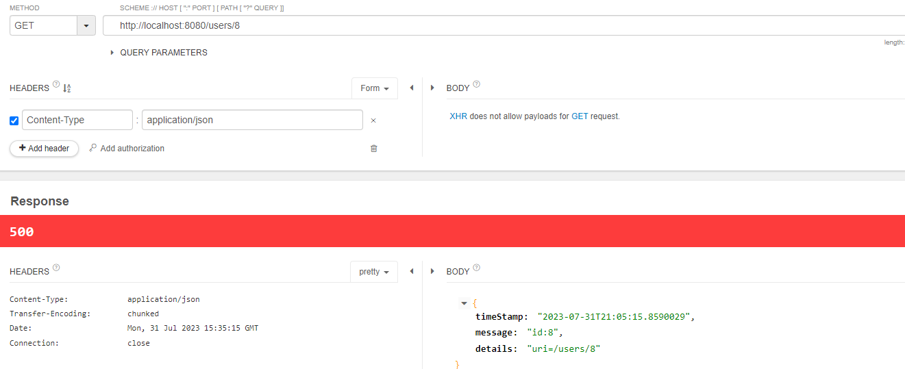
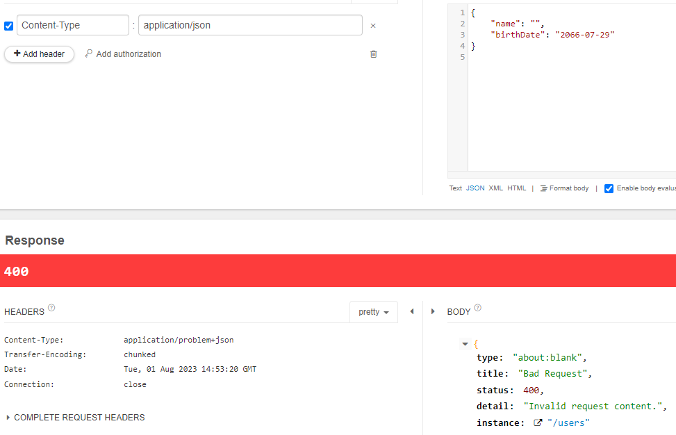
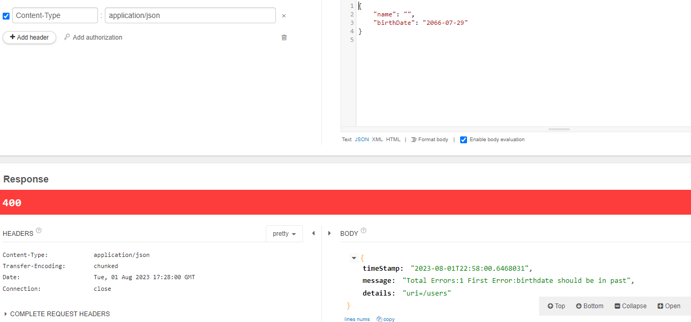

## Lecture 128/ Step 8.0 - Creating a REST API with Spring Boot - An Overview

- WHY Spring Boot?
    - You can build REST API WITHOUT Spring Boot
    - What is the need for Spring Boot?
- HOW to build a great REST API?
    - Identifying Resources (/users, /user posts)
    - Identifying Actions (GET, POST, PUT, DELETE, ...)
    - Defining Request and Response structures
    - Using appropriate Response Status (200, 404, 500, ..)
    - Understanding REST API Best Practices
        - Thinking from the perspective of your consumer
        - Validation, Internationalization - i18n, Exception Handling, HATEOAS, Versioning, Documentation, Content Negotiation and a lot more!

- Building REST API with Spring Boot - Approach
- 1: Build 3 Simple Hello World REST API
    - Understand the magic of Spring Boot
    - Understand fundamentals of building REST API with Spring Boot
        - @RestController, @RequestMapping, @PathVariable, JSON conversion
- 2: Build a REST API for a Social Media Application
    - Design and Build a Great REST API
        - Choosing the right URI for resources (/users, /users{id}, users/{id}/posts)
        - Choosing the right request method for actions (GET, POST, PUT, DELETE, ..)
        - Designing Request and Response structures
        - Implementing Security, Validation and Exception Handling
    - Build Advanced REST API Features
        - Internationalization, HATEOAS, Versioning, Documentation, Content Negotiation, ...
- 3: Connect your REST API to a Database
    - Fundamentals of JPA and Hibernate
    - Use H2 and MySQL as databases

## Lecture 129/ Step 8.1 - Initializing a REST API Project with Spring Boot
- Go to start.spring.io in the google and then choose the Project accordingly as below.
- Project - Maven Project
- Language - Java
- Spring Boot - 3.0
- Project Metadata
    - Group: com.in28minutes.rest.webservices
    - Artifact: restful-web-services
    - Name: restful-web-services
    - Description: Demo Project for Spring Boot
    - Package Name: com.in28minutes.rest.webservices.restful-web-services
    - Packaging: Jar
    - Java: 20
- Add Dependencies
    - *Spring Web* - To build the REST API we need this dependency. It uses `APACHE TOMCAT` as the default embedded container.
    - *Spring Data JPA* - Need JPA and hibernate to persist our data.
    - *H2 Database* - We start using this as initial database and later switch over to SQL.
    - *Spring Boot DevTools* - We don't want to restart the server everytime we make code changes. This dependency provides fast application restarts, LiveReload, and configurations for enhanced development experience.
- Click on Generate button.
- A zip folder will be downloaded on your local machine. Extract it.
- In Eclipse IDE go to - file > import > existing maven project > browse to the location where you extracted > select the folder > click on finish
- Typically all the dependencies will be downloaded by maven in 2-3 minutes. We will be able to see all the folder in the restful-web-services project.
- 
- here, the src/main/java has all the source code
- src/main/resources has all the configurations, for example application.properties
- src/test/java is where you write your Unit Test
- pom.xml is where we define our dependencies.
    - We already have dependencies here which we included at the time of project creation and those are as follows 
        - spring-boot-starter-data-jpa
        - spring-boot-starter-web
        - spring-boot-devtools
        - h2
        - spring-boot-starter-test : this is the dependency added by default into all spring boot projects because this is something which enables you to write `Unit Test` in spring boot
- Now we have our entire project ready.
- To run the application go to the src/main/java which has a file named RestfulWebServicesApplication.java > open it > right click > run as java application > Application will be launched.

## Lecture 130/ Step 8.2 - Creating a Hello World REST API with Spring Boot

- Go to src/main/java --> com.in28minutes.rest.webservices.restfulwebservices > right click > new > class > Name: HelloWorldController > Package : com.in28minutes.rest.webservices.restfulwebservices.helloworld > finish
- Here we want to 
    - 1) Create a REST API so this controller would expose a REST API
    - 2) We want to give a specific url to the REST API i.e hello-world i.e when someone enters localhost:8080/hello-world in the url then we want this specific method to return "Hello World" as the response in the browser
- For this first we need to register this controller as the REST controller and for that let's make use of the annotation `@RestController` from *import org.springframework.web.bind.annotation.RestController* and by doing this we can expose a REST API from this controller
- We want to give specific url to this specific method and to do that we can make use of `@RequestMapping` from *import org.springframework.web.bind.annotation.RequestMapping* and we want to show what type of HTTP method is this and that's why we need to use `RequestMethod.GET` from *import org.springframework.web.bind.annotation.RequestMethod* and the url will be associated with a path i.e path= "/hello-world" in this particular context. So the method will look something as shown below.
- ```java
    @RestController
    public class HelloWorldController {
        @RequestMapping(method = RequestMethod.GET, path = "/hello-world")
        public String hellowWorld() {
            return "Hello-World!";
        }
    }
  ```
- Here we can see that we have used `@RequestMapping` and then showed which type of method we are making use of i.e *method = RequestMethod.GET* . But there is another way in which we don't have to specify the type of method we are making use of i.e. by using `@GetMapping `from *import org.springframework.web.bind.annotation.GetMapping*. So the above code will be slightly shorten.
- ```java
    @RestController
    public class HelloWorldController {
        @GetMapping(path = "/hello-world")
        public String hellowWorld() {
            return "Hello-World!";
        }
    }
  ```
- Similarly we have @PostMapping, DeleteMapping, etc..

## Lecture 131/ Step 8.3 - Enhancing the Hello World REST API to return a BEAN

- Let's see how to return a JSON back from our REST API in this specific step.
- Copy paste the `hellowWorld()` method and change the method name to `helloWorldBean`. This method will be of type bean and will return a *Bean* i.e *HelloWorldBean* to be specific. But this will throw error because we don't have any class/bean named **HelloWorldBean**.
- So create a class *HelloWorldBean* in the same package where this rest controller is located i.e. *com.in28minutes.rest.webservices.restfulwebservices.helloworld*. While creating the class we don't need to make use of *java.lang.String* as the SuperClass, so let's just uncheck the check box and click on finish.
- ```java
    package com.in28minutes.rest.webservices.restfulwebservices.helloworld;

    public class HelloWorldBean {}
  ```
- ```java
    @RestController
    public class HelloWorldController {
	
       @GetMapping(path = "/hello-world-bean")
        public HelloWorldBean hellowWorldBean() {
            return new HelloWorldBean("Hello World");
        }
    }
  ```
- But again thi method will complain because we don't have any constructor in the bean HelloWorldBean, so let's create a constructor and pass a parameter to it as shown below along with it also write getters, setters and the toString method.
- ```java
    package com.in28minutes.rest.webservices.restfulwebservices.helloworld;

    public class HelloWorldBean {
        private String message;
        public HelloWorldBean(String message) {
            this.message = message;
        }
        public String getMessage() {
            return message;
        }
        public void setMessage(String message) {
            this.message = message;
        }
        @Override
        public String toString() {
            return "HelloWorldBean [message=" + message + "]";
        }
    }
  ```
- So instead of returning a string back as in our previous method, here we're returning an instance of our own class. So in the *helloWorldBean()* method we have created a class called HelloWorldBean and this contains a member variable as *message* and what we're doing is we're setting *Hello World* as the value into this variable message, we're creating a bean and returning it back.
- So now upon hitting the url *localhost:8080/hello-world-bean* we will get a JSON repsonse back. As -->  { "message": "Hello World" }

## Lecture 132/ Step 8.4 - What's happening in the background? Spring Boot Starters & Autoconfig

- **What's Happening in the Background?**
    - Let's explore some Spring Boot Magic: Enable Debug Logging.'
    - And for this in the application.properties  --> logging.level.org.springframework=debug. Add this line so that logging will be happening on the debug level
    - 1) How are our requests handled?
        - Whenever we're talking about Spring MVC then we're talking about *Dispatcher Servlet* - **Front Controller Pattern**. What would happen is that all our request are first going to something called `DispatcherServlet`. Earlier we used two url's i.e. localhot:8080/hello-world and the localhost:8080/hello-world-bean, here also irrespective of the url all requests in the spring MVC are handled by *DispatcherServlet* and this is called front controller pattern. *DispatcherServlet* is the first thing that your request goes to. WHY? because *DispatcherServlet* is mapped to the root url i.e. [/] 
        -  If we search in the logs and if we search for the Mapping Servlet's or *dispatcherservlet* we will be able to see something like below
            - Mapping servlet's: dispatcherServlet url's=[/]
        - **Note** - *If you are not able to see the logs then right click in the console  --> go to preferences and uncheck the Limit Console output*
        - **Auto Configuration** - The DispatcherServlet is auto configured by something called *DispatcherServletAutoConfiguration*, it is one of the important spring boot features, `based on the classes which are available in the classpath`, spring boot would automatically detect the fact that we are building a Web application/a REST API and therefore it would automatically configure a DispatcherServlet.
            - If we search for *DispatcherServletAutoConfiguration* in the logs we can see a bean which is created, so this has matched therefore it would go ahead and create a *dispatcherservlet* for us.
    - 2) How does **HelloWorldBean** object get converted to JSON?
        - Earlier we hit a url in the browser *localhost:8080/hello-world-bean* and it's output was { "message": "Hello World" } i.e. in the JSON format.
        - So what happens is that the request goes to dispatcherservlet, the dispatcherservlet would check what are the url's that are available, and it would be able to detect that the url /hello-world-bean is mapped to helloWorldBean() method. So it will execute the method and in that method we are returning a java bean back, but how does it get converted to JSON?
        -   ```java
                @RestController
                public class HelloWorldController {
                
                @GetMapping(path = "/hello-world-bean")
                    public HelloWorldBean helloWorldBean() {
                        return new HelloWorldBean("Hello World");
                    }
                }
            ```
        - There are two very important parts that are involved --> **@ResponseBody** + JacksonHttpMessageConverters
            - In the above code we can see that we have *@RestController*, if we go inside the *RestController* we can see that it's an interface which is annotated with `@ResponseBody`, basically what we're telling is that *return new HelloWorldBean("Hello World")* bean should be returned as-is, and when we return the bean as-is there is a message conversion which would happen.
            - The default conversion setup by spring boot auto configuration is using `JacksonHttpMessageConverters` and this also is a result of auto configuration
                - **Auto Configuration** (JacksonHttpMessageConvertersConfiguration)
                - Again if we search for *JacksonHttpMessageConvertersConfiguration* in the logs, we can see it is automatically configured for REST API by Spring Boot
            - So the **HelloWorldBean** is getting converted to JSON because of the fact that **@ResponseBody** + JacksonHttpMessageConverters are auto configured by spring boot
    - 3) Who is configuring error mapping?
        - When we type in a wrong url for example if we type *localhost:8080/hello-world-bean-1* then we would see a *Whitelabel error page*
            - This application has no explicit mapping for /error, so you are seeing this as a fallback. 
            - There was an unexpected error (type=Not Found, status=404).
        - The error page is also a result of *Auto Configuration* *(ErrorMvcAutoConfiguration)*, we can see it in the logs. And if we open up ErrorMvcAutoConfiguration class and scroll down a little we can see the *Whitelabel error page* is coming in from.
        - So this *ErrorMvcAutoConfiguration* is configured automatically whenever an unknown url is requested.
    - 4) How are all jars available(Spring, Spring MVC, Jackson, Tomcat)?
        - We saw that our application is running in Tomcat, we did not do anything to set up our application in Tomcat, So how these all are available to us? It is because of *starter projects*
        - **Starter Projects** - Spring Boot Starter Web (spring-webmvc, spring-web, spring-boot-starter-tomcat, spring-boot-starter-json)
        - In pom.xml we have number of dependency such as tomcat, etc, so we can see that all the dependencies that we are making use of are coming in because of one starter i.e **spring-boot-starter-web**
        - So at a high level the important thing to understand is that **starter projects** bring in all the dependencies, so the Spring, Spring MVC, Jackson, Tomcat, etc are coming in because of the starter project.
        - And Spring boot AutoConfiguration does rest of the magic, Spring boot AutoConfiguration looks at the classpath, looks all the jars and the classes available in the classpath and based on what is available in the classpath it can Auto Configure a lot of things. By default if we have spring-boot-starter-web in the configuration, then TOMCAT webserver would be auto configured, dispatcherServlet would be auto configured, the bean to JSON conversion would be auto configured, the error page would be auto configured.
    - let's come back to our INFO level logging instead of the DEBUG level, so in application.properties
        - logging.level.org.springframework=info

## Lecture 133/ Step 8.5 - Enhancing the HelloWorld REST API with a Path Variable

- Whenever we look at a url, for example /users/1/todos/101, so this would be url to access a specific todo of a specific user. So when we have such url's then value in here (1) is the **path variable**, if we want to get the todos for the second user then we need to change the path varibale from 1 to 2 then the url would become /users/2/todos/200, and if we change the todo itself then we would need to change number from 101 to 200 and these variables/numbers are called **path parameters**.
- Most of the REST API url's have some kind of path parameters, so we will build a url accepting path parameters, something like /hello-world/path-varibale/{name}, we need to put *name* in the braces {} to indicate that it is a variable.
- ```java
    @GetMapping(path = "/hello-world/path-variable/{name}")
	public HelloWorldBean hellowWorldPathVariable() {
		return new HelloWorldBean("Hello World");
	}
  ```
- If some user is sending request to /hello-world/path-variable/MSDhoni, so what we want to do is to capture the value *MSDhoni* into this path variable and to that we can make use of `@PathVariable` from *import org.springframework.web.bind.annotation.PathVariable*
- ```java
    @GetMapping(path = "/hello-world/path-variable/{name}")
	public HelloWorldBean helloWorldPathVariable(@PathVariable String name) {
		return new HelloWorldBean("Hello World");
	}
  ```
- So what happen's in here is when we type in /hello-world/path-variable/MSDhoni, So this *MSDhoni* present in the url would be mapped by spring mvc with the *name* present in the parameters of the method i.e (@PathVariable String name). And now we can use this name to display in the browser when someone hits this particular url as shown below.
- ```java
    @GetMapping(path = "/hello-world/path-variable/{name}")
	public HelloWorldBean helloWorldPathVariable(@PathVariable String name) {
		return new HelloWorldBean(String.format("Hello World, %s", name));
	}
  ```
- So if we type in *localhost:8080/hello-world/path-variable/MSDhoni* the output --> { "message": "Hello World, MSDhoni" } , if we type in *localhost:8080/hello-world/path-variable/Virat* the output --> { "message": "Hello World, Virat" }
- So whatever the name we are entering in the url it is getting mapped to the path variable and we are picking up the value and returning it back.

## Lecture 134/ Step 8.6 - Designing the REST API for Social Media Application

-  Build a REST API for Social Media Application
- **Key Resources:**
    - Users
    - Posts
- **Key Details:**
    - User: id, name, birthDate
    - Post: id, description
- Request Methods for REST API
    - **GET** - Retrieve details of a resource
    - **POST** - Create a new resource
    - **PUT** - Update an existing resource
    - **PATCH** - Update part of a resource
    - **DELETE** - Delete a resource
- **Users REST API**
    - Retrieve all Users
        - **GET/users**
    - Create a User
        - **POST/users**
    - Retrieve one User
        - **GET/users/{id}->/users/1**
    - Delete a User
        - **DELETE/users/{id}->/users/1**
    - Posts REST API
        - Retrieve all posts for a user
            - GET/users/{id}/posts
        - Create a post for a user
            - POST/users/{id}/posts
        - Retrieve details of a post
            - GET/users/{id}/posts/{post_id}
- One best practice we are making is that we are using the plurals in the resource url's i.e. *users*. because these are easy to read and understand.

## Lecture 135/ Step 8.7 - Create User Bean and UserDaoService

- Create a bean for the user with id, name and birthDate. For this create a new class **User** in the package **com.in28minutes.rest.webservices.restfulwebservices.user**. Add all the data members, write constructor, getters, setters and the ToString method as shown below.
- ```java
    package com.in28minutes.rest.webservices.restfulwebservices.user;
    import java.time.LocalDate;

    public class User {
        
        private Integer id;
        private String name;
        private LocalDate birthDate;
        
        public User(Integer id, String name, LocalDate birthDate) {
            super();
            this.id = id;
            this.name = name;
            this.birthDate = birthDate;
        }

        public Integer getId() {
            return id;
        }

        public void setId(Integer id) {
            this.id = id;
        }

        public String getName() {
            return name;
        }

        public void setName(String name) {
            this.name = name;
        }

        public LocalDate getBirthDate() {
            return birthDate;
        }

        public void setBirthDate(LocalDate birthDate) {
            this.birthDate = birthDate;
        }

        @Override
        public String toString() {
            return "User [id=" + id + ", name=" + name + ", birthDate=" + birthDate + "]";
        }  

    }
  ```
- Now we have our User Bean ready with all the details that we would need. Now we want to build a REST API around this User Bean, we would want to save, retrieve, delete a specific user and do all sorts of options with the specific user. And to be able to perform operations with something which is stored in the database we will create a **DAO** object i.e *(Data Access Object)*. So let's create a class **UserDaoService** in the same package.
- We would want this class to be managed by Spring and that's why we will annotate this class with **@Component** from **import org.springframework.stereotype.Component**.
- For now, we will create a static list of users and later point of time we will connect it to H2 or mysql database. Right now we will make our *UserDaoService* talk to this static List
- ```java
    package com.in28minutes.rest.webservices.restfulwebservices.user;

    import java.util.ArrayList;
    import java.util.List;
    import org.springframework.stereotype.Component;

    @Component
    public class UserDaoService {
        private static List<User> users = new ArrayList<>();
    }
  ```
- We have a Static empty list right now, we want to initialise this with a set of users, so we will create a static block as shown below.
- ```java
    @Component
    public class UserDaoService {
        
        private static List<User> users = new ArrayList<>();
        
        static {
            users.add(new User(1, "MSDhoni", LocalDate.now().minusYears(27)));
            users.add(new User(2, "Virat", LocalDate.now().minusYears(21)));
            users.add(new User(3, "McCullum", LocalDate.now().minusYears(24)));
        }
    }
  `````
- And now we can have a method which upon getting called will retrieve all the users from this static list.
- ```java
    @Component
    public class UserDaoService {
        
        private static List<User> users = new ArrayList<>();
        
        static {
            users.add(new User(1, "MSDhoni", LocalDate.now().minusYears(27)));
            users.add(new User(2, "Virat", LocalDate.now().minusYears(21)));
            users.add(new User(3, "McCullum", LocalDate.now().minusYears(24)));
        }
        
        public List<User> findAll(){
            return users;
        }
    }
  ```
## Lecture 136/ Step 8.8 - 
## Lecture 137/ Step 8.9 - Implementing GET methods for User Resource

- Create a resource for our user and for that create a class **UserResource** in the same package and this would be a REST API and thats why annotate this class with **@RestController** from package **import org.springframework.web.bind.annotation.RestController**.
- ```java
    package com.in28minutes.rest.webservices.restfulwebservices.user;
    import org.springframework.web.bind.annotation.RestController;

    @RestController
    public class UserResource {}
  ```
- We will be having a method `retrieveAllUsers()` which will be getting all the users from the UserDaoService class, so we need to autowire the UserDaoService in our UserResource controller. To make use of UserDaoService we need to do the constructor injection and in that constructor we need to initialize the UserDaoService as shown below.
- ```java
    package com.in28minutes.rest.webservices.restfulwebservices.user;

    import java.util.List;

    import org.springframework.web.bind.annotation.GetMapping;
    import org.springframework.web.bind.annotation.RestController;

    @RestController
    public class UserResource {
        
        private UserDaoService service;
        
        public UserResource(UserDaoService service) { // constructor injection
            this.service = service; // initialized the UserDaoService
        }
        
        @GetMapping("/users")
        public List<User> retrieveAllUsers(){
            return service.findAll();
        }
    }
  ```
- Now upon hitting the url localhost:8080/users we will get the output as
- ```json
    [
    {
    "id": 1,
    "name": "MSDhoni",
    "birthDate": "1996-07-29"
    },
    {
    "id": 2,
    "name": "Virat",
    "birthDate": "2002-07-29"
    },
    {
    "id": 3,
    "name": "McCullum",
    "birthDate": "1999-07-29"
    }
    ]
  ```
- Now we want to get the details of a specific user and for that we need to make use of functional programming in our UserDaoService as shown below
- ```java
    // UserDaoService.java
    public User findOne(int id) {
        // Here we need to make use of a predicate and we need to make use it because
        // suppose I have a user id if I have a user then I want to check if his Id = id which passed in
		// if they are same then we want to get that user and we want to return it back
		Predicate<? super User> predicate = user -> user.getId().equals(id);
		return users.stream().filter(predicate).findFirst().get();
		// the way we can retrieve a specific user from this list by making use of functional programming
		// for this we will convert the users list to a stream and from the list we want to filter based on a predicate
		// so now we would want to findFirst one which is matching that id this would return a optional back on which you need to do a get()
	}
  ```
- Now we need to call this method from our RestController as shown below
- ```java
    @GetMapping("/users/{id}")
	public User retrieveUser(@PathVariable int id){
		return service.findOne(id);
	}
  ```
- Upon entering the url *localhost:8080/users/2* the output will be --> { "id": 2, "name": "Virat", "birthDate": "2002-07-29" }. This according to our list. We can have 1 or even 3 in place of 2 and we will be able to get back only the details of that particular user.

## Lecture 138/ Step 8.10 - Implementing POST Method to Create User Resource

- To transmit user details to a list of users, we need to include these details within our request. To achieve this, we must use an annotation named `@RequestBody`. This annotation specifies that a method parameter should be associated with the body of the web request. Our request will contain a body that encapsulates all the necessary user details to be added, which will then be mapped to the **User** bean.
- In our *UserDaoService*, we are required to implement a `saveUser()` method. This method will involve adding the details received from the client to the list of users.
- To automate the assignment of user ID's dynamically without manual intervention, we'll introduce a variable named *usersCount*. This variable will be utilized to increment the IDs within the static user list, as illustrated below.
- ```java
    private static int usersCount = 0;
	
	static {
		users.add(new User(++usersCount, "MSDhoni", LocalDate.now().minusYears(27)));
		users.add(new User(++usersCount, "Virat", LocalDate.now().minusYears(21)));
		users.add(new User(++usersCount, "McCullum", LocalDate.now().minusYears(24)));
	}
  ```
- The `saveUser()` method will include the `++usersCount` incrementation, which will be added to the user passed in from our RestController's method.
- ```java
    // UserDaoService.java
    public User save(User user) {
		user.setId(++usersCount);
		users.add(user);
		return user;
	}
  ```
- Also let's make call to this method from our RestController.
- ```java
    @PostMapping("/users")
	public void createUser(@RequestBody User user) {
		service.save(user);
	}
  ```
- Testing a POST request directly from the browser isn't feasible. To accomplish this task, we'll require a testing client such as Postman, Talend API tester, etc. For now, we'll utilize the Talend API tester. Please access Google, search for the Talend API tester extension, and add it to our Chrome extensions.
- Within the Talend API tester, select the POST method and send the name and birthDate of the new user that you intend to add to our list of users. A successfull addition of the user will prompt a response code of 200.

## Lecture 139/ Step 8.10 - Enhancing POST Method to return correct HTTP Status Code and Location

- Return the **correct response status**
    - Resource is not found => 404
    - Server exception => 500
    - Validation error => 400
- Important Response Statuses
    - 200 -success
    - 201- Created
    - 204 - No Content
    - 401 - Unauthorized (When authorization fails)
    - 400 - Bad Request (such as validation error)
    - 404 - Resource Not Found
    - 500 - Server Error
- Upon the successful creation of the user, the appropriate response status for us is 201. To achieve this, our `createUser()` method should return this response status. For this purpose, we'll utilize the `ResponseEntity` class found in *org.springframework.http*. There are several classes available in *org.springframework.http* that correspond to different response statuses we aim to return.
- The above method is updated as shown below.
- ```java
    @PostMapping("/users")
	public ResponseEntity<Object> createUser(@RequestBody User user) {
		service.save(user);
		return ResponseEntity.created(null).build();
	}
  ```
- Upon sending this request from the *Talend API tester*, the response status returned will be 201, visible within the Talend API tester window.
- 
- Utilizing the `created()` method of the *ResponseEntity* class is one option among several others available, such as `accepted()`, `badRequest()`, `interServerError()`, `notFound()` and numerous more. The choice of method depends entirely on the functionality of your specific method. Currently, after the creation of a user, we've returned the location as **null**. We'll address this issue later. Let's continue improving our API for now.
- When constructing a REST API, it's crucial to consider it from the perspective of its consumers. As the consumer of this API is attempting to create a user, receiving a status of 201 upon successfull creation is beneficial. Additionally, it would be advantageous to return the URI of the created user. For instance, we can specify that the created user URI is /users/4, enabling the consumer to verify it by visiting the URL localhost:8080/users/4.
- To return the URL of the created resource, typically, we utilize a specific HTTP header called **location**. The `created()` method in the ResponseEntity class accepts a URI location, allowing us to include the location of the newly created resource in the HTTP header.
- ```java
    @PostMapping("/users")
	public ResponseEntity<Object> createUser(@RequestBody User user) {
		service.save(user);
		URI location;  // line 3
		return ResponseEntity.created(location).build();
	}
  ```
- On line 3, we aim to assign the variable `location` as `/users/4`. However, rather than hard-coding the URL, we prefer to use the current request URL, which is `/users`, and append the newly created user's ID, which in this case is 4 due to our current setup with a static list that already contains 3 users. Therefore, the next user's ID in line should be 4. If this were an actual database, the ID could vary.
- After appending, our URL should resemble `/users/{id}`, and we want to replace the placeholder `{id}` with the value obtained from `user.getID()`. 
- To obtain the URI of the current method, we utilize an inbuilt utility method from the Spring class named `ServletUriComponentsBuilder`. This class provides the method `fromCurrentRequest()` to retrieve the current request's URI.
```java
    URI location = ServletUriComponentsBuilder.fromCurrentRequest();
```
- Now we want to add the path to the current request and we want to replace the {id} with the id of the current user and for this we will make use of `buildAndExpand()` method which will get the Id from the `saveUser()` and then we will make it` toUri()`
- We intend to augment the current request's path and substitute the `{id}` placeholder with the ID of the current user. This process involves using the `buildAndExpand()` method, which retrieves the ID from the `saveUser` action, followed by conversion to a URI using `toUri()`.

- ```java
    // UserResource
    @PostMapping("/users")
	public ResponseEntity<Object> createUser(@RequestBody User user) {
		User savedUser = service.save(user);
		URI location = ServletUriComponentsBuilder.fromCurrentRequest().path("/{id}").buildAndExpand(savedUser.getId()).toUri(); 
		return ResponseEntity.created(location).build();
	}
  ```
- 
- As seen in the image we have received location and upon clicking on that location the consumer of the API can see the newly created user.

## Lecture 140/ Step 8.11 - Implementing Exception Handling - 404 Resource Not Found

- When querying for a non-existing user, it triggers the return of a whitelabel error page displaying a NoSuchElementException: "No Value Present". This exception originates from the `get()` method within our `findOne()` method's return statement in the UserDaoService. 
- To rectify this, rather than using the `get()` method, we will utilize `orElse()`. This alternative method returns the value if it's present; otherwise, it returns the value we provide, which in this case is null.

- ```java
    // UserResource
    @GetMapping("/users/{id}")
	public User retrieveUser(@PathVariable int id){
		return service.findOne(id);
	}
    // UserDaoService
    public User findOne(int id) {
		Predicate<? super User> predicate = user -> user.getId().equals(id);
		return users.stream().filter(predicate).findFirst().orElse(null);
	}
  ```
- When accessing http://localhost:8080/users/7, it will result in an empty response because we've returned null, and the 7th user is not available. However, this leaves the API consumer blank. Therefore, we'll modify our `retrieveUser()` method as follows.
- ```java
    @GetMapping("/users/{id}")
	public User retrieveUser(@PathVariable int id){
		User user = service.findOne(id);
		if(user == null)
			throw new UserNotFoundException("id:"+id);
		return user;
	}
  ```
- Create a class named **UserNotFoundException** in the same package, extending the **RuntimeException** as depicted below.
- ```java
    package com.in28minutes.rest.webservices.restfulwebservices.user;

    public class UserNotFoundException extends RuntimeException {
        
        public UserNotFoundException(String message) {
            super(message);
        }
    }
  ```
- After running the application and navigating to the URL http://localhost:8080/users/7, the result will be a whitelabel error page displaying the UserNotFoundException error with the message "id:7".
- To ensure that the **UserNotFoundException** results in a 404 error, we can use the **@ResponseStatus** annotation from the package *import org.springframework.web.bind.annotation.ResponseStatus*. This annotation offers various statuses that can be returned, including CREATED, NOT_FOUND, ACCEPTED, and more.
- ```java
    package com.in28minutes.rest.webservices.restfulwebservices.user;

    import org.springframework.http.HttpStatus;
    import org.springframework.web.bind.annotation.ResponseStatus;

    @ResponseStatus(code = HttpStatus.NOT_FOUND)
    public class UserNotFoundException extends RuntimeException {
        
        public UserNotFoundException(String message) {
            super(message);
        }

    }
  ```
- After running the application and accessing the URL http://localhost:8080/users/7, the result will be a whitelabel error page indicating "Not Found" with a status of 404. Additionally, it will display the returned message "id:7". 
- 
## Lecture 141 - Resources Skip

## Lecture 142/ Step 8.12 - Implementing Generic Exception Handling for all resources

- To create a custom structure for error responses, we'll define a bean that represents the custom exception structure.
- Create a class named **ErrorDetails** within the package **com.in28minutes.rest.webservices.restfulwebservices.exception**. This class should include data members such as timeStamp, message, and details.
- ```java
    package com.in28minutes.rest.webservices.restfulwebservices.exception;

    import java.time.LocalDateTime;

    public class ErrorDetails {
        
        private LocalDateTime timeStamp;
        private String message;
        private String details;
        public ErrorDetails(LocalDateTime timeStamp, String message, String details) {
            super();
            this.timeStamp = timeStamp;
            this.message = message;
            this.details = details;
        }
        public LocalDateTime getTimeStamp() {
            return timeStamp;
        }
        public String getMessage() {
            return message;
        }
        public String getDetails() {
            return details;
        }

    }
  ```
- Before implementing this exception, it's valuable to understand how Spring manages exceptions. The class **ResponseEntityExceptionHandler** offers a range of methods to handle various types of exceptions. For our purpose, we aim for **CustomizedResponseEntityExceptionHandler** to extend this specific class and override one of the existing methods to create a customized exception handling process.
- Create another class named **CustomizedResponseEntityExceptionHandler** within the same package. This class should extend the **ResponseEntityExceptionHandler** from the package **org.springframework.web.servlet.mvc.method.annotation**.
- ```java
    package com.in28minutes.rest.webservices.restfulwebservices.exception;

    import java.time.LocalDateTime;

    import org.springframework.http.HttpStatus;
    import org.springframework.http.ResponseEntity;
    import org.springframework.web.bind.annotation.ControllerAdvice;
    import org.springframework.web.bind.annotation.ExceptionHandler;
    import org.springframework.web.context.request.WebRequest;
    import org.springframework.web.servlet.mvc.method.annotation.ResponseEntityExceptionHandler;


    @ControllerAdvice
    public class CustomizedResponseEntityExceptionHandler extends ResponseEntityExceptionHandler {
        
        @ExceptionHandler(Exception.class)
        public final ResponseEntity<Object> handleAllExceptions(Exception ex, WebRequest request) throws Exception {
            
            ErrorDetails errorDetails = new ErrorDetails(LocalDateTime.now(), ex.getMessage(), request.getDescription(false));
            return new ResponseEntity(errorDetails, HttpStatus.INTERNAL_SERVER_ERROR);
        }
    }
  ```

- In this implementation, two annotations are utilized: **@ExceptionHandler** is used to specify that the method will handle exceptions, specifically all types of exceptions (Exception.class). The second annotation, **@ControllerAdvice**, is a specialization of **@Component** for classes declaring **@ExceptionHandler**. This configuration enables the retrieval of a customized error structure, as illustrated below.
- 
- For user not found exception we are returning a 500(Server Error) back however for this exception we want to return a BAD_REQUEST back. So we need to customize our above method because for all bad requests it will return exception but for USERNOTFOUNDEXCEPTION we need NOT_FOUND i.e 404(Resource not found) back
- For the *UserNotFoundException*, the desired response code is BAD_REQUEST instead of a 500 (Server Error). We need to customize the above method as, for all bad requests, it returns an exception, but specifically for *UserNotFoundException*, we aim to return a NOT_FOUND status (404 - Resource not found) instead.
- ```java
    package com.in28minutes.rest.webservices.restfulwebservices.exception;

    import java.time.LocalDateTime;

    import org.springframework.http.HttpStatus;
    import org.springframework.http.ResponseEntity;
    import org.springframework.web.bind.annotation.ControllerAdvice;
    import org.springframework.web.bind.annotation.ExceptionHandler;
    import org.springframework.web.context.request.WebRequest;
    import org.springframework.web.servlet.mvc.method.annotation.ResponseEntityExceptionHandler;

    import com.in28minutes.rest.webservices.restfulwebservices.user.UserNotFoundException;


    @ControllerAdvice
    public class CustomizedResponseEntityExceptionHandler extends ResponseEntityExceptionHandler {
        
        @ExceptionHandler(Exception.class)
        public final ResponseEntity<ErrorDetails> handleAllExceptions(Exception ex, WebRequest request) throws Exception {
            
            ErrorDetails errorDetails = new ErrorDetails(LocalDateTime.now(), ex.getMessage(), request.getDescription(false));
            return new ResponseEntity<ErrorDetails>(errorDetails, HttpStatus.INTERNAL_SERVER_ERROR);
        }
        
        
        @ExceptionHandler(UserNotFoundException.class)
        public final ResponseEntity<ErrorDetails> handleUserNotFoundExceptionException(Exception ex, WebRequest request) throws Exception {
            
            ErrorDetails errorDetails = new ErrorDetails(LocalDateTime.now(), ex.getMessage(), request.getDescription(false));
            return new ResponseEntity<ErrorDetails>(errorDetails, HttpStatus.NOT_FOUND);
        }
    }
  ```
- 

## Lecture 143/ Step 8.13 - Implementing DELETE method to delete a User Resource

- Similar to the *retrieveUser()* method we can have *deleteUser()* method.
- ```java
    @DeleteMapping("/users/{id}")
	public User deleteUser(@PathVariable int id){
		User user = service.findOne(id);
		if(user == null)
			throw new UserNotFoundException("id:"+id);
		return user;
	}
  ```
- We need to implement a similar method to `findOne()` in the UserDaoService, but this method should perform the delete operation.
- ```java
    // this code is in UserDaoService
    public void deleteById(int id) {
		Predicate<? super User> predicate = user -> user.getId().equals(id);
		users.removeIf(predicate);
	}
  ```

## Lecture 144/ Step 8.14 - Implementing Validation for REST API

- To incorporate validation, we require an additional dependency in our pom.xml, namely *starter-validation*. Below the starter-web, add the dependency as illustrated below.
- ```java
    <dependency>
        <groupId>org.springframework.boot</groupId>
        <artifactId>spring-boot-starter-validation</artifactId>
    </dependency>
  ```
- To utilize this dependency in our RestController, we'll utilize the annotation **@Valid** from the package **jakarta.validation.Valid**. This annotation is used to mark a property, method parameter, or method return type for validation cascading.
- When using this parameter, during the process of binding, the validations that are defined on your object are automatically invoked.
- ```java
    @PostMapping("/users")
	public ResponseEntity<Object> createUser(@Valid @RequestBody User user) {
		User savedUser = service.save(user);
		URI location = ServletUriComponentsBuilder.fromCurrentRequest().path("/{id}").buildAndExpand(savedUser.getId()).toUri(); 
		return ResponseEntity.created(location).build();
	}
  ```
- Currently, in our **User** bean, there aren't any validations in place. Let's add some validations to the User bean.
- ```java
    import jakarta.validation.constraints.Past;
    import jakarta.validation.constraints.Size;

    public class User {
	
	private Integer id;
	@Size(min=2, message="Name should have atleast 2 characters")
	private String name;
	@Past(message="birthdate should be in past")
	private LocalDate birthDate;
  ```
- We've set the minimum required length for the name when adding a new user to be 2, and the birth date must be in the past. If a future birth date or a name length less than 2 is entered, an error will be generated as indicated below.
- 
- We're receiving a 400 Bad Request, but the issue lies in the response not specifying the problem with the request. To address this, we aim to override the `handleMethodArgumentNotValid()` method from the **ResponseEntityExceptionHandler** inbuilt class within our **CustomizedResponseEntityExceptionHandler** class to define our customized method.
- ```java
    // CustomizedResponseEntityExceptionHandler.java
    @Override
	protected ResponseEntity<Object> handleMethodArgumentNotValid(
			MethodArgumentNotValidException ex, HttpHeaders headers, HttpStatusCode status, WebRequest request) {

		ErrorDetails errorDetails = new ErrorDetails(LocalDateTime.now(), ex.getMessage(), request.getDescription(false));
		return new ResponseEntity(errorDetails, HttpStatus.BAD_REQUEST);
	}
  ```
- 
- Based on the specific use case, there's room to customize the error message significantly. We can iterate through all the field errors in our errorDetails and display the exact error messages accordingly.
- ```java
    @Override
	protected ResponseEntity<Object> handleMethodArgumentNotValid(
			MethodArgumentNotValidException ex, HttpHeaders headers, HttpStatusCode status, WebRequest request) {
		
		
		ErrorDetails errorDetails = new ErrorDetails(LocalDateTime.now(), 
													"Total Errors:" + ex.getErrorCount() + " First Error:" + 
													 ex.getFieldError().getDefaultMessage(), 
													 request.getDescription(false));
		
		return new ResponseEntity(errorDetails, HttpStatus.BAD_REQUEST);
	}
  ```
- 

## Lecture 146/ Step 8.16 - Understanding Open API Specification and Swagger

- Your REST API consumers need to understand your REST API:
    - Resources
    - Actions
    - Request/Response Structure (Contraints/Validations)
- **Challenges**
    - Accuracy: How do you ensure that your documentation is upto date & correct?
    - Consistency: You might have 100's of REST API in an enterprise. How do you ensure consistency?
- **Options**:
    - 1: Manually maintain Documentation
        - Additional effort to keep it in sync with code
    - 2: Generate from code
        - REST API Documentation - Swagger and Open API
        - Quick overview:
            - 2011: Swagger specification and Swagger Tools were introduced
            - 2016: Open Api specification were created based on Swagger Spec.
                - Swagger Tools (ex: Swagger UI continue to exist)
            - Open API Specification: Standard, language-agnostoc interface
                - Discover and understand REST API
                - Earlier called Swagger Specification
            - Swagger UI: Visualize and interact with your REST API

## Lecture 148/ Step 8.17 - Configuring Auto Generation of Swagger Documentation

- To integrate Swagger documentation, we need to add a dependency in the pom.xml, placed just below the Spring Boot validation dependency.
- ```java
    <dependency>
        <groupId>org.springdoc</groupId>
        <artifactId>springdoc-openapi-starter-webmvc-ui</artifactId>
        <version>2.0.0</version>
    </dependency>
  ```
- Accessing *localhost:8080/swagger-ui.html* will direct you to the Swagger UI, where you can view the documentation for our REST API.
- 
- We can even try out our REST API's from here upon expanding any of the API's

## Lecture 150/ Step 8.18 - Exploring Content Negotiation - Implementing Support for XML

- **Same Resource** - Same URI
    - HOWEVER **Different Representations** are possible
        - Example: Different Content Type- XML or JSON or..
        - Example: Different Language- English or Dutch or..
    - How can a consumer tell the REST API provider what they want?
        - **Content Negotiaton**
    - Example: Accept header (MIME types - application/xml, application/json, ...)
    - Example: Accept- Langauge header (en, nl, fr, ..)
- To implement Accept headers for consumers, we need to add a specific dependency in the pom.xml file.
- ```java
    <dependency>
        <groupId>com.fasterxml.jackson.dataformat</groupId>
        <artifactId>jackson-dataformat-xml</artifactId>
    </dependency>
  ```
- We can send request by adding Headers as Accept - application/xml as shown in the image below and we'll be able to receive the users in xml format
- 
- Upon altering the headers to "application/json," consumers can retrieve JSON-formatted data. Consequently, for the identical user list, the API supports two distinct representations: JSON and XML.
- For now we will comment out the swagger and xml dependencies as they can cause confusions going forward.

## Lecture 151/ Step 8.19 - Exploring Internationalization for REST API

- Your REST API might have consumers from around the world
- How do you customize it to users around the world?
    - Internationalization - i18n
- Typically **HTTP Request Header - Accept-Language** is used
    - Accept-Language - indicates natural language and locale that the consumer prefers
    - Example: en-English(Good Morning)
    - Example: nl-Dutch(Goedemorgen)
    - Example: fr-French(Bonjour) 
- To implement the internationalization let's head over to our *HelloWorldController*, and update our `helloWorld()` method to `helloWorldInternationalized()`. 
- ```java
    @GetMapping(path = "/hello-world-internationalized")
	public String hellowWorldInternationalized() {
		return "Hello-World V2!";
	}
  ```
- We want to do is to show **Good Morning** text in different languages and for that let's create a specific file named **messages.properties** in the src/main/resources folder. The name of this file has to be **messages.properties** only. Also update the above method to get the message from the **messages.properties** file. And in that file let's add the following text.
- ```java
    good.morning.message= Good Morning
  ```
- ```java
    private MessageSource messageSource;

   @GetMapping(path = "/hello-world-internationalized")
	public String hellowWorldInternationalized() {
		Locale locale = LocaleContextHolder.getLocale();
		return messageSource.getMessage("good.morning.message", null, "Default Message", locale);
	}
  ```
- Here in this above method we have made use of messageSource's `getMessage()` method which takes in 4 arguments i.e the message that we provided in our newly created file, a variable if any is present in that file we have no variable hence null here, a default message and a locale. So along with the request if the users sends a accept header in then the locale for that specific header will be returned by this *LocaleContextHeder.getLocale()* and if there is no locale provided then it would use the default locale. Now upon calling this method form browser we will get **Good Morning**.
- We can do the same for the dutch i.e. nl and for this, create a specific file named **messages_nl.properties** in the src/main/resources folder. The name of this file has to be **messages_nl.properties** only. And we have to update the above method to get the message from the **messages_nl.properties** file. And in that file let's add the following text.
- ```java
    good.morning.message= Goedemorgan
  ```
- Before calling this method from our Talend API tester we need to add a Header: Accept-Language : nl. Now we will see Goedemorgan as output.
So same can be done for french as well.

## Lecture 153/8:20 - Versioning REST API - URI Versioning

- What is the need of Versioning? So let's hope you have built an amazing REST API
    - You have 100s of consumers
    - You need to implement a breaking change
        - Example: Split name into firstName and lastName
        - Version 1
            - { 
                "name": "Bob Charlie"
             }
        - Version 2
            - {
                "name": {
                    "firstName": "Bob",
                    "lastName": "Charlie"
                }
            }

- **Solution**: Versioning REST API
    - Variety of options
        - URL
        - Request Parameter
        - Header
        - Media Type
- let's start with URL, for this let's create a new Controller named **VersioningPersonController** as shown below.
- ```java
    package com.in28minutes.rest.webservices.restfulwebservices.versioning;

    import org.springframework.web.bind.annotation.GetMapping;
    import org.springframework.web.bind.annotation.RestController;

    @RestController
    public class VersioningPersonController {
        
        @GetMapping("/v1/person")
        public PersonV1 getFirstVersionOfPerson() {
            return new PersonV1("Bob Charlie");
        }
        
        @GetMapping("/v2/person")
        public PersonV2 getSecondVersionOfPerson() {
            return new PersonV2(new Name("Bob", "Charlie"));
        }
    }

    // First Person Class
    package com.in28minutes.rest.webservices.restfulwebservices.versioning;

    public class PersonV1 {
        private String name;

        public PersonV1(String name) {
            super();
            this.name = name;
        }

        public String getName() {
            return name;
        }

        @Override
        public String toString() {
            return "PersonV1 [name=" + name + "]";
        }
        
    }

    // Second Person Class
    package com.in28minutes.rest.webservices.restfulwebservices.versioning;

    public class PersonV2 {
        private Name name;

        public PersonV2(Name name) {
            super();
            this.name = name;
        }

        public Name getName() {
            return name;
        }

        @Override
        public String toString() {
            return "PersonV2 [name=" + name + "]";
        }
    }

    // Name class
    package com.in28minutes.rest.webservices.restfulwebservices.versioning;

    public class Name {
        private String firstname;
        private String lastName;
        public Name(String firstname, String lastName) {
            super();
            this.firstname = firstname;
            this.lastName = lastName;
        }
        public String getFirstname() {
            return firstname;
        }
        public String getLastName() {
            return lastName;
        }
        @Override
        public String toString() {
            return "Name [firstname=" + firstname + ", lastName=" + lastName + "]";
        }
    }
  ```
- We will get the output as we disccussed for v1 and v2 versions

## Lecture 154/8:21 - Version REST API - Request Param, Header and Content Negotiation

- In the last step we learnt the URI or the URL versioning and now in this step let's start with request parameter versioning. A consumer can specify a version as a request parameter
- **URI Versioning** - Twitter
    - http://localhost:8080/v1/person
    - http://localhost:8080/v2/person
- **Request Parameter Versioning** - Amazon
    - http://localhost:8080/person?version=1
    - http://localhost:8080/person?version=2
- So we will copy our v1/person method and while pasting we want to distinguish it based on the request parameter. And we want to call this api only when there is a requestParam coming in.
- ```java
	@GetMapping(path="/person", params="version=1")
	public PersonV1 getFirstVersionOfPersonRequestParameter() {
		return new PersonV1("Bob Charlie");
	}

	@GetMapping(path="/person", params="version=2")
	public PersonV1 getSecondVersionOfPersonRequestParameter() {
		return new PersonV1("Snoop Dog");
	}
  ```
- So now when we will enter  http://localhost:8080/person?version=1 in the browser then we will get back { "name": "Bob Charlie" } and when we enter http://localhost:8080/person?version=2 in the browser then we will get back { "name": {"firstname": "Snoop","lastName": "Dog"} } as output.
- **(Custom) headers versioning** - Microsoft
    - SAME-URL headers=[X-API-VERSION=1]
    - SAME-URL headers=[X-API-VERSION=2]
- ```java
	@GetMapping(path="/person/header", headers="X-API-VERSION=1")
	public PersonV1 getFirstVersionOfPersonRequestHeader() {
		return new PersonV1("Bob Charlie");
	}

	@GetMapping(path="/person/header", headers="X-API-VERSION=2")
	public PersonV2 getSecondVersionOfPersonRequestHeader() {
		return new PersonV2(new Name("Snoop", "Dog"));
	}
  ```
- The results are as shown below, in the images we can see that the headers has been passed on.
- 
- 
- **Media type versioning** (a.k.a "content negotiation" or "accept header") - GitHub
    - SAME-URL produces=application/vnd.company.app-v1+json
    - SAME-URL produces=application/vnd.company.app-v2+json
- ```java
	@GetMapping(path="/person/header", headers="X-API-VERSION=1")
	public PersonV1 getFirstVersionOfPersonRequestHeader() {
		return new PersonV1("Bob Charlie");
	}

	@GetMapping(path="/person/header", headers="X-API-VERSION=2")
	public PersonV2 getSecondVersionOfPersonRequestHeader() {
		return new PersonV2(new Name("Snoop", "Dog"));
	}
  ```
- The results are as shown below, in the images we can see that the headers has been passed on.
- 
- 
- Now we have seen diffrent types of uri versionings, so which one better to consider.
- **Factors to consider**
    - URI Pollution
        - When we look at URI versioning and the Request parameter versioning, what we are doing is we are creating new url's to represent the new versions so there is lot of URI pollution in these both cases. However in the case of Headers versioning and Media type versioning we were using the same url so they have less amount of URI pollution.
    - Misuse of HTTP Headers
        - Http Headers were never meant to be used for versioning, so Headers versioning and Media type versioning misuse the HTTP Headers.
    - Caching
        -  Typically caching is done based on the url and when it comes to header version and media type versioning we are using different versions, however both those versions can have the same url. So when it comes to header versioning and media type versioning we cannot cache just based on the url's, you would also need to look at the headers before you would do the caching.
    - Can we execute the request on the browser?
        - When it comes to URI versioning and the Request parameter versioning we can easily execute them on the browser because the differentiation is in the url's however when it comes to header versioning and media type versioning the differentiation is in the headers, typically you would need to have a command line utility or you would need to use REST API client to differentiate based on the headers.
    - API Documentation
        - Typically generating documentation for URI versioning and the Request parameter versioning is easy because the url's for both versions are different but typically api documentation generating tools might not support generating documentation differentiating based on the headrers.
    - **Summary**: No Perfect Solution
    - Recommendation
        - Think about versioning even before you need it!
        - One Enterprise - One Versioning Approach
    
## Lecture 155/8:22 - Implementing HATEOAS for REST API

- Hypermedia as the Engine of Application State (HATEOAS)
- Website allows you to:
    - See Data AND Perform Actions (using links)
- How about enhancing your REST API to tell consumers how to perform subsequent actions?
    - HATEOAS
- Implmentation Options:
    - 1: Custom Format and Implementations
        - Difficult to maintain
    - 2: Use Standard Implementaion
        - HAL (JSON Hypertext Application Language): Simple format that gives a consistent and easy way to hyperlink between resources in your API
        - Spring HATEOAS: Generate HAL responses with hyperlinks to resources
- To make use of HATEOAS in your application we need to make use of dependency in the pom.xml
- ```java
    <dependency>
			<groupId>org.springframework.boot</groupId>
			<artifactId>spring-boot-starter-hateoas</artifactId>
	</dependency>
  ```
- So now in our UserResource RestController we have a retrieveUser method which returns a json response with matched id.
- ```java
    @GetMapping("/users/{id}")
	public User retrieveUser(@PathVariable int id){
		User user = service.findOne(id);
		if(user == null)
			throw new UserNotFoundException("id:"+id);
		return user;
	}
  ```
- When this method is called in browser as http://localhost:8080/users/1 then it returns output as { "id": 1, "name": "MSDhoni", "birthDate": "1996-09-28" }
- In addition to this data as output we also want a link which will route us to the users list. To get data and link we need to make use of couple of hateoas concepts which are *EntityModel* (it is a simple EntityModel wrapping a domain object and adding links to it) and *WebMvcLinkBuilder* (it is a builder to ease building link instances pointing to Spring MVC controllers). What we want to do is to add few links to our response as part of our *User* bean and we don't want to make change to the structure of every bean and that's why we would make use of EntityModel.
- So first thing we need to do is wrap the *User* bean into EntityModel. EntityModel<User> from *import org.springframework.hateoas.EntityModel*
- ```java
   @GetMapping("/users/{id}")
	public EntityModel<User> retrieveUser(@PathVariable int id){
		User user = service.findOne(id);
		if(user == null)
			throw new UserNotFoundException("id:"+id);
		
		EntityModel<User> entityModel = EntityModel.of(user);
		return entityModel;
	}
  ```
- Now upon calling this method in browser as http://localhost:8080/users/1 the output will be { "id": 1, "name": "MSDhoni", "birthDate": "1996-09-28" } we can see nothing has changed and there are no links added. So if we want to return links we need to add them to the EntityModel and to be able to create links we need to use another utility class `WebMvcLinkBuilder` from *import org.springframework.hateoas.server.mvc.WebMvcLinkBuilder*
- Import all the methods from `WebMvcLinkBuilder` into our own controller by import static org.springframework.hateoas.server.mvc.WebMvcLinkBuilder.* . The * at the end of the import sentence tells that we are importing all of the methods present inside the class. 
- Now what we want is the link for the retrieving all the users list method i.e. retrieveAllUsers(), So the link will be generated as
- ```java
    WebMvcLinkBuilder link = linkTo(methodOn(this.getClass()).retrieveAllUsers());
  ```
- So basically we're using the WebMvcLinkBuilder's `linkTo()` method to create a link pointing to the controller's `retrieveAllUsers` method.
- And now as we have the link we can add this link to the EntityModel.
- ```java
    WebMvcLinkBuilder link = linkTo(methodOn(this.getClass()).retrieveAllUsers());
    entityModel.add(link.withRel("all-users"));
  ```
- So now final method would look like
- ```java
   @GetMapping("/users/{id}")
    public EntityModel<User> retrieveUser(@PathVariable int id){
        User user = service.findOne(id);
        if(user == null)
            throw new UserNotFoundException("id:"+id);

        EntityModel<User> entityModel = EntityModel.of(user);
        WebMvcLinkBuilder link = linkTo(methodOn(this.getClass()).retrieveAllUsers());
        entityModel.add(link.withRel("all-users"));
        return entityModel;
    }
  ```
- 
- And now upon clicking on the link we will be redirected to the list of the users. Depending on the resource we can add as many links as we want to it.

## Lecture 156/8:23 - Implementing Static Filtering for REST API

- **Serialization**: Convert object to stream (example: JSON)
    - For example we are returning an EntityModel back or returning list of users back, converting this to json or to an xml is called serialization
    - Most popular JSON serialiazation in Java : Jackson
- How about customizing the REST API response returned by Jackson Framework
- 1: Customize field names in response
    - @JSONproperty
    - ```java
            import com.fasterxml.jackson.annotation.JsonProperty;
        	@JsonProperty("user_name")
	        private String name;
      ```
    - 
    - json property is very useful to customize your attribute names and response.
- 2: Return only selected fields
    - Filtering
    - Example: Filter out Passwords
    - Two Types:
        - **Static filtering**: Same filtering for a bean across different REST API
            - @JsonIgnoreProperties, @JsonIgnore
         - **Dynamic filtering**: Customize filtering for a bean for specific REST API
            - @JsonIgnoreProperties, @JsonIgnore
        - Let's take example with a bean with three fields : { "field1": "value1", "field2": "value2", "field3": "value3" }. We want to always filter out field2 which is a password field and don't want it to be a part of any of the REST API responses and this is what is called Static Filtering -> basically same filtering for a bean accross different REST API.
        - The alternative is dynamic filtering, for example consider the field1, we want to send field1 as a part of the specific REST API however for a different REST API we don't want to send it. So we need to dynamically decode whether we need to send it or not.
        - Create an example for filtering by creating new class and bean as shown below in the filtering package
        - ```java
            package com.in28minutes.rest.webservices.restfulwebservices.filtering;
            import org.springframework.web.bind.annotation.GetMapping;
            import org.springframework.web.bind.annotation.RestController;

            @RestController
            public class FilteringController {
                
                @GetMapping("/filtering")
                public SomeBean filtering() {
                    return new SomeBean("value1", "value2", "value3");
                }
            }
          ```
          - ```java
                package com.in28minutes.rest.webservices.restfulwebservices.filtering;

                public class SomeBean {
                    
                    private String field1;
                    private String field2;
                    private String field3;
                    public SomeBean(String field1, String field2, String field3) {
                        super();
                        this.field1 = field1;
                        this.field2 = field2;
                        this.field3 = field3;
                    }
                    public String getField1() {
                        return field1;
                    }
                    public String getField2() {
                        return field2;
                    }
                    public String getField3() {
                        return field3;
                    }
                    @Override
                    public String toString() {
                        return "SomeBean [field1=" + field1 + ", field2=" + field2 + ", field3=" + field3 + "]";
                    }
                }
          ```
        - 
        - So now to avoid the field2 from coming into json response we can make use of the @JsonIgnore. And upon using it, the field2 wont be coming into the response
        - The same thing would happen if we have a list i.e.
        - ```java 
            @GetMapping("/filtering-list")
            public List<SomeBean> filteringList() {
                return Arrays.asList(new SomeBean ("value1", "value2", "value3"),
                        new SomeBean ("value4", "value5", "value6"));
            }
          ```
        - 
        - In addition to having @JsonIgnore written over any data member we can have @JsonIgnoreProperties written over the bean itself which can be said as it is defined at the class level
        - ```java
            import com.fasterxml.jackson.annotation.JsonIgnoreProperties;

            @JsonIgnoreProperties("field1")
            public class SomeBean { ------}

            // can even make more member ignore by using array in
             @JsonIgnoreProperties({"field1", "field2"})
          ```

## Lecture 157/8:24 - Implementing Dynamic Filtering for REST API        

- There may be situations where you might want to return different attributes in same bean in different REST API. Before starting dynamic filtering let's comment @JsonIgnore from the bean and now we will get back all the 3 three fields again.
- So now what we will do for `filtering()` method is we will have field1 and field3 in the response however for `filteringList()` method we will have field2 and field3 in the response. So for the same bean we will have different filtering logic in different REST API.
- Because we want to filter different things in different REST API we cannot define filtering on the bean itself. The logic to filter will now be written in controller. And that's where the class *MappingJacksonValue* will help us. If you have specific serialization instructions that you want to pass to the jackson converter in that scenario we can make use of *MappingJacksonValue*.
- ```java
	@GetMapping("/filtering")
	public MappingJacksonValue filtering() {
		// so we have the bean which contains the data that we want to return back
		SomeBean someBean = new SomeBean("value1", "value2", "value3");	
        // It creates an instance of a class named SomeBean and initializes it with values "value1", "value2", and "value3".
		MappingJacksonValue mappingJacksonValue = new MappingJacksonValue(someBean);
        // It creates a MappingJacksonValue object, a class provided by Spring that helps in applying filters during serialization to control what gets serialized.
		SimpleBeanPropertyFilter filter = SimpleBeanPropertyFilter.filterOutAllExcept("field1", "field3");
        // This line creates a filter that includes only "field1" and "field3" properties of the SomeBean class and excludes all other properties during JSON serialization.
		FilterProvider filters = new SimpleFilterProvider().addFilter("SomeBeanFilter", filter );
        // It creates a FilterProvider object, specifically a SimpleFilterProvider, and associates the created filter (filter) with the filter id "SomeBeanFilter".
		mappingJacksonValue.setFilters(filters);
        // It applies the filters defined in the FilterProvider to the MappingJacksonValue. This will instruct Jackson (the underlying JSON serialization/deserialization library used by Spring) to apply the filter when serializing the someBean object
		return mappingJacksonValue;
        // The method returns the MappingJacksonValue object. As a result, when this method is called through the "/filtering" endpoint, the response will be a JSON object containing only "field1" and "field3" properties of the SomeBean object.
	}

    // Without comment the above method looks like this
    @GetMapping("/filtering")
	public MappingJacksonValue filtering() {
		SomeBean someBean = new SomeBean("value1", "value2", "value3");	
		MappingJacksonValue mappingJacksonValue = new MappingJacksonValue(someBean);
		SimpleBeanPropertyFilter filter = SimpleBeanPropertyFilter.filterOutAllExcept("field1", "field3");
		FilterProvider filters = new SimpleFilterProvider().addFilter("SomeBeanFilter", filter );
		mappingJacksonValue.setFilters(filters);
		return mappingJacksonValue;
	}
	
	@GetMapping("/filtering-list")
	public MappingJacksonValue filteringList() {
		
		List<SomeBean> someBean=  Arrays.asList(new SomeBean ("value1", "value2", "value3"),
				new SomeBean ("value4", "value5", "value6"));
		MappingJacksonValue mappingJacksonValue = new MappingJacksonValue(someBean);
		SimpleBeanPropertyFilter filter = SimpleBeanPropertyFilter.filterOutAllExcept("field2", "field3");
		FilterProvider filters = new SimpleFilterProvider().addFilter("SomeBeanFilter", filter);
		mappingJacksonValue.setFilters(filters);
		return mappingJacksonValue;		
	}
  ```

## Lecture 158/8:25 - Monitoring APIs with Spring Boot Actuator

- **Spring Boot Actuator**: Provides Spring Boot's production-ready features
    - Monitor and manage your aplication in your production
- Spring boot starter Actuator: Starter to add Spring boot Actuator to your application
    - **spring-boot starter-actuator**
- Provides a number of endpoints:
    - beans - Complete list of Spring beans in your app
    - health - Application health information
    - metrics - Application metrics
    - mappings - Details around Request Mapings
    - and a lot more ...
- just need to add the dependency in the pom.xml
- ```java
    <dependency>
        <groupId>org.springframework.boot</groupId>
        <artifactId>spring-boot-starter-actuator</artifactId>
    </dependency>
  ```
- Upon running and hitting the url http://localhost:8080/actuator we will get the following as the repsonse.
- 
- And if we click on the url "href": "http://localhost:8080/actuator/health" then we will get back { "status": "UP" } as the repsonse. By default only thing that the actuator exposes is the health of the application. If you want to expose more things then go to application.properties and configure as below
- ```java
    management.endpoints.web.exposure.include=*
  ```
- 

## Lecture 159/8:26 - Exploring APIs with Spring Boot HAL Explorer

- 1: HAL (JSON Hypertext Application Language)
    - Simple format that gives a consistent and easy way to hyperlink between resources in your API
    - ```json
        {
            "id": 1,
            "user_name": "MSDhoni",
            "birth_date": "1996-09-28",
            "_links": {
                "all-users": {
                    "href": "http://localhost:8080/users"
                }
            }
        }
      ```
    - Here in the above response we can see that _links and the format that we were making use of is the HAL format
- 2: HAL Explorer
    - An API explorer for RESTful Hypermedia APIs using HAL
    - Enable your non-technical teams to play with APIs
- 3: Spring Boot HAL Explorer
    - Auto configures HAL Explorer for Spring Boot Projects
    - For this just add the dependency in the pom.xml
    - ```java
        <dependency>
			<groupId>org.springframework.data</groupId>
			<artifactId>spring-data-rest-hal-explorer</artifactId>
		</dependency>
      ```
      - Now upon entering the url http://localhost:8080/ the HAL explorer will get loaded in which you can explore all things
      - 

## Lecture 160/8:27 - Connecting REST API to H2 using JPA and Hibernate - An Overview

- In the application.properties add the following configuration
- ```java
    spring.h2.console.enabled=true
  ```

## Lecture 162/8:29 - Creating User Entity and some test data 

- We want JPA to manage our *User* class and to do that we need the annotation *@Entity* from *import jakarta.persistence.Entity*.
- We need our *id* to be primary key and also to be auto generated and for that we need @Id and @GeneratedValue from *import jakarta.persistence.Entity* and *import jakarta.persistence.GeneratedValue*
- ```java
    @Entity
    public class User {
        @Id
        @GeneratedValue
        private Integer id;
    }
  ```
- Now upon running the applicaton we will get an error -> *Syntax error in SQL statement expected "identifier"*. The reason we are getting this error is because the *user* is a keyword in H2 so we can rename the user using @Entity as user_details.
- ```java
    @Entity(name = "user_details")
    public class User {
        @Id
        @GeneratedValue
        private Integer id;
    }
  ```
- If we look at the log a connection url is available which would look something like this *Added connection url=jdbc:h2:mem:3045b516-abd8-4947-a078-888fe7aaf63e*. But this is a dynamic url which means the url will be different each time we run the application. And that's why we need a static url and for that in the application.properties we will configure a static url as shown below
- ```java
    spring.datasource.url=jdbc:h2:mem:testdb
  ```
- And upon running the application we will get back the url as *url=jdbc:h2:mem:testdb* and also we can launch up the h2 console at localhost:8080/h2-console. Now click on connect and we can see that the user_details table is available but there is no data in it. So let's create a new data.sql file in src/main/resources -> new file named it data.sql
- Let's put first query in here *insert into user_details(id, birth_date, name) values(10001, current_date(), 'MSDhoni');*
- But upon running the application we will get error because the data.sql file will get executed before our table is getting created and we want to delay that. So in application.properties.
- ```java
    spring.jpa.defer-datasource-initialization=true
  ```
- We want to defer the initialization of the data source and defer the execution of the data.sql file, and now upon running the application the newly inserted data will be available in the table and we can see that in the image shown below
- 
- Now let's add more users *insert into user_details(id, birth_date, name) values(10002, current_date(), 'Virat');* and *insert into user_details(id, birth_date, name) values(10003, current_date(), 'McCullum');*

## Lecture 163/8:29 - Enhancing REST API to connect to H2 using JPA and Hibernate

- We want our UserResource controller to talk to the database and the way we can do this is using User repository. So let's create a new interface *UserRepository* which will extend JpaRepository.
- ```java
    package com.in28minutes.rest.webservices.restfulwebservices.jpa;

    import org.springframework.data.jpa.repository.JpaRepository;
    import com.in28minutes.rest.webservices.restfulwebservices.user.User;

    public interface UserRepository extends JpaRepository<User, Integer> { }
  ```
- Here we can see that we have used *User* class and *Integer* datatype in the <>, so basically JpaRepository will manage *User* entity and data member *Id* whose datatype is *Integer*.
- And now we want to make use of UserRepository in the UserResource and talk to the database. For this let's create a copy of UserResource and named it as UserJpaResource and make sure to update all the url mappings for example /users to be changed as /jpa/users so that we won't get the ambiguous mapping error. Also give the reference of UserRepository as *private UserRepository repository*, so UserJpaResource would look like as shown below
- ```java
    package com.in28minutes.rest.webservices.restfulwebservices.user;
    import static org.springframework.hateoas.server.mvc.WebMvcLinkBuilder.linkTo;
    import static org.springframework.hateoas.server.mvc.WebMvcLinkBuilder.methodOn;
    import java.net.URI;
    import java.util.List;
    import org.springframework.hateoas.EntityModel;
    import org.springframework.hateoas.server.mvc.WebMvcLinkBuilder;
    import org.springframework.http.ResponseEntity;
    import org.springframework.web.bind.annotation.DeleteMapping;
    import org.springframework.web.bind.annotation.GetMapping;
    import org.springframework.web.bind.annotation.PathVariable;
    import org.springframework.web.bind.annotation.PostMapping;
    import org.springframework.web.bind.annotation.RequestBody;
    import org.springframework.web.bind.annotation.RestController;
    import org.springframework.web.servlet.support.ServletUriComponentsBuilder;
    import com.in28minutes.rest.webservices.restfulwebservices.jpa.UserRepository;
    import jakarta.validation.Valid;

    @RestController
    public class UserJpaResource {
        
        private UserDaoService service;
        
        private UserRepository repository; // here we added the UserRepository 
        
        public UserJpaResource(UserDaoService service, UserRepository repository) {
            this.service = service;
            this.repository= repository; // here we wired in the constructor 
        }
        
        @GetMapping("/jpa/users")
        public List<User> retrieveAllUsers(){
            return service.findAll();
        }
        
        @GetMapping("/jpa/users/{id}")
            public EntityModel<User> retrieveUser(@PathVariable int id){
                User user = service.findOne(id);
                if(user == null)
                    throw new UserNotFoundException("id:"+id);
                
                    //entityModel.add(link.withRel("all-users"));
                EntityModel<User> entityModel = EntityModel.of(user);
                WebMvcLinkBuilder link = linkTo(methodOn(this.getClass()).retrieveAllUsers());
                entityModel.add(link.withRel("all-users"));
                return entityModel;
            }
        
        @DeleteMapping("/jpa/users/{id}")
        public void deleteUser(@PathVariable int id){
            service.deleteById(id);
        }
        
        @PostMapping("/jpa/users")
        public ResponseEntity<Object> createUser(@Valid @RequestBody User user) {
            User savedUser = service.save(user);
            URI location = ServletUriComponentsBuilder.fromCurrentRequest().path("/{id}").buildAndExpand(savedUser.getId()).toUri(); 
            return ResponseEntity.created(location).build();
        }
    }
  ```
- Right now all the methods are dealing with the UserDaoService so we will gradually change them with UserJpaRepository, so let's start with constructor first i.e let's wire in the UserRepository. So let's start with retrieving all the users from the database.
- ```java
     @GetMapping("/jpa/users")
    public List<User> retrieveAllUsers(){
        return repository.findAll();
    }
  ```
- http://localhost:8080/jpa/users will give error because we are using JPA in the User class entity and we haven't provided any default constructor
- ```json
    {
        "timeStamp": "2023-10-12T08:59:26.4661287",
        "message": "No default constructor for entity : com.in28minutes.rest.webservices.restfulwebservices.user.User",
        "details": "uri=/jpa/users"
    }
  ```
- So let's add a default constructor in the User class
- ```java
    @Entity(name = "user_details")
    public class User {
        
        protected User() {}  // default constructor added
        
        @Id
        @GeneratedValue
        private Integer id;
    }
  ```
- Now http://localhost:8080/jpa/users will give the list from the database
- ```json
    [
        {
        "id": 10001,
        "user_name": "MSDhoni",
        "birth_date": "2023-10-12"
        },
        {
        "id": 10002,
        "user_name": "Virat",
        "birth_date": "2023-10-12"
        },
        {
        "id": 10003,
        "user_name": "McCullum",
        "birth_date": "2023-10-12"
        }
    ]
  ```
- Let's move on to retrieve a single user from the database, so in the repository there is no method `findOne()` as used in the DaoService but here in repository we have `findById()` which returns an Optional of User back, and to get the User object from optional we can use get() method on it.
- ```java
    @GetMapping("/jpa/users/{id}")
	public EntityModel<User> retrieveUser(@PathVariable int id){
		Optional<User> user = repository.findById(id);
		if(user.isEmpty())
			throw new UserNotFoundException("id:"+id);
		
		EntityModel<User> entityModel = EntityModel.of(user.get());
		WebMvcLinkBuilder link = linkTo(methodOn(this.getClass()).retrieveAllUsers());
		entityModel.add(link.withRel("all-users"));
		return entityModel;
	}
  ``` 
- so now on http://localhost:8080/jpa/users/10001 we will get back
- ```json
    {
        "user_name": "MSDhoni",
        "birth_date": "2023-10-12",
        "_links": {
        "all-users": {
            "href": "http://localhost:8080/jpa/users"
            }
        }
    }
  ```
- Let's now deal with deleting the user and for that we just need to replace service with repository.
- ```java
    @DeleteMapping("/jpa/users/{id}")
	public void deleteUser(@PathVariable int id){
		repository.deleteById(id);
	}
  ```
- So in the postman or in talend api tester if we choose method as DELETE and hit the url http://localhost:8080/jpa/users/10003 then the user with id 10003 will get deleted.
- Now the last to make use of repository is the createUser method. Earlier we used the @JsonProperty to make our entity name as user_name and birthDate as birth_date, let's now comment that @JsonProperty so that we don't have any issue while inserting a new record.
- ```java
   @PostMapping("/jpa/users")
	public ResponseEntity<Object> createUser(@Valid @RequestBody User user) {
		User savedUser = repository.save(user);
		URI location = ServletUriComponentsBuilder.fromCurrentRequest().path("/{id}").buildAndExpand(savedUser.getId()).toUri(); 
		return ResponseEntity.created(location).build();
	}
  ```
- So in the postman or in talend api tester if we chose method as POST and hit the url http://localhost:8080/jpa/users and then provide the json format { "name": "MSDhoni V2", "birthDate": "1996-03-10"}, then a new user with id will get created in the h2 database

## Lecture 164/8:30 - Creating Post Entity with many to One Relationship with User Entity

- Untill now we created API's to retrieve all users, create a user, retrieve one user, delete a user, now in this step let's create POST API to Retrieve All posts for user i.e GET/users/{id}/posts and a API to create a post for a user i.e POST/users/{id}/posts
- For this purpose create a class named *Post* in the user package. Upon creation of this class we will be able to see the table named *post* in the h2-console.
- ```java
    package com.in28minutes.rest.webservices.restfulwebservices.user;
    import jakarta.persistence.Entity;
    import jakarta.persistence.GeneratedValue;
    import jakarta.persistence.Id;

    @Entity
    public class Post {
        
        @Id
        @GeneratedValue
        private Integer id;
        private String description;

        public Integer getId() {
            return id;
        }

        public void setId(Integer id) {
            this.id = id;
        }

        public String getDescription() {
            return description;
        }

        public void setDescription(String description) {
            this.description = description;
        }

        public Post(Integer id, String description) {
            super();
            this.id = id;
            this.description = description;
        }
    }
  ``` 
- Now we want to map post to a user so in the above Post class we need to add in the User object.
- ```java
    // Post.java
     private User user;
  ```
- And also in the User entity we want to store list of posts
- ```java
    // User.java
    private List<Post> posts;
  ```
- So what kind of relationship a user has with the post? A single user can have many post so it has one to many relationship and that's why the above list should get annotated with the *@OneToMany* annotation from the *import jakarta.persistence.OneToMany*
- ```java
    // User.java
    @OneToMany
    private List<Post> posts;
  ```
- And in @OneToMany we can specify which is the field in Post entity which owns this relationship. So the *user* field in the *Post* entity owns the relationship
- ```java
    // User.java
    @OneToMany(mappedBy = "user")
    private List<Post> posts;
  ```
- And now in the Post entity the relationship is reversed i.e it many to One
- ```java
    // Post.java
    @ManyToOne
     private User user;
  ```
- We're using the User bean and Post bean as part of our REST API responses and we don't want Post to be a part of our Json response and that's why we need to add in annotation @JsonIgnore from *import com.fasterxml.jackson.annotation.JsonIgnore*
- ```java
    // User.java
    @OneToMany
    @JsonIgnore
    private List<Post> posts;
  ```
- ```java
    // Post.java
    @ManyToOne
    @JsonIgnore
     private User user;
  ```
- We need to customize the ManyToOne annotation using the fetch attribute. The fetch attribute decides whether the association should be easily loaded or must be eagerly fetched. This means if we want to retrieve the details of the post of the user in the same query then you're asking for EAGER fetch so along with the post details the user details will also get fetched and thats's the default behaviour for ManyToOne relationship, however we need to make use of LAZY fetch type and that's why 
- ```java
    // Post.java
	@ManyToOne(fetch = FetchType.LAZY)
	@JsonIgnore
	private User user;
  ```
- Now when we fetch the post then we don't want to fetch the user details associated the the post. Now let's add in another property in the application.properties
- ```java
    // application.properties
    spring.jpa.show-sql= true
  ```
- The above will generate some queries in the console upon running the application as shown below  
    - Hibernate: create sequence post_seq start with 1 increment by 50
        - post sequenece is here because we have @GeneratedValue in the Post class for the id field
    - Hibernate: create sequence user_details_seq start with 1 increment by 50
        - user_details sequenece is here because we have @GeneratedValue in the User class
    - So the above two sequences are used to create the id values when we create new post or new users
    - Hibernate: create table user_details (birth_date date, id integer not null, name varchar(255), primary key (id))
    - Hibernate: create table post (id integer not null, user_id integer, description varchar(255), primary key (id))
        - here we can see we have got the user_id field because we have created a User object in the Post entity and in the Userclass we said the owner of the relationship is the user and that's why the user_id column has got created in the post class
        - the user_id column will be used to associate the post with a specific user
- Let's try and create some data in the post table and for this in data.sql file
- ```sql
    insert into post(id, description, user_id)
    values(20002, 'I want to learn DevOps', 10001);

    insert into post(id, description, user_id)
    values(20003, 'I want to learn AWS Certified', 10002);

    insert into post(id, description, user_id)
    values(20004, 'I want to learn Multi Cloud', 10002);
  ```
- Upon running the application and opening the h2-console we will be able to see the 
- 

## Lecture 165/8:31 - Implementing a GET api to retrieve all Post of a User

- Retrieve all posts for a user
    - GET/users/{id}/posts
- ```java
    // UserJpaRepository
    @GetMapping("/jpa/users/{id}/posts")
	public List<Post> retrievePostsForUser(@PathVariable int id){
		Optional<User> user = repository.findById(id);
		if(user.isEmpty())
			throw new UserNotFoundException("id:"+id);
		
		return user.get().getPosts(); // to call this getPosts() we need to add the getters and setters for the post in the User.java
	}
    
    //User.java
    public List<Post> getPosts() {
		return posts;
	}

	public void setPosts(List<Post> posts) {
		this.posts = posts;
	}
  ```
- Upon hitting the url we will get back only the posts details and not the user details as shown below
    - [ { "id": 20001, "description": "I want to learn AWS" }, { "id": 20002, "description": "I want to learn DevOps"}]

## Lecture 166/8:32 - Implementing a POST Api to create a Post for a User

- Right now to play with the User we have the UserRepository similalry we would need the PostRepository and for that let's copy paste the UserRepository and rename it as PostRepository in the same package as that of the UserRepository
- ```java
    // PostRepository.java
    package com.in28minutes.rest.webservices.restfulwebservices.jpa;

    import org.springframework.data.jpa.repository.JpaRepository;
    import com.in28minutes.rest.webservices.restfulwebservices.user.Post;

    public interface PostRepository extends JpaRepository<Post, Integer> {
    }

    // UserJpaResource.java
    @RestController
    public class UserJpaResource {
        
        private UserRepository repository;
        // added and constructor injected the postRepository in the UserJpaResource
        private PostRepository postRepository;
        
        public UserJpaResource(UserRepository repository, PostRepository postRepository) {

            this.repository = repository;
            this.postRepository = postRepository;
        }
    }
  ```
- Now in this JpaUserResource we want to create a method to create post for a user and for that
- ```java
    // UserJpaResource.java
    @PostMapping("/jpa/users/{id}/posts")
	public List<Post> createPostForUser(@PathVariable int id, @Valid @RequestBody Post post){
		Optional<User> user = repository.findById(id);
		if(user.isEmpty())
			throw new UserNotFoundException("id:"+id);
		
		return user.get().getPosts();
	}

    // we have used @Valid annotation on the Post entity so let's add some validation 
    // we need to add validation in the post for the description
    // Post.java
    @Size(min = 10)
	private String description;

    // in this method we want to set the user for the post and for that we need the setUser method from the Post.jsva class
    // but we have not getter and setter for user in the post.java
    // so let's add getter and setter for User in the Post class
    // Post.java
    public User getUser() {
		return user;
	}

	public void setUser(User user) {
		this.user = user;
	}
  ```
- We can make use of the `setUser()` in the `createPostForUser()` and set the user for the post.
- ```java
    post.setUser(user.get());
    // post.setUser(user) - this is an optional and that's we need to make use of the get method on it
  ```
- Once we have done it we can save it and for that we can make use of the `postRepository` save method. And once we have save the post we want to build the uri for it. So what we want to do is use the location d=from the current request to the path we wnat to append the id as shown below.
- ```java
    // UserJpaResource
    @PostMapping("/jpa/users/{id}/posts")
	public ResponseEntity<Object> createPostForUser(@PathVariable int id, @Valid @RequestBody Post post){
		Optional<User> user = repository.findById(id);
		if(user.isEmpty())
			throw new UserNotFoundException("id:"+id);
		post.setUser(user.get());
		Post savedPost = postRepository.save(post);
		
		URI location = ServletUriComponentsBuilder.fromCurrentRequest()
				.path("/{id}")
				.buildAndExpand(savedPost.getId()).toUri(); 
		return ResponseEntity.created(location).build();
	}
  ```
- So above here we have changed the return type from `List` to `ResponseEntity` because we wanted to build the Uri.
- Now upon running the application and hitting the url `http://localhost:8080/jpa/users/10001/posts` we will get two posts as
- ```json
    [
        {
        "id": 20001,
        "description": "I want to learn AWS"
        },
        {
        "id": 20002,
        "description": "I want to learn DevOps"
        }
    ]
  ```
- Now we want to add a new post for the user 10001 and for in the talend api we need to use our newly created methods url as `http://localhost:8080/jpa/users/10001/posts` and in the body sending `description as I wan to leaarn Azure Fundamentals` then test the method and we will get back 201 with the method returning uri back as `http://localhost:8080/jpa/users/10001/posts/1` shown below
- 
- and now upon hitting the url `http://localhost:8080/jpa/users/10001/posts` we will get three posts as
- ```json
    [
        {
        "id": 1,
        "description": "I want to leaarn Azure Fundamentals"
        },
        {
        "id": 20001,
        "description": "I want to learn AWS"
        },
        {
        "id": 20002,
        "description": "I want to learn DevOps"
        }
    ]
  ```
- The newly created post will also get inserted in the Post table in the database against the same user id which inserted the post as shown below
- 

- ## Lecture 179/8:33 - Exploring JPA and Hibernate Queries for REST API

- In this step we will dig deeper into what is happening behind the scenees for each of these api calls we made untill now.
- Earlier in our pom.xml we added `spring.jpa.show.sql=true`, this will print all the sql queries that are being executed in the log
- We had a object created for the UserRepository in our `UserJpaResource` as repository we need to rename it as `userRepository` so that the naming consistency throughout the project. So,
- ```java
    // UserJpaREsource.java
    private UserRepository userRepository;
    public UserJpaResource(UserRepository userRepository, PostRepository postRepository) {
		this.userRepository = userRepository;
		this.postRepository = postRepository;
	}
  ```
- Here on I need to add the notes about eact query getting executed upon each API call are called successfully

- ## Lecture 180/8:34 - Connecting REST API to MySQL Database - An Overview

- We want to launch a MySQL database as a docker container, once we launch it we will have our appliacation connect to the MySQL database.
- Untill now we used inhouse database that is h2 database.
- As we are using jpa and hibernate switching of database becomes easy

- ## Lecture 181/8:34z - Optional - Installing Docker

- Install the docker desktop from the official docker and then run the docler desktop

- ## Lecture 184/8:35 - Optional - Connecting REST API to MySQL Database - Implementation

- After Ropening the docker desktop we need to enter the below command to launch the MySQL in Docker
- ``
- We need to tell the spring boot application about our user, password and the database that we are going to make use of in the application.properties
- ```java
    spring.datasource.url=jdbc:mysql://localhost:3306/social_media_database
    spring.datasource.username=root
    spring.datasource.password=root
  ```
- When we are talking about in memory database like H2 then spring boot auto configuration will look at the entities and create the tables. However the spring boot auto configuration will not create the table if we are dealing with database such as MySQL. So to make the spring boot auto configuration create all the tables for use we need to add below line in the application.properties section
- ```java
    // application.properties
    spring.jpa.hibernate.ddl-auto=update 
    spring.jpa.properties.hibernate.dialect=org.hibernate.dialect.MySQLDialect
  ```
- `spring.jpa.hibernate.ddl-auto=update` will ensure at the start up of the application based on the entities which are present the database schema will be updated and we also wanted the dialect to use hence `spring.jpa.properties.hibernate.dialect=org.hibernate.dialect.MySQLDialect`. So now our application is ready to talk to the mysql database.
- ```java
    // application.properties
    logging.level.org.springframework=info
    management.endpoints.web.exposure.include=*
    spring.jpa.defer-datasource-initialization=true
    spring.jpa.show-sql= true

    spring.datasource.url=jdbc:mysql://localhost:3306/social_media_database
    spring.datasource.username=root
    spring.datasource.password=root

    spring.jpa.hibernate.ddl-auto=update
    spring.jpa.properties.hibernate.dialect=org.hibernate.dialect.MySQLDialect
  ```
- Just that in the pom.xml we have h2 confugured in , but we need to configure the mysql dependency, so
- ```java
    // pom.xml
    <!--<dependency> // commented h2 dependency
        <groupId>com.h2database</groupId>
        <artifactId>h2</artifactId>
        <scope>runtime</scope>
    </dependency>-->
    <dependency> // added mysql dependency
        <groupId>mysql</groupId>
        <artifactId>mysql-connector-java</artifactId>
        <version>8.0.33</version>
    </dependency>
  ```
- Upon running the application we can sse the tables are created which can be seen in the console
- ```java
    Hibernate: create table post (id integer not null, description varchar(255), user_id integer, primary key (id)) engine=InnoDB
    Hibernate: create table post_seq (next_val bigint) engine=InnoDB
    Hibernate: insert into post_seq values ( 1 )
    Hibernate: create table user_details (id integer not null, birth_date date, name varchar(255), primary key (id)) engine=InnoDB
    Hibernate: create table user_details_seq (next_val bigint) engine=InnoDB
    Hibernate: insert into user_details_seq values ( 1 )
    Hibernate: alter table post add constraint FKa3biitl48c71riii9uyelpdhb foreign key (user_id) references user_details (id)
  ```
- Now upon hiiting the url `http://localhost:8080/jpa/users` there will be no users that are coming back because whaterver we have in data.sql will not be executed if we are connecting to a real database, the things which are present in data.sql are only executed when we are connectinf to an in memory database. So our real mysql database right now does'nt have any data. So we can create a user using talend api tester post method and then we would be abke to create post for the the user after the creation of the user in the datbase.

- ## Lecture 185/8:36 - Implementing Basic Authentication with Spring Security

- Untill now we creted number of api but we did not focus on the security of our api's that is anyone can access and send request tour rest api, so we want to have security and authentication for our rest api.
- So we need to add the following dependency in the pom.xml and upon running the application we will be able to see apassword being generated in the console
- ```java
    // pom.xml
    <dependency>
        <groupId>org.springframework.boot</groupId>
        <artifactId>spring-boot-starter-security</artifactId>
        <version>3.1.1</version>
    </dependency>
  ```
- The console might have something like `Using generated security password: 5f8e8673-d7c5-4328-8f91-557a65a2a9e2`. So now upon running the application and trying to access any of the api we will be redirected to the `localhost:8080/login` and an html page asking to enter username and password. Here the username is `user` and password is the above generated one. The same issue will be there when we will try to access any api in the talend/postman api testers.
- So in case of talend we need to `Add Authorization` where again username and password we need to enter and then it will work. But if we stop the application and run again then there will be a new password gnerated so this will continue everytieme new. So we need to have pur own password So
- ```java
    // application.properties   
    spring.security.user.name=username
    spring.security.user.password=password
  ```
- Now upon running the application we can fill in the above usrname and password and then we will be able to access the api's. The spring security by default gets applied to all the api's present in the application

- ## Lecture 186/8:37 - Enhancing Spring Security Configuration for Basic Authentication

- Now when we are trying to create a new user `http://localhost:8080/jpa/users` in the talend api tester then we are getting back response as 403 so we need to fix it
- Before that we needto understand how the spring security works?
    - whenever we send a request, spring security intercepts that request and it would excute a series of filters known as `filter chains`
    - All requests should be authenticated
    - if a request is not atuthenticated then by default a web page is shown to enter usrname and password
    - enable a check for CSRF - which would impact our POST and PUT requests
- We want to customize the filter chain and there are 2 things that we want to modify. Showing a sign in page is good for web applications however for rest api we want http basic authentication and when we are making use of http basic authentication a pop should come up and should ask for username and password. the second thing is we want to disable CSRF  sothat we can send post request
- In spring security if we want to override the existing folter chain then we woud need to define the netire chain again. So we will create a `Configuration` file where we will create a `Bean` in which we would define a `filter chain`
- So create a new class `SpringSecurityConfiguration` in the package `com.in28minutes.rest.webservices.restfulwebservices.security`. This class would contain spring beans dorectly created and it will be anotated with `@Configuration` which indicated a class declares one or more `@Bean` methods and may be processed by the spring container to generate bean definitions
- The bean we want ti define is `SecurityFilterChain` defines a filter chain which is capable of being matched against an HttpServletRequest
- ```java
    // SpringSecurityConfiguration.java
    package com.in28minutes.rest.webservices.restfulwebservices.security;

    import org.springframework.context.annotation.Bean;
    import org.springframework.context.annotation.Configuration;
    import org.springframework.security.config.annotation.web.builders.HttpSecurity;
    import org.springframework.security.web.SecurityFilterChain;

    @Configuration
    public class SpringSecurityConfiguration {

        @Bean
        public SecurityFilterChain filterChain(HttpSecurity http) throws Exception{
            return http.build();
        }
    }
  ```
- So we are overriding the default filter chain which is defined by spring security and right now we are not doing anything here and thats why there is now authentication when truing to acces rest api, and that why niw we want to add steos into our filter chain
- ```java
    // SpringSecurityConfiguration.java
    package com.in28minutes.rest.webservices.restfulwebservices.security;

    import static org.springframework.security.config.Customizer.withDefaults;

    import org.springframework.context.annotation.Bean;
    import org.springframework.context.annotation.Configuration;
    import org.springframework.security.config.annotation.web.builders.HttpSecurity;
    import org.springframework.security.web.SecurityFilterChain;

    @Configuration
    public class SpringSecurityConfiguration {

        @Bean
        public SecurityFilterChain filterChain(HttpSecurity http) throws Exception{
            // 1) All requests should be authenticated
            http.authorizeHttpRequests(
                    auth -> auth.anyRequest().authenticated()
                    );
            // 2) If a request is not authenticated, a web page is hsown
            // so we need to enable basic authentication in place of web page
            http.httpBasic(withDefaults());
            // 3) Disable CSRF
            http.csrf().disable();
            return http.build();
        }
    }
  ```
- Now we will be able to use the POST method and get back 201.


## REACT START FROM HERE

## Lecture 182/9:07 - Exploring important nodejs commands - Create React App

- npm start: Runs the app in development mode
    - Recommendation: Use Google Chrome
- npm test: Run unit tests
- npm run build: Build a production deployable unit
    - Minified
    - Optimized for performance
- npm install --save react-router-dom: Add a dependency to your project


## Lecture 183/9:08 - Exploring Visual Studio Code and Create React App

- Toggle Explorer: ctrl+B or cmd+B
- Toggle Explorer
    - Ctrl + B or Cmd + B
- Explore Left Hand Side Bar
    - Search etc
- Make a change to index.html
    - Change Title
- Make a change to App.js
    - Remove everything in App div
    - Add My Todo Application
- How is the magic happening?
    - Create React App
    - Automatically builds and renders in the browser

## Lecture 184/9:09 - Exploring Create React App Folder Structure

- Goal: Get a 10,000 feet overview of folder structure
- README.md: Documentation
- package.json: Define dependencies (similar to Maven pom.xml)
- node_modules: Folder where all the dependencies are downloaded to
- **React Initialization**
    - public/index.html: Contains root div
    - src/index.js: Initializes React App. Loads App component.
        - src/index.css - Styling for entire application
    - src/App.js: Code for App component
        - src/App.css - Styling for App component
        - src/App.test.js-Unit tests for App component
            - Unit test is written along side production code (Different to Java approach)
- Remember: Syntax might look little complex
    - Different from typical Java code (imports, ...)


## Lecture 185/9:10 - Getting started with React ComponentS

- Why do we need React Components?
- Web applications have complex structure
    - Menu, Header, Footer, Welcome Page, Login Page, Logout Page, Todo Page etc
- Components help you modularize React apps
    - Create separate components for each page element
        - Menu Component
        - Header Component
        - Footer Component
        - .....
    - Why?
        - Modularization
        - Reuse
- Understanding React Components
- First component typically loaded in React is
    - Apps: App Component
- Parts of a Component
    - View (JSX or JavaScript)
    - Logic (JavaScript)
    - Styling (CSS)
    - State (Internal Data Store)
    - Props (Pass Data)
- (Remember) React component names must always start with a capital letter

## Lecture 186/9:11 - Creating Your First React Component and more

- The app.js file contains the actual content which is getting loaded into our page. All the components that we will be creating will be the child components of the AppComponent present in here.
- Currently our app.js looks as shown below.
- ```js
    import './App.css';

    function App() {
    return (
        <div className="App">
        My Todo Application
        </div>
    );
    }

    export default App;
  ```
- Let's write the code for our first react component just below the App() function ends. Typically whenever we want to return something from our component we would put it into parenthesis () and that's why after the *return* in the above code we have opened the parenthesis.
- So within the parenthesis we would define what we want to return back from a component. Whatever you return back is shown as the part of that specific component. So our new *FirstComponent* can be created as shown below.
- ```js
    import './App.css';

    function App() {
    return (
        <div className="App">
        My Todo Application
        </div>
    );
    }
    function FirstComponent(){
        return (
            <div class="FirstComponent">
                <h4>First Component</h4>
            </div>
        )
    }

    export default App;
  ```
- Now we have created our new component but this won't be visible in our page because it should be included in the hierarchy of the AppComponent. So the App Component will have a FirstComponet tag inside its return statement as shown below.
- ```js
     function App() {
    return (
        <div className="App">
        My Todo Application
        <FirstComponent></FirstComponent>
        </div>
    );
    }
  ```
- Similarly we can have a SecondComponent. We are making use of functions as the component and that's the reason why these things are called *Function Components*
- In react there are class components as well, an example of class component is shown below
- ```js
    import { Component } from 'react';
    class ThirdComponent extends Component{
        render(){
            return (
            <div class="ThirdComponent">Third Component</div>
            )
        }
    }
  ```
- In the class component we have to make use of *render* function and inside that function we can write the return statement. Also the class components needs to extend the Component which is imported from react library.

## Lecture 187/9:12 - Getting started with State in React- useState hook

- We will start with writing the code in one module that is in the App.js
- When should you use a function component and when should you use the class component?
- Understanding State in React
    - Each of the component that we build in react can have *State*
    - **State** - Built-in React object used to contain data information about the component
    - **(Remember)** In earlier versions of React, ONLY class Components can have state
        - AND implementing state was very complex!
    - **Hooks were introduced in React 16.8**
        - Hooks are very easy to use
        - **useState** hook allows adding state to Function Components
    - So whenever you are using a React version greater than 16.8 then everytime you will use the function component.

## Lecture 188/9:13 - Exploring JSX - React Views

- So the question number 2 i.e why are we using the parenthesis after the return statement in the below code?
- ```js
    function FirstComponent(){
        return (  // here why are we using the parenthesis?
            <div class="FirstComponent">
                <h4>First Component</h4>
            </div>
        )
    }
  ```
- React Projects use JSX for presenetation (*JSX- Javascript xml*)
- **Stricter than HTML**
    - Close tags are mandatory
    - **Only one top level tag allowed:**
        - Cannot return multiple top-level JSX tags
        - Wrap into a shared parent  
            - ```js
                class FourthComponent extends Component {
                    render(){
                        return(
                            <div>    // So this parent tags is necessary
                                <div class="FourthComponent">Fourth Component</div>
                                <div class="FourthComponent">Fourth Component</div>
                                // so if we keep only the above two div tags and not the parent div for these both div's then it will throw error and will demand for a parent div tag
                                // Because these are two separate tags and it is not allowed as part of component view
                            </div>
                        )
                        }
                }
              ```
            - Adjacent JSX elements must be wrapped in an enclosing tag.
            - You should have a closing div tag, if you have a opening div tag.
            - So the above can also be done using empty wrapper i.e removing div
            - ```js
                class FourthComponent extends Component {
                    render(){
                        return(
                            <>    // So this empty wrapper as a parent will also work
                                <div class="FourthComponent">Fourth Component</div>
                                <div class="FourthComponent">Fourth Component</div>                
                            </>
                        )
                        }
                }
              ```
- **How is JSX enabled in a React Project?**
    - Different browsers have different levels of support for modern JS features (ES2015,...,ES2022,..)
    -   - How to ensure backward compatability for your JS code?
        - Solution: Babel
        - Babel converts JSX to JS
        - So whatever code you write in jsx it will be converted into browser compatible javascript
    - Let's Play with Babel and JSX
        - Let's try Babel: https://babeljs.io/repl
    - wrapping the code in *Parenthesis ()* makes returning complex JSX values easier, because if we remove the parenthesis then the line which is adjacent to *return* statement will only get executed and the other which are written below the return statement will not be considered.
    - Custom Components should start with upper case letter
        - For HTML you should use small case
    - Specify CSS class - className
    - We have used **className** when we created a component in the div tag. If it was plain HTML then we would have written **class** only
    - ```html
        <div className="FirstComponent"></div>  <!-- This is JSX format->
        <div class="FirstComponent"></div>  <!-- This is HTML format->
      ```
        
## Lecture 189/09:14 -Following Javascript best practices - Refactoring to Modules

- 1: Each component in its **own file (or module)**
    - src\components\learning-examples\FirstComponent.jsx
    - We have created a new react component in the newly created folder *learning-examples* as the *FirstComponent.jsx* and we have cut pasted the FirstComponent function from App.js to FirstComponent.jsx
    - ```js
        // FirstComponent.jsx
        function FirstComponent(){
        return (
            <div class="FirstComponent">
                <h4>First Component</h4>
            </div>
        )
        }
      ```
    - upon running the application we will get an error saying *FirstComponent is defined but never used*
    - So we need to make an import in the App.js to make use of FirstComponent.
        - *import FirstComponent from './components/learning-examples/FirstComponent'*
    - Even after importing we will get an error saying- *export 'default' (imported as 'FirstComponent') was not found in './components/learning-examples/FirstComponent'*
    - What it is saying that we are not exporting out *FirstComponent*. The way we can export out is 
    - ````js
        export default function FirstComponent(){
            return ( 
                <div class="FirstComponent">
                    <h4>First Component</h4>
                </div>
            )
        }
      ```
    - Similar can be done for the SecondComponent. In case of ThirdComponent and the FourthComponent we have to write an extra import statement because these two components are class components and they both extends component
        - ```js
            import { Component } from "react"

            export default class ThirdComponent extends Component {
                render(){
                return(
                    <div class="ThirdComponent">Third Component</div>
                )
                }
            }
          ```
    - *import { Component } from "react"* in this statement we are making use of braces {} while importing Component. In case of *import FirstComponent from './components/leraning-examples/FirstComponent'* we are not making use of braces {} while importing FirstComponent. WHY?
    - So let's say we have created a new Component named as *FifthComponent* in the FirstComponent itself as shown below and imported it in the App.js
    - ```js 
        export default function FirstComponent(){
        return (
            <div class="FirstComponent">
                <h4>First Component</h4>
            </div>
        )
        }

        // this is the new created component inside the FirstComponent
        export default function FifthComponent(){
            return (
                <div class="FifthComponent">
                    <h4>Fifth Component</h4>
                </div>
            )
        }
      ```
    - We have two default components in the *FirstComponent* and this will give error because a component can only have one default export. So we need to remove the word default from the FifthComponent i.e. *export function FifthComponent(){ ...}*
    - Now we can make an import of it in the App.js *import FifthComponent from './components/leraning-examples/FirstComponent'*.
    - But by not making use of {} braces while importing the FifthComponent we will only get whatever is written in the default component i.e. in this case we will get contents written in the *FirstComponent* and NOT from *FifthComponent*
    - So to get what is written in the FifthComponent we need to make use of {} braces while importing it and now the import statement will look as shown below.
        - *import {FifthComponent} from './components/leraning-examples/FirstComponent'*
    - So to make use of the components which are written inside some parent component and which are not the default ones we need to make use of braces {}
- Now we can see that App.js is very crowded with imports. So let's create a LearningComponent and make every component to get imported in it and then export the LearningComponent and then import LearningComponent in the App.js as shown below.
- ```js
    // LearningComponent
    import FirstComponent from "./FirstComponent";
    import SecondComponent from "./SecondComponent";
    import ThirdComponent from "./ThirdComponent";
    import FourthComponent from "./FourthComponent";
    import { FifthComponent } from "./FirstComponent";

    export default function LearningComponent() {
        return (
        <div className="LearningComponent">
            <FirstComponent></FirstComponent>
            <SecondComponent></SecondComponent>
            <ThirdComponent/>
            <FourthComponent/>
            <FifthComponent />
        </div>
        );
    }

    // App.js
    import './App.css';
    import LearningComponent from './components/leraning-examples/LearningComponent';

    function App() {
    return (
        <div className="App">
        <LearningComponent />
        </div>
    );
    }
    export default App;
  ```
- Now we can see that App.js looks more clean.

## Lecture 190/09:15 - Exploring JavaScript further

- let's create a new Component -> LearningJavascript.jsx.
- ```js
    const person = {
        name: 'Saeel Dhatrak',
        address: {
            line1: 'Balaji chowk Pashan',
            city: 'Pune',
            country: 'India',
        },
        profiles: ['twitter', 'instagram', 'linkedin'],
        printProfile: () => {
            person.profiles.map(
                profile => console.log(profile)         
            )
        }
    }

    export default function LearningJavascript() {
        return(
            <>
                <div>{person.name}</div>
                <div>{person.address.line1}</div>
                <div>{person.printProfile()}</div>
            </>
        )
    }
  ```
- Add the import to the LearningComponent.JSX and all the things will work in the App.js

# 10 - Exploring React Components with Counter Example

## Lecture 191/ 10:01 - Exploring React Components with Counter Example

- Parts of a Component
    - View (JSX or Javascript)
    - Logic (Javascript)
    - Styling (CSS)
    - State (Internal Data Store)
    - Props (Pass Data)
- Let's learn more about each of these building in another simple example
    - A counter App

## Lecture 192/ 10:02 -  Getting Started with React Application - Counter

- Let's add our components in our application's *components/counter* folder with name Counter.jsx
- ```js
    export default function Counter(){

        function incrementCounterFunction(){
            console.log('increment clicked')
        }

        return (
            <div className="Counter">
                <span className="count">0</span>
                <div>
                    <button className="counterButton" onClick={incrementCounterFunction}>+1</button>
                </div>
            </div>

        )
    }
  ```
- here in the above button we have used the onClick in which we are calling the function incrementCounterFunction inside the curly braces without using the parenthesis ().
- So it is the syntax of the jsx for *onClick* in which we need to write the name of the function inside the braces {} which are gonna get called upon clicking of that particular button.

## Lecture 192/10:03 - Getting Started with React Application - Counter - 2

- Options of styling your react components
    - 1: style
        - Error: button style={border-radius:30px}
        - Correct Syntax: button style={{border-radius:"30px"}}
        - Another way is to write the styling in the javascript format in a constant variable and then used that variable in the style section which braces as shown below.
        - ```js
            export default function Counter(){

                const buttonStyle = {
                    fontSize:"16px",
                    backgroundColor: "#00a5ab",
                    width: "100px",
                    margin: "10px",
                    color: "white",
                    padding: "15px",
                    borderRadius: "30px"
                };

                function incrementCounterFunction(){
                    console.log('increment clicked')
                }

                return (
                    <div className="Counter">
                        <span className="count">0</span>
                        <div>
                            <button className="counterButton" 
                                    onClick={incrementCounterFunction}
                                    style = {buttonStyle}
                            >+1</button>
                        </div>
                    </div>
                )
            }
          ```
        - In the above code we can see that the styling property are not separated by hyphen rather they are in the camelcasing format because we are writing styling in the javascript itself.
        - Also if we had not written the button style separately then in the style tag itself we would had to make use of two curly braces and the hyphen in the styling property
        - ```js
            // it would have look something like this
            <button className="counterButton" 
                    onClick={incrementCounterFunction}
                    style = {{background-color: "white"}}
            >+1</button>
          ```
    - 2: className
        - Define the css Class in your component's CSS file
        - But now as we can see the jsx file is crowded, so let's create a Counter.css file in the same counter folder and shift this css code over there and make a import of this css file in jsx file
        - ```js
            // This is Counter.css
            .counterButton{
                    font-size: 16px;
                    background-color: #00a5ab;
                    width: 100px;
                    margin: 10px;
                    color: white;
                    padding: 15px;
                    border-radius: 30px;
                    border-color: black;
                    border-width: 5px;
                }

                .count{
                    font-size: 150px;
                    padding: 20px;
                }
            // This is Counter.jsx
            import './Counter.css'
            export default function Counter(){

                function incrementCounterFunction(){
                    console.log('increment clicked')
                }

                return (
                    <div className="Counter">
                        <span className="count">0</span>
                        <div>
                            <button className="counterButton" 
                                    onClick={incrementCounterFunction}
                            >+1</button>
                        </div>
                    </div>
                )
            }
          ```

## Lecture 194/10:04 - Exploring React State with useState hook - Adding State to counter

- **State** - Built-in react object used to contain data or information about the component
- In earlier version of react ONLY class components can have state and implementing state was very complex
- **Hooks** were introduced in React 16.8
    - Hooks are very easy to use
    - **useState** hook - allows adding state to *Function Component*
        - **useState** - returns two things
            - 1: current State
            - 2: A function to update state
    - Each instance of component has it's own state
    - How to share state between components?
        - Move State "upwards" (to a parent component)
- ```js
    const state = useState(0);

    function incrementCounterFunction(){
        console.log(state)
        console.log('increment clicked')
    }
    // so when the increment button gets clicked the useState would return two things 
    // 1) the value which is 0 here
    // 2) the function to update the state
    // i.e. [0, f]
  ```
- so the above code can be modified as below
- ```js
    // also remember to import use state  
    // import { useState } from 'react'
    const [count, setCount] = useState(0);
    // here we are taking the array which us coming back i.e. [0,f]
    // and we are taking each of those values and we're mapping it to another array
    // count is mapped to the first element which is returned by useState which is the current value of the state that is 0
    // setCount will be mapped to the function to update the state
    function incrementCounterFunction(){
        setCount(count + 1)
        console.log(count)
    }
  ```
- And this value of the count can be further updated in our span where we have hard coded it as 0
- ```js
    import { useState } from 'react'
    import './Counter.css'
    export default function Counter(){

        const [count, setCount] = useState(0);
        function incrementCounterFunction(){
            setCount(count + 1)
            console.log(count)
        }

        return (
            <div className="Counter">
                <span className="count">{count}</span>  // So here we have used the value of count instead of hard coded value
                <div>
                    <button className="counterButton" 
                            onClick={incrementCounterFunction}
                    >+1</button>
                </div>
            </div>
        )
    }
  ```
- 
- So what is happening here is useState returns the array back, the first element in the array is the count value and the second element is the function and that's what is being returned back.
- And when we want to update the state, we are calling the function and adding 1 to the current state value.

## Lecture 195/10:05 - Exploring react State - what is happening in background?

- Similar to increment button we can have a decrement button also.
- ```js
    function decrementCounterFunction(){
        setCount(count - 1)
        console.log(count)
    }
    <button className="counterButton" 
            onClick={decrementCounterFunction}
    >-1</button>
  ```
- So we can see that upon updation of the state even the view is getting updated i.e we can see in the browser the increment and decrement.
-  What's happening in the background with react?
    - We updated the state => React updated the view
        - How can you update an HTML element?
            - A HTML page is represented by DOM (Document Object Model)
            - Each element in a HTML page is a node in the DOM
            - You need to update the DOM to update the element
            - HOWEVER, writing code to upgarde the DOM can be complex and slow!
        - React takes a different approach:
            - **Virtual DOM: "virtual"** representation of a UI (kept in memory)
                - React code updates Virtual DOM
            - React identifies changes and synchronizes them to HTML pages
                - 1: react creates virtual; DOM v1 on load of page
                - 2: You perform and action (you update the state)
                    - 3: react creates virtual DOM v2 as a result of your action
                    - 4: React performs a diff between v1 and v2
                    - 5: React synchronizes changes (updates HTML page)
            - Summary: We are NOT updating the DOM directly!
                - React identifies changes and efficiently updates the DOM

## Lecture 196/10:06 - Exploring React Props - Setting Counter increment value

- Let's create multiple counter buttons with their own state. So let's just add the counter component two more times in the App.js
- ```js
    function App() {
        return (
            <div className="App">
            My Todo Application // Now what we want want is that 
            <Counter></Counter> // this counter should always be incrementing by 1 and decrementing by 1
            <Counter></Counter> // this counter should always be incrementing by 2 and decrementing by 2
            <Counter></Counter> // this counter should always be incrementing by 5 and decrementing by 5
            </div>
        );
    }
  ```
- But right now all the three counters are incrementing by 1 and decrementing by 1. We need to avoid this duplication and that's where props comes in.
- Each component can be associated with a number of properties. *Props* are used for things that remain a constant during lifetime of a component
    - Example increment value of a specific component
- Let's create a functional component named `PlayingWithProps` in the App.js as shown below.
- ```js
    import './App.css';
    import Counter from './components/counter/Counter';

    function App() {
        return (
            <div className="App">
                My Todo Application
                <Counter></Counter>
                <Counter></Counter>
                <Counter></Counter>
                <PlayingWithProps property1="value1" property2="value2"/>
            </div>
        );
    }

    function PlayingWithProps(properties){
        console.log(properties)
        console.log(properties.property1)
        console.log(properties.property2)
        return(
            <div>Props</div>
        )
    }
    export default App;
  ```
- Now here we will get back {property1: 'value1', property2: 'value2'} in the first console, value1 in the second console.log and value2 in the third console.
- So we can see that the values that we are passing as the values of property in the Component name can be retrieved back in the function as the parameter.
- Other way that we can get back the values is
- ```js
    function PlayingWithProps({property1, property2}){
        console.log(property1)
        console.log(property2)
        return(
            <div>Props</div>
        )
    }
  ```
- So now let's do the same with the Counter component, we will use the property name as *by* and will have values as 1,2, 5 as the values of these *by* in the props.
- ```js
    function App() {
    return (
        <div className="App">
            My Todo Application
            <Counter by="1"/>
            <Counter by="2"/>
            <Counter by="5"/>
        </div>
    );
    }
  ```
- Now we need to access these values in the Counter component also.
- ```js
    import './Counter.css'
    import { useState } from 'react'
    export default function Counter({by}){  // we have use the property name as by

        const[count, setCount] = useState(0);

        function incrementCounterFunction(){
            setCount(count + by);  // used it here also
        }

        function decrementCounterFunction(){
            setCount(count - by); // used it here also
        }

        return (
            <div className="Counter">
                <span className="count">{count}</span>
                <div>
                    <button className="counterButton" 
                            onClick={incrementCounterFunction}
                    >+{by}</button>
                    <button className="counterButton" 
                            onClick={decrementCounterFunction}
                    >-{by}</button>
                </div>
            </div>
        )
    }
  ```
- But right now it is doing a string append rather than mathematical addition

## Lecture 197/10:0 - Creating Multiple Counter Buttons

- We need to pass in the number within the braces as shown below.
- ```js
    function App() {
        return (
            <div className="App">
            My Todo Application
            <Counter by={1}/>
            <Counter by={2}/>
            <Counter by={5}/>
            </div>
        );
    }
  ```
- Now what if I want to add a constraint on the property to accept only certain type of values. This can be achieved by using prop types.
- So in the Counter.jsx we can set a prop type for your counter *import {PropTypes} from 'prop-types'* 
- ```js
    // Counter.jsx
    Counter.propTypes = {
        by: PropTypes.number // here by is the property name that we have used
    }
  ```
- So now if we provide the string in the App.js while making use of the Counter Component then it will run and give warning that string is provided and number was needed.
- In addition we can also give the default values to your properties.
- ```js
    //Counter.jsx
    Counter.defaultProps = {
    by: 1
    }
    // And if we don't provide any of the values to property in App.js
    // App.js
    function App() {
        return (
            <div className="App">
            My Todo Application
            <Counter /> // So if we remove by={1} from here then also the increment and decrement will happen by 1 because we have setted the defaultProps value as 1
            <Counter by={2}/>
            <Counter by={5}/>
            </div>
        );
    }
  ```
- 

## Lecture 198/10:08 - Moving React State Up - Setting up Counter and Counter Button

- 1: Let's create multiple counter buttons   --- done
- 2: Let's have a different increment value for each button   --- done
- 3: Let's have common state for all our buttons  --- pending
    - Right now every button has it's own state i.e each button has it's own counter display. What we want is common state i.e 6 button but single state means displaying counter number should only be single.
    - Right now all the counter are defined in App.js So each of the individual counter have there own state.
    - We want to have state at a level above the counter itself, we would want to have a global state
    - **Moving State up and More....**
        - How can we have one state for all counters?
            - 1: Rename Counter to CounterButton
                - Right now what we're calling a counter is actually a CounterButton and we will create a new Counter class to have the real counter
                - So our code looks like this
                - ```js
                    // App.js
                    import './App.css';
                    import CounterButton from './components/counter/Counter'; // changed named here

                    function App() {
                        return (
                            <div className="App">
                            My Todo Application
                            <CounterButton />
                            <CounterButton by={2}/>
                            <CounterButton by={5}/>
                            </div>
                        );
                    }
                    export default App;

                    // Counter.jsx
                    import './Counter.css'
                    import { useState } from 'react'
                    import {PropTypes} from 'prop-types'

                    export default function CounterButton({by}){  // changed name here

                        const[count, setCount] = useState(0);

                        function incrementCounterFunction(){
                            setCount(count + by);
                        }
                        function decrementCounterFunction(){
                            setCount(count - by);
                        }
                        return (
                            <div className="Counter">
                                <span className="count">{count}</span>
                                <div>
                                    <button className="counterButton" 
                                            onClick={incrementCounterFunction}
                                    >+{by}</button>
                                    <button className="counterButton" 
                                            onClick={decrementCounterFunction}
                                    >-{by}</button>
                                </div>
                            </div>
                        )
                    }

                    CounterButton.propTypes = {
                        by: PropTypes.number
                    }

                    CounterButton.defaultProps = {
                        by: 1
                    }
                ```   
            - Now that we have the counter class we can move the responsibility of the all the counter buttons to the counter class.
            - So everything remains the same just we remove the *export default* from our CounterButton function and give it to the newly created Counter function in the Counter.jsx as shown below
            - ```js
                export default function Counter(){
                    return(
                        <>
                            <CounterButton />
                            <CounterButton by={2}/>
                            <CounterButton by={5}/>
                        </>
                    )
                }
              ```
            - And now as these function is carrying the responsibility of all the CounterButton we just need to make use of this Counter class in the App.js instead of the counterButtons.
            - ```js
                import Counter from './components/counter/Counter';

                function App() {
                    return (
                        <div className="App">
                        <Counter />
                        </div>
                    );
                }
              ```
            - And everything will work as its was earlier just that we have now called the Counter 1 time instead of the CounterButton 3 times in our App.js. The advantage is that we can start maintaining the state at the counter level. So how can we maintain state at the Counter level?
            - ```js
                export default function Counter(){
                    const[count, setCount] = useState(0);

                    return(
                        <>
                            <span className="totalCount">{count}</span>
                            <CounterButton />
                            <CounterButton by={2}/>
                            <CounterButton by={5}/>
                        </>
                    )
                }
              ```
            - So we can have a count which is maintained at the counter level and we can have a count i.e span as shown below which will be showing 0 currently.
            - 
            - So now whenever a increment is clicked we want the parent state to change as well and to do that we will create a method on the parent.
            - ```js
                export default function Counter(){
                    const[count, setCount] = useState(0);

                    function incrementCounterParentFunction(by){
                        setCount(count + by);
                    }
                    return(
                        <>
                            <span className="totalCount">{count}</span>
                            <CounterButton />
                            <CounterButton by={2}/>
                            <CounterButton by={5}/>
                        </>
                    )
                }
            ```

## Lecture 199/10:09 -  Moving React State Up - Calling Parent Component Methods

- We now have state in the child component as well as in the parent component. We have created a parent component increment method as well and now we want to call it from all the CounterButtons
- The child components will not have access to the parent methods, the only way is for the parent method to pass it down. For example: let's create a method - someMethodInParent()
- ```js
    export default function Counter(){
        const[count, setCount] = useState(0);
        function incrementCounterParentFunction(by){
            setCount(count + by);
        }

        function someMethodInParent(){
            console.log("someMethodInParent is called")
        }
        
        return(
            <>
                <span className="totalCount">{count}</span>
                <CounterButton by={1} someMethodInParent={someMethodInParent}/>
                <CounterButton by={2} someMethodInParent={someMethodInParent}/>
                <CounterButton by={3} someMethodInParent={someMethodInParent}/>
            </>
        )
    }

    function CounterButton({by, someMethodInParent}){

        const[count, setCount] = useState(0);

        function incrementCounterFunction(){
            setCount(count + by);
            someMethodInParent();
        }

        function decrementCounterFunction(){
            setCount(count - by);
            someMethodInParent();
        }
    }
  ```
- So we have used the method name as property and value while calling the CounterButton and similarly we have passed on the method name to the function CounterButton and we have called it in increment and decrement functions.
- Now similarly we want the *incrementCounterParentFunction()* method to work for us. Before this let's remove the *someMethodInParent()* from our code.
- So the way we can do that is shown below
- ```js
    import './Counter.css'
    import { useState } from 'react'
    import {PropTypes} from 'prop-types'

    export default function Counter(){
        const[count, setCount] = useState(0);

        function incrementCounterParentFunction(by){
            setCount(count + by);
        }

        function decrementCounterParentFunction(by){
            setCount(count - by);
        }
        
        return(
            <>
                <span className="totalCount">{count}</span>
                <CounterButton by={1} 
                    incrementMethod={incrementCounterParentFunction} // we have stored the value incrementCounterParentFunction in property name incrementMethod
                    decrementMethod={decrementCounterParentFunction}/> // we have stored the value decrementCounterParentFunction in property name decrementMethod
                <CounterButton by={2} 
                    incrementMethod={incrementCounterParentFunction} 
                    decrementMethod={decrementCounterParentFunction}/>
                <CounterButton by={3} 
                    incrementMethod={incrementCounterParentFunction}  
                    decrementMethod={decrementCounterParentFunction}/>
            </>
        )
    }

    function CounterButton({by, incrementMethod, decrementMethod}){

        const[count, setCount] = useState(0);

        function incrementCounterFunction(){
            setCount(count + by);
            incrementMethod(by);  // we have used the by as parameter because the incrementCounterParentFunction expects a parameter which is by
        }

        function decrementCounterFunction(){
            setCount(count - by);
            decrementMethod(by);  // we have used the by as parameter because the decrementCounterParentFunction expects a parameter which is by
        }

        return (
            <div className="Counter">
                <span className="count">{count}</span>
                <div>
                    <button className="counterButton" 
                            onClick={incrementCounterFunction}
                    >+{by}</button>
                    <button className="counterButton" 
                            onClick={decrementCounterFunction}
                    >-{by}</button>
                </div>
            </div>
        )
    }

    CounterButton.propTypes = {
        by: PropTypes.number
    }

    CounterButton.defaultProps = {
        by: 1
    }
  ```

## Lecture 200/10:10 - Exploring React Developer Tools

- React Developer Tools - Chrome Extension
- Chrome Developer Tools extension for React
- Goal: Inspect React Component Hierarchies
- Components tab shows:
    - Root React components
    - Sub components that were rendered
- For each component, you can see and edit
    - props
    - state
- Useful for:
    - Understanding and Learning React
    - Debugging problems
- Let's now go back and make a separate module for CounterButton and for this let's create a CounterButton.jsx file in the counter folder and cut paste the code related to CounterButton from the Counter.jsx file
- ```js
    // Counter.jsx
    import './Counter.css'
    import { useState } from 'react'
    import CounterButton from './CounterButton'

    export default function Counter(){
        const[count, setCount] = useState(0);

        function incrementCounterParentFunction(by){
            setCount(count + by);
        }

        function decrementCounterParentFunction(by){
            setCount(count - by);
        }
        
        return(
            <>
                <span className="totalCount">{count}</span>
                <CounterButton by={1} 
                    incrementMethod={incrementCounterParentFunction} 
                    decrementMethod={decrementCounterParentFunction}/>
                <CounterButton by={2} 
                    incrementMethod={incrementCounterParentFunction} 
                    decrementMethod={decrementCounterParentFunction}/>
                <CounterButton by={3} 
                    incrementMethod={incrementCounterParentFunction} 
                    decrementMethod={decrementCounterParentFunction}/>
            </>
        )
    }
  ```
- And the CounterButton.jsx will look like shown below
- ```js
    import {PropTypes} from 'prop-types'
    import { useState } from 'react'

    export default function CounterButton({by, incrementMethod, decrementMethod}){
        const[count, setCount] = useState(0);

        function incrementCounterFunction(){
            setCount(count + by);
            incrementMethod(by);
        }

        function decrementCounterFunction(){
            setCount(count - by);
            decrementMethod(by);
        }

        return (
            <div className="Counter">
                
                <div>
                    <button className="counterButton" 
                            onClick={incrementCounterFunction}
                    >+{by}</button>
                    <button className="counterButton" 
                            onClick={decrementCounterFunction}
                    >-{by}</button>
                </div>
            </div>
        )
    }

    CounterButton.propTypes = {
        by: PropTypes.number
    }
    CounterButton.defaultProps = {
        by: 1
    }
  ```

## Lecture 201/10:11 - Adding Reset Button to Counter

- 

## Section 11 Started here
## Lecture 218/11:01 - Getting Started with React Todo Management App
- Todo Management App - What will we learn?
- Routing
- Forms
- Validation
- REST API calls
- Authentication

## Lecture 219/11:02 - Getting Started with Login Component - Todo React App

- Starting with TodoApp
    - 1: LoginComponent
        - Make LoginComponent Controlled
            - Link form fields with state
        - Implement Hard-Coded Authentication
        - Implement Conditional Rendering
    - 2: WelcomeComponent
        - Implement Routing
- Create a new folder in `component` folder named `todo` ad inside this folder create a new component name `TodoApp.jsx`
- ```js
    // TodoApp.jsx
    export default function TodoApp(){
        return(
            <div className="TodoApp">
                Todo Management Application
            </div>
        )
    }
  ```
- Now we need to make use of this TodoApp in our App.js and we no longer need that Counter app so the App.js gets updated as shown below
- ```js
    // App.js
    import './App.css';
    import TodoApp from './components/todo/TodoApp';
    function App() {
        return (
            <div className="App">
            <TodoApp />
            </div>
        );
    }
    export default App;
  ```
- Now we will start with LoginComponent and we will begin writing this component in the TodoApp.js component itself
- ```js
    // TodoApp.js
    export default function TodoApp(){
        return(
            <div className="TodoApp">
                Todo Management Application
                <LoginComponent/>
                {/* <WelcomeComponent /> */}
            </div>
        )
    }

    function LoginComponent(){
        return(
            <div className="Login">
                <div className="LoginForm">
                    <div>
                        <label>User Name</label>
                        <input type="text" name="username"></input>
                    </div>
                    <div>
                        <label>Password</label>
                        <input type="password" name="password"></input>
                    </div>
                    <div>
                        <button type="button" name="login">login</button>
                    </div>
                </div>
            </div>
        )
    }
  ```
  
## Lecture 219/11:02 -Improving Login Component Further - Todo React App

- Lets write a file TodoApp.css in the same todo folder and import it in the TodoApp.jsx. Also have a `value` element in the input of username as shown below.
- ```js
    // TodoApp.css
    label, input, button{
        margin: 10px;
        padding: 5px;
    }
    // TodoApp.jsx
    import './TodoApp.css'
    <div> // LoginComponent
        <label>User Name</label>
        <input type="text" name="username" value="in28minutes"></input>
    </div>
  ```
- Here we have `value="in28minutes"` and when we try to change the value in the input box we will get warning stating- A component is changing an uncontrolled input to be controlled. This is likely caused by the value changing from undefined to a defined value, which should not happen. Decide between using a controlled or uncontrolled input element for the lifetime of the component
- In react there is a concept called controlled component, whenever we are playing with form elements in react there are two diffrent things that coe into picture. 1) react state - we can hold the value of the form variable in the react state 2) value in the form element itself
- When we try to inspesct the input tag we can there is dom element which holding the value of it and whenever we change the value the specific dom element is automatically updated
- whenever we are using form elements with react we need to ensure the react state and dom value should be syncronozed. When we set that up for a specific component then that component would be called a controlled component
- We need to make LoginComponent a controled component and for that lets startwith adding some state using the useState for holding username
- ```js
    const [username, setUsername] = useState('in28minutes')

    <div>
        <label>User Name</label>
        <input type="text" name="username" value={username}></input>
    </div>
  ```
- So we are tagging up the form element with the state. But now also this will be readonly because we will get warning as - You provided a `value` prop to a form field without an `onChange` handler. This will render a read-only field. If the field should be mutable use `defaultValue`. Otherwise, set either `onChange` or `readOnly`
- So we need to provide a onChange  method and in which we will log the event that is happening in the input field.
- ```js
    function handleUsernameChange(event){
        console.log(event.target.value);
        setUsername(event.target.value)
    }
    <div>
        <label>User Name</label>
        <input type="text" name="username" value={username} onChange={handleUsernameChange}></input>
    </div>
  ```
- So whatever we are going to write after the `username` in the input box it will get appended in the box. And same can be done for password i.e useState for password and other functions. SO our TodoApp.jsx is
- ```js
    // TodoApp.jsx
    import './TodoApp.css'
    import { useState } from 'react'

    export default function TodoApp(){
        return(
            <div className="TodoApp">
                Todo Management Application
                <LoginComponent/>
                {/* <WelcomeComponent /> */}
            </div>
        )
    }

    function LoginComponent(){
        const [username, setUsername] = useState('in28minutes')
        const [password, setPassword] = useState('')
        function handleUsernameChange(event){
            setUsername(event.target.value)
        }
        function handlePasswordChange(event){
            setPassword(event.target.value);
        }
        return(
            <div className="Login">
                <div className="LoginForm">
                    <div>
                        <label>User Name</label>
                        <input type="text" name="username" value={username} onChange={handleUsernameChange}></input>
                    </div>
                    <div>
                        <label>Password</label>
                        <input type="password" name="password" value={password} onChange={handlePasswordChange}></input>
                    </div>
                    <div>
                        <button type="button" name="login">login</button>
                    </div>
                </div>
            </div>
        )
    }
  ```

## Lecture 221/11:04 - Adding HardCoded Authentication - TodoReact App

- For now lets add in hard coded authentication and later we will make use pf speing secirity
- ```js
    // TodoApp.jsx
    const [showSuccessMessage, setShowSuccessMessage] = useState(false)
    const [showErrorMessage, setShowErrorMessage] = useState(false)
    function handleSubmit(){
        if(username==='in28minutes' && password==='dummy'){
            setShowSuccessMessage(true)
            setShowErrorMessage(false)
        }else{
            setShowSuccessMessage(false)
            setShowErrorMessage(true)
        }
    }

    function SuccessMessageComponent(){
        if(showSuccessMessage){
            return <div className="successMessage" >Authenticated Successfully</div> 
        }
        return null
    }
    function ErrorMessageComponent(){
        if(showErrorMessage){
            return <div className="errorMessage">Authentication Failed. Please check your credentials.</div> 
        }
        return null
    }
    return(
        <div className="Login">
            <SuccessMessageComponent />
            <ErrorMessageComponent />
            <div className="LoginForm">
                // rest code remains same
            </div>
        </div>
    )
  ```
- So here we are doing conditional rendering of the components based on their state values i.e they will only appear here if the value becomes true.

## Lecture 222/11:05 - Conditionally displaying messages in Login Component - Todo React App

- The above was a complex approach we can have a easy approach as well. So we cam wrote the logic in the return statement of the Login component itself.
- Example to understand
    - true && `Ranga` , the answer is true
    - false && `Ranga` , the answer is false
- This means the expression will return the value only when the first value is true otherwise it won;'t reeturn the value back. The same logic we can apply to our code.
- ```js
    {showSuccessMessage && <div className="successMessage" >Authenticated Successfully</div>}
    {showErrorMessage && <div className="errorMessage">Authentication Failed. Please check your credentials.</div> }
  ```
- So this will only be shown when the first statement is true and now we dont need both the success and error component

## Lecture 223/11:06 - Adding React Router Dom and Routing from Login to welcome Component

- The way we can use routing is by using react router dom and to make use of it in our project we need to onstall it using the command `npm install react-router-dom` and upon installation it will get added to our package.json file. Now in TodoApp.js we need to `import {BrowserRouter, Routes, Route} from 'react-router-dom'` .
- inside the `BrowserRouter` we need to configure `Routes`. And the routes that we want to configure we can express those thrugh `Route` inside the `Routes`. Inside the Route we need to tell on which `path` and which `element` needs to be opened up as shown below.
- ```js
    // TodoApp.js
    import './TodoApp.css'
    import { useState } from 'react'
    import {BrowserRouter, Routes, Route} from 'react-router-dom'

    export default function TodoApp(){
        return(
            <div className="TodoApp">
                <BrowserRouter>
                    <Routes>
                        <Route path='/' element={<LoginComponent />} />   
                        <Route path='/login' element={<LoginComponent />} />
                        <Route path='/welcome' element={<WelcomeComponent />} />
                    </Routes>
                </BrowserRouter>
            </div>
        )
    }
    // Also added new Welcome Component in the TodoApp.js file
    
    function WelcomeComponent(){
        return(
            <div className="Welcome">Welcome Component</div>
        )
    }
  ```
- Now when user enters the right detail we want to route from `/login` to `/welcome` page. For this we need to make use of another react hook i.e `useNavigate` imported from the `react-router-dom` . This hook returns an impertaive method for changing the location.
- ```js
    // TodoApp.js
    import {BrowserRouter, Routes, Route, useNavigate} from 'react-router-dom'
    // In the function LoginComponent
    const navigate = useNavigate()
    function handleSubmit(){
        if(username==='in28minutes' && password==='dummy'){
            setShowSuccessMessage(true)
            setShowErrorMessage(false)
            navigate('/welcome')
        }else{
            setShowSuccessMessage(false)
            setShowErrorMessage(true)
        }
    }
  ```
- So now upon entering the correct credentials we will be navigated to the welcome component.

## Lecture 224/11:07 - Adding Error Component to our React App

- If in the browser which does not exist then a blank page will appear. So instead of blank page we need to show proper error page and fpr that we will create a ErrorComponent. Again this component will be in the TodoApp.js for now only later we will change it
- ```js
    function ErrorComponent(){
        return(
            <div className="ErrorComponent">
                <h1>We are working really hard!</h1>
                <div>
                    Apologies for the 404. React out to our team at ABC-DEF-GHIJ
                </div>
            </div>
        )
    }
     <Route path='*' element={<ErrorComponent/>} />
  ```
- So the above ErrorComponent will be shown if none of the existing paths are matched that are available in the routes.

## Lecture 225/11:08 - Removing Hard Coding from Welcome Component

- Currently our welcomeComponents looks lime shown below where we have hard coded the name `in28minutes`. We want to pickup the username entered by the user in the input box of the login form.
- ```js
    function WelcomeComponent(){
        return(
            <div className="WelcomeComponent">
                <h1>Welcome in28minutes</h1>
                <div>Welcome Component</div>
            </div>
        )
    }
  ```
- Right now upon clicking on the handleSubmit button the routing is happening with the `navigate` method, now we want to add in some params to it.  For this the router parameter should capture the value of the username.
- ```js
    <Route path='/welcome/:username' element={<WelcomeComponent />} />
  ```
- We can capture the value of this `username`  in the `WelcomeComponent` by using a hook called `userParams` imported from react-router-dom. This hook returns an object of key-value pairs of the dynamic params from the current url that were matched by the route path.
- So we need to make use of this useParams in the WelcomeComponent
- ```js
    <Route path='/welcome/:username' element={<WelcomeComponent />} />
    function handleSubmit(){
        if(username==='in28minutes' && password==='dummy'){
            setShowSuccessMessage(true)
            setShowErrorMessage(false)
            navigate('/welcome/in28minutes') // added here in28minutes
        }
    }
    function WelcomeComponent(){
        const params = useParams()
        console.log(params.username);
        return(
            <div className="WelcomeComponent">
                <h1>Welcome in28minutes</h1>
                <div>Welcome Component</div>
            </div>
        )
    }
  ```
- So there is another way to use the useParams where in the object that is returned by useParams is de-constructed and we can make use of the value catched from it and use it in our h1 tag as shown below
- ```js
    const {username} = useParams()
    console.log(username);
    <h1>Welcome {username}</h1>
  ```
- So in the `navigate('/welcome/in28minutes')` we were making use of hard coded name, now we need to use the basic javascript syntax to make use of the variable so the `navigate('/welcome/${username}')`
- And when we are using variables we need to make use of ticks rather than the single quotes. So the navigate changes as 
- ```js
    function handleSubmit(){
        if(username==='in28minutes' && password==='dummy'){
            setShowSuccessMessage(true)
            setShowErrorMessage(false)
            navigate(`/welcome/${username}`)
        }else{
            setShowSuccessMessage(false)
            setShowErrorMessage(true)
        }
    }
  ```

## Lecture 226/11:07 - Getting Started with react List Todo Component

- So we need to make new component named ListTodosComponent and have the Route for it also
- ```js
    <Route path='/todos' element={<ListTodosComponent />} />
    function ListTodosComponent(){
        const todos =[
            {id:1, description: 'Learn AWS'},
            {id:2, description: 'Learn Full Stack Dev'},
            {id:3, description: 'Learn DevOps'},
        ]
        return(
            <div className="ListTodosComponent">
                <h1>Things You Want to Do!</h1>
                <div>
                    <table>
                        <thead>
                            <tr>
                                <td>id</td>
                                <td>description</td>
                            </tr>
                        </thead>
                        <tbody>
                            {
                                todos.map(
                                    todo => ( 
                                        <tr>
                                            <td>{todo.id}</td>
                                            <td>{todo.description}</td>
                                        </tr>
                                    )
                                )
                            }
                        </tbody>
                    </table>
                </div>
            </div>
        )
    }
  ```
- here we are mapping each todo to a jsx expression which generated the tr for that specific todo.
- ```js
    {
        todos.map(
            todo => ( 
                <tr>
                    <td>{todo.id}</td>
                    <td>{todo.description}</td>
                </tr>
            )
        )
    }
  ```
- Upon loading the page we will have a warning in the console - Each child in a list should have a unique "key" prop. One practice in react is to have a unique key prop for every element in the list, react uses the id to uodate the dom elements and for react to work efficiently then we need to add key
- ```js
    {
        todos.map(
            todo => ( 
                <tr key={todo.id}>
                    <td>{todo.id}</td>
                    <td>{todo.description}</td>
                </tr>
            )
        )
    }
  ```

## Lecture 227/11:10 - Displaying More Todo Details in react list todo component

- ```js
    // Lets add in some more details in our array of objects of todos
    const today = new Date();
    const targetDate = new Date(today.getFullYear()+12, today.getMonth(), today.getDay())
    const todos =[
        {id:1, description: 'Learn AWS', done: false, targetDate: targetDate},
        {id:2, description: 'Learn Full Stack Dev', done: false, targetDate: targetDate},
        {id:3, description: 'Learn DevOps', done: false, targetDate: targetDate},
    ]

    <table>
        <thead>
            <tr>
                <td>ID</td>
                <td>Description</td>
                <td>Is Done?</td>
                <td>Target Date</td>
            </tr>
        </thead>
        <tbody>
            {
                todos.map(
                    todo => ( 
                        <tr key={todo.id}>
                            <td>{todo.id}</td>
                            <td>{todo.description}</td>
                            <td>{todo.done.toString()}</td> // Here toString method because done is boolean
                            <td>{todo.targetDate.toDateString()}</td> // here toDateString() becox can't show date directly
                        </tr>
                    )
                )
            }
        </tbody>
    </table>
  ```
- Now when user lands on welcome page we want a link on welcome page to access the todo list page
- ```js
    function WelcomeComponent(){
        const {username} = useParams()
        console.log(username);
        return(
            <div className="WelcomeComponent">
                <h1>Welcome {username}</h1>
                <div>
                    Manage Your Todos. <a href="/todos">Access Here</a>
                </div>
            </div>
        )
    }
  ```
- Now we will be able to access our todos by clicking on the link but this is not the right approach. Because if we look at our network tab in the chrome tools we will be able to see that when we click on the link the entire page gets refreshed which is not what we want as we are building single page application using react.
- However there is alternative way using `Link to` which we need to import from react-router-dom and using this we won't be refreshing the whole page rather only that particular part will be refreshed by the new component
- ```js
    import {BrowserRouter, Routes, Route, useNavigate, useParams, Link} from 'react-router-dom'
     return(
            <div className="WelcomeComponent">
                <h1>Welcome {username}</h1>
                <div>
                    Manage Your Todos. <Link to="/todos">Access Here</Link>
                </div>
            </div>
        )
  ```

## Lecture 228/11:11 - Creating react header, footer and logout components

- Start with creating a new HeaderComponent and a FooterComponent in the same TodoApp.jsx file
- ```js
    function HeaderComponent(){
        return(
            <div className="header">
                Header <hr />
            </div>
        )
    }

    function FooterComponent(){
        return(
            <div className="footer">
                <hr /> Footer
            </div>
        )
    }
  ```
- We want to show header and footer at the top and bottom of every page. So in the TodoApp.jsx we need to wrap the `BrowserRouter` between header and footer component as shown below. So every page wil have now 3 components the component itself, header and footer.
- ```js
    export default function TodoApp(){
        return(
            <div className="TodoApp">
                <HeaderComponent />
                <BrowserRouter>
                    <Routes>
                        <Route path='/' element={<LoginComponent />} />   
                        <Route path='/login' element={<LoginComponent />} />
                        <Route path='/welcome/:username' element={<WelcomeComponent />} />
                        <Route path='/todos' element={<ListTodosComponent />} />
                        <Route path='*' element={<ErrorComponent/>} />
                    </Routes>
                </BrowserRouter>
                <FooterComponent />
            </div>
        )
    }
  ```
- Now we need to create a LogoutComponent
- ```js
    <Route path='/logout' element={<LogoutComponent />} />
    function LogoutComponent(){
        return(
            <div className="LogoutComponent">
                <h1>You are logged out!</h1>
                <div>
                    Thank you for using our app . Come back Soon
                </div>
            </div>
        )
    }
  ```

## Lecture 229/11:12 - Adding Bootstrap to React Front End Application

- 
- Now to make it more attractive in looking we ineed to install bootstrap using command `npm install bootstrap` and it will getadded to package.json. Now we want the bootstrap to available to us through out the application therefore we need to add it to the index.js as a relative path.
- ```js
    // index.js
    import 'bootstrap/dist/css/bootstrap.min.css';
  ```
- We will start styling the ListTodosComponent using bootstrap.
- ```js
    return(
        <div className="container"> // best bootstrap class
            <h1>Things You Want to Do!</h1>
            <div>
                <table className="table"> // this provides the structure of a table
                    // rest remains same
                </table>
            </div>
        </div>
    )
  ```

## Lecture 231/11:13 - Using bootstrap to style todo react front end application

- Lets start with footer and in it we will make w=use of the htmk tag called footer as shown below.
- ```js
    function FooterComponent(){
        return(
            <footer className="footer">
                <div className="container">
                    Your Footer 
                </div>
            </footer>
        )
    }
    // TodoApp.css
    footer{
        bottom: 0;
        position: absolute;
        width: 90%;
        height: 40px;
    }
  ```
- Moving on to the header component and in it we will make w=use of the htmk tag called footer as shown below.
- ```js
    function HeaderComponent(){
        return(
            <header className="header">
                <div className="container">
                    <ul className="navbar-nav">
                        <li className="nav-item"><a className="nav-link" href="https://www.google.com">in28minutes</a></li>
                        <li className="nav-item"><Link className="nav-link" to="/welcome/in28minutes">in28minutes</Link></li>
                    </ul>
                </div>
            </header>
        )
    }
  ```
- Upon using the `Link` we will get error - useHref() may beused only in the context of a Router component. We are including HeaderComponent in the TodoApp.jsx directly and it is not part of the router. Currently our router looks like
- ```js
    <HeaderComponent />
        <BrowserRouter>
            <Routes>
                <Route path='/' element={<LoginComponent />} />   
                <Route path='/login' element={<LoginComponent />} />
                <Route path='/welcome/:username' element={<WelcomeComponent />} />
                <Route path='/todos' element={<ListTodosComponent />} />
                <Route path='/logout' element={<LogoutComponent />} />
                <Route path='*' element={<ErrorComponent/>} />
            </Routes>
        </BrowserRouter>
        <FooterComponent />
  ```
- So we cannot make the use of Link if you are not the part of router. So we need to include in the router as done below.
- ```js
    <BrowserRouter>
    <HeaderComponent />
        <Routes>
            <Route path='/' element={<LoginComponent />} />   
            <Route path='/login' element={<LoginComponent />} />
            <Route path='/welcome/:username' element={<WelcomeComponent />} />
            <Route path='/todos' element={<ListTodosComponent />} />
            <Route path='/logout' element={<LogoutComponent />} />
            <Route path='*' element={<ErrorComponent/>} />
        </Routes>
    <FooterComponent />
    </BrowserRouter>
  ```
- And now we won't get that error. And add few more links.
- ```js
    function HeaderComponent(){
        return(
            <header className="header">
                <div className="container">
                    <ul className="navbar-nav">
                        <li className="nav-item"><a className="nav-link" href="https://www.in28minutes.com">in28minutes</a></li>
                        <li className="nav-item"><Link className="nav-link" to="/welcome/Saeel">Home</Link></li>
                        <li className="nav-item"><Link className="nav-link" to="/todos">Todos</Link></li>
                        <li className="nav-item"><Link className="nav-link" to="/logout">Logout</Link></li>
                        <li className="nav-item"><Link className="nav-link" to="/login">Login</Link></li>
                    </ul>
                </div>
            </header>
        )
    }
  ```
- Right now our header links are coming one below another. We want the `in28minutes` as the brand of website, Home & Todos on the left side and the remainings login & logout on the right corner
- 
- ```js
    function HeaderComponent(){
        return(
            <header className="border-bottom border-light border-5 mb-5 p-2">
                <div className="container">
                    <div className="row">
                        <nav className="navbar navbar-expand-lg">
                            <a className="navbar-brand ms-2 fs-2 fw-bold text-black" href="https://www.in28minutes.com">in28minutes</a>
                            <div className="collapse navbar-collapse">
                                <ul className="navbar-nav">
                                    <li className="nav-item fs-5"><Link className="nav-link" to="/welcome/in28minutes">Home</Link></li>
                                    <li className="nav-item fs-5"><Link className="nav-link" to="/todos">Todos</Link></li>
                                </ul>
                            </div>
                            <ul className="navbar-nav">
                                <li className="nav-item fs-5"><Link className="nav-link" to="/login">Login</Link></li>
                                <li className="nav-item fs-5"><Link className="nav-link" to="/logout">Logout</Link></li>
                            </ul>
                        </nav>
                    </div>
                </div>
            </header>
        )
    }
  ```
- Above we have used the class `navbar-nav` because of which our links are coming side by side, used the class `nav-link` which makes our link not look like link still upon hovering over it our cursor changes to pointer.
- The class `collapse navbar-collapse` if we remove it then all the menus will come beside each other, removing `navbar-brand ms-2 fs-2 fw-bold text-black` will make our brand name normal
- `border-bottom border-light border-5 mb-5 p-2` makes our header margin padding and border etc
- 
- Right now we are able to go on any page withour even logging in and ,any more flaws.

## Lecture 232/11:14 - Refactoring React Components to Individual Javascript Modules

- Right now we have all the components in one that is in the TodoApp.jsx. We need to separate them into their own modules. Starting with Footer componnent, actually we are not going to use the footer component in future. Rest all will have their respective jsx files as shown below our TodoApp.jsx now gets more clean.
- ```js
    import './TodoApp.css'
    import {BrowserRouter, Routes, Route} from 'react-router-dom'
    import LogoutComponent from './LogoutComponent'
    import HeaderComponent from './HeaderComponent'
    import ListTodosComponent from './ListTodosComponent'
    import ErrorComponent from './ErrorComponent'
    import WelcomeComponent from './WelcomeComponent'
    import LoginComponent from './LoginComponent'

    export default function TodoApp(){
        return(
            <div className="TodoApp">           
                <BrowserRouter>
                <HeaderComponent />
                    <Routes>
                        <Route path='/' element={<LoginComponent />} />   
                        <Route path='/login' element={<LoginComponent />} />
                        <Route path='/welcome/:username' element={<WelcomeComponent />} />
                        <Route path='/todos' element={<ListTodosComponent />} />
                        <Route path='/logout' element={<LogoutComponent />} />
                        <Route path='*' element={<ErrorComponent/>} />
                    </Routes>
                </BrowserRouter>       
            </div>
        )
    }
  ```

## Lecture 233/11:15 - Sharing react state with multiple components with auth context

- We want to move all the logic related to the authentication present in the Login Component to a new its own component named `AuthContext.js` in a new `security` folder. In this js file we want to
- ```js
    // AuthContext.js
    // 1. Create a Context

    // 2. Put some state in the context

    // 3. Share the created context with other components
  ```
- To create a context we need to make use of a react hook `createContext` and this would return authentication context back. `const AuthContext = createContext()`. Now we have created a context to share with other componentsn. we want to put some values in the context and share it with other components and to enable us to do that create a functional components name `AuthProvider` and this is the one which would provide the context to other components.
- ```js
    // AuthContext.js
        const AuthContext = createContext() // 1. Create a Context
    // 2. Put some state in the context
    // 3. Share the created context with other components
    export default function AuthProvider({children}){
        return(<></>)
    }
  ```
- Once the AuthProvider is ready we will be using AuthProvider as a parent. We want to provide the context which is in AuthProvider to each element present in the BrowserRouter of the TodoApp.jsx. So we would need to wrap the BrowserRouter with AuthProvider. So it will wrap around all the children, so all the children under the Authprovider will be assigned `function AuthProvider({children})` children variable here.
- ```js
    // TodoApp.jsx
    export default function TodoApp(){
        return(
           <div className="TodoApp">  
            <AuthProvider>         
                <BrowserRouter>
                <HeaderComponent />
                    <Routes>
                        <Route path='/' element={<LoginComponent />} />   
                        <Route path='/login' element={<LoginComponent />} />
                        <Route path='/welcome/:username' element={<WelcomeComponent />} />
                        <Route path='/todos' element={<ListTodosComponent />} />
                        <Route path='/logout' element={<LogoutComponent />} />
                        <Route path='*' element={<ErrorComponent/>} />
                    </Routes>
                </BrowserRouter>
            </AuthProvider>       
        </div>
        )
    }
  ```
- And we want to provide the context to the children of the AuthProvider
- ```js
    // AuthContext.js
    import { createContext } from "react";
    const AuthContext = createContext()
    export default function AuthProvider({children}){
        return(
            <AuthContext.Provider>
                {children}
            </AuthContext.Provider>
        )
    }
  ```
- Now we need to put some value in the state so that we can provide tjem to the children of the provider
- ```js
    export default function AuthProvider({children}){
    const [number, setNumber] = useState(0)
        return(
            <AuthContext.Provider value={{number}}>
                {children}
            </AuthContext.Provider>
        )
    }
  ```
- So we have a number and we have used it as a value to our AuthProvider in the double cul=rly braces and we would want to use this number now in other component and to do this we need to provode access to the AuthContext. So we would need to export Auth Context. `export const AuthContext = createContext()`. And we need to import it in the component where we want to use it. here imoorting in the HedaerComponebt `import { AuthContext } from "./security/AuthContext"`.
- To make use of the AuthContext in the HeaderComponent we need to make use of a react hook `useContext`
- ```js
    // HeaderComponent.jsx
    import { Link } from "react-router-dom"
    import { AuthContext } from "./security/AuthContext"
    import { useContext } from "react"

    export default function HeaderComponent(){
        const authContext = useContext(AuthContext) // hook
        console.log(authContext.number); //number becoz we have given name to variable in AuthProvider as number
        return(
            // Rest html Code reamins same
        )
    }
  ```
- So we can see 0 in the logs. So the state that we have in the AuthContext are now able to share across diffrent components

## Lecture 244/11:16 - Updating react state and verifting updates through auth context

- We want to update the state of the number in auth context every few seconds. So after every 10 seconds we will increment the value of number and initially we will kwwp the value to 10 as shown below.
- ```js
    
    export default function AuthProvider({children}){

        const [number, setNumber] = useState(10)

        setInterval(() => setNumber(number+1), 10000)
        return(
            <AuthContext.Provider value={{number}}>
                {children}
            </AuthContext.Provider>
        )
    }
  ```
- Right now we are using useContext and a reference to AuthContext in HeaderComponent. Typically when we have common context we will be using it across the application and we would want to make it relly easyto ue it and therefore we will create a hook for it
- ```js
    // AuthContext.js
    export const useAuth = () => useContext(AuthContext)
  ```
- So if any other component wants to make use of the authentication context they can make use of the `useAuth` hook. So in our header component
- ```js
    // HeaderComponent.jsx
    import { Link } from "react-router-dom"
    import { useAuth } from "./security/AuthContext"
    export default function HeaderComponent(){
        //const authContext = useContext(AuthContext)
        const authContext = useAuth()
        console.log(authContext.number);
        return(
            // Rest code Same
        )
    }
  ```
- So now everything works same.

## Lecture 235/11:17 - Setting isAuthenticated into React State - Auth Context

- We want to enable and disable the menu based on user has logged in or not. To do that when the user logs in we need to put a flag in AuthContext indicating that the user is logged in and this flag will decide which menu itemsto be showed. Let's have a variable `isAuthenticated` using the useState in the AuthContext
- ```js
    // AuthContext.js
    import { createContext, useContext, useState } from "react";

    export const AuthContext = createContext()
    export const useAuth = () => useContext(AuthContext)
    export default function AuthProvider({children}){
        const [number, setNumber] = useState(10)
        const [isAuthenticated, setAuthenticated] = useState(false) // this will act as flag
        setInterval(() => setNumber(number+1), 10000)
        return(
            <AuthContext.Provider value={{number, isAuthenticated, setAuthenticated}}> // passing here so that it is available to all the other components
                {children}
            </AuthContext.Provider>
        )
    }
  ```
- So in LoginComponent we want to set the `isAuthenticated` to true with the help of `useAuth` same as we did in the HeaderComponent.
- ```js
    // LoginComponent
    const authContext = useAuth()
    function handleSubmit(){
        if(username==='in28minutes' && password==='dummy'){
            authContext.setAuthenticated(true)
            setShowSuccessMessage(true)
            setShowErrorMessage(false)
            navigate(`/welcome/${username}`)
            
        }else{
            authContext.setAuthenticated(false)
            setShowSuccessMessage(false)
            setShowErrorMessage(true)
        }
    }
  ```
- Now based on the state of the `isAuthenticated` we need to show the items in the HeaderComponent.
- ```js
    // HeaderComponent.js
    import { Link } from "react-router-dom"
    import { useAuth } from "./security/AuthContext"
    export default function HeaderComponent(){

        const authContext = useAuth()
        const isAuthenticated = authContext.isAuthenticated
        function logout(){
            authContext.setAuthenticated(false)
        }
        return(
            <header className="border-bottom border-light border-5 mb-5 p-2">
                <div className="container">
                    <div className="row">
                        <nav className="navbar navbar-expand-lg">
                            <a className="navbar-brand ms-2 fs-2 fw-bold text-black" href="https://www.in28minutes.com">in28minutes</a>
                            <div className="collapse navbar-collapse">
                                <ul className="navbar-nav">
                                    <li className="nav-item fs-5">
                                        {isAuthenticated && <Link className="nav-link" to="/welcome/in28minutes">Home</Link>}  
                                    </li>
                                    <li className="nav-item fs-5">
                                        {isAuthenticated && <Link className="nav-link" to="/todos">Todos</Link>}
                                    </li>
                                </ul>
                            </div>
                            <ul className="navbar-nav">
                                <li className="nav-item fs-5">
                                    {!isAuthenticated && <Link className="nav-link" to="/login">Login</Link>}
                                </li>
                                <li className="nav-item fs-5">
                                    {isAuthenticated && <Link className="nav-link" to="/logout" onClick={logout}>Logout</Link>}
                                </li>
                            </ul>
                        </nav>
                    </div>
                </div>
            </header>
        )
    }
  ```
- So here we have added the jsx syntax using the `isAuthenticated` value to show or not to show the items. Also added a logout function to change the value of `isAuthenticated` to false.
- Still the issue here is upon typing the url directly we are able to re-direct to the particular url even without loggin in so we need to protect our routes.

## Lecture 236/11:18 - Protecting Secure React Routes using Authenticated Route -1

- Right now we are calling `setAuthenticated` in multiple components like Login and Header components and also the Authentication logic present in Login component we will take the logic to the AuthContext. Start with creating login function in AuthContext
- ```js
    // AuthContext.js
    import { createContext, useContext, useState } from "react";

    export const AuthContext = createContext()
    export const useAuth = () => useContext(AuthContext)

    export default function AuthProvider({children}){
        const [isAuthenticated, setAuthenticated] = useState(false)
        function login(username, password){
            if(username==='username' && password==='dummy'){
                setAuthenticated(true)
                return true
            }else{
                setAuthenticated(false)
                return false
            }
        }
        function logout(){
            setAuthenticated(false)
        }
        return(
            <AuthContext.Provider value={{isAuthenticated, login, logout}}> // adding login method so that other components can access it and removed the setAuthenticated from the object so it remains here only
                {children}
            </AuthContext.Provider>
        )
    }
  ```
- Now lets remove the un-necesaary code from the LoginComponent and use the AuthContext login function in the handSubmit method as shown below.
- ```js
    // LoginComponent.jsx
    import { useState } from 'react'
    import {useNavigate} from 'react-router-dom'
    import { useAuth } from './security/AuthContext'

    export default function LoginComponent(){
        const [username, setUsername] = useState('in28minutes')
        const [password, setPassword] = useState('')
        const [showSuccessMessage, setShowSuccessMessage] = useState(false)
        const [showErrorMessage, setShowErrorMessage] = useState(false)
        const navigate = useNavigate()
        const authContext = useAuth()

        function handleSubmit(){
            if(authContext.login(username, password)){
                navigate(`/welcome/${username}`)
                
            }else{
                setShowErrorMessage(true)
            }
        }

        return(
            <div className="Login">
                <h1>Time to Login!</h1>
                {showErrorMessage && <div className="errorMessage">Authentication Failed. Please check your credentials.</div> }
                <div className="LoginForm">
                    <div>
                        <label>User Name</label>
                        <input type="text" name="username" value={username} onChange={handleUsernameChange}></input>
                    </div>
                    <div>
                        <label>Password</label>
                        <input type="password" name="password" value={password} onChange={handlePasswordChange}></input>
                    </div>
                    <div>
                        <button type="button" name="login" onClick={handleSubmit}>login</button>
                    </div>
                </div>
            </div>
        )
    }
  ```
- We have removed the showSuccessMessage logic because there is not point to keep it here because we are going to move from Login Page to welcime page.
- So the function `logout` in the HeaderComponent logic can also be moved to AuthContext and in the HeaderComponent we need to just make use of authContext
- ```js
    // HeaderComponent.jsx
    function logout(){
        authContext.logout()
    }
  ```

## Lecture 237/11:19 - Protecting Secure React Routes using Authenticated Route - 2

- We want to allow users to todos route only when the user is logged in, because currently upon entering the url manually will be redirected to the page irrespective of logged in or not. So we need to create Authenticated Route which will check if your are logged in and only if you are logged in you eill be taken to that specific route. So in TodoApp.jsx we will create a function `AuthenticatedRoute`.
- So the components welcome, todos and logout should only be shown when the user is authenticated so these 3 components should come under the `AuthenticatedRoute`
- ```js
    // TodoApp.jsx
    export default function TodoApp(){
        function AuthenticatedRoute({children}){
            const authContext = useAuth()
            if(authContext.isAuthenticated)
                return children
            return <Navigate to="/" /> // imported from react-router-dom
        }
        return(
            <div className="TodoApp">  
                <AuthProvider>         
                    <BrowserRouter>
                    <HeaderComponent />
                        <Routes>
                            <Route path='/' element={<LoginComponent />} />   
                            <Route path='/login' element={<LoginComponent />} />
                            <Route path='/welcome/:username' element={
                                <AuthenticatedRoute>
                                    <WelcomeComponent />
                                </AuthenticatedRoute>
                            } />
                            <Route path='/todos' element={
                                <AuthenticatedRoute>
                                    <ListTodosComponent />
                                </AuthenticatedRoute>
                            } />
                            <Route path='/logout' element={
                                <AuthenticatedRoute>
                                    <LogoutComponent />
                                </AuthenticatedRoute>
                            } />
                            <Route path='*' element={<ErrorComponent/>} />
                        </Routes>
                    </BrowserRouter>
                </AuthProvider>       
            </div>
        )
    }
  ```

## Section-12 : Connecting Spring Boot REST API with React Frontend - Java Full Stack App

### Lecture 240/12:01 - Setting Todo Rest Api project for React Full Stack Application

- We will start with talking to  Hello World Rest Api. We already have the following rest api in our application ready
    - `@GetMapping(path="/hello-world")`
    - `@GetMapping(path="/hello-world-bean")`
    - `@GetMapping(path="/hello-world/path-variable/{name}")`
- We will integrate our react application with the above shown rest api's. Once we are done with above rest api's then we will move on to integrating our todo react application with the following toso rest api's
    - Retrieve Todos : `@GetMapping(path="/users/{username}/todos")`
    - Retrieve Todo : `@GetMapping(path="/users/{username}/todos/{id}")`
    - Delete Todo : `@DeleteMapping(path="/users/{username}/todos/{id}")`
    - Update Todo : `@PutMapping(path="/users/{username}/todos/{id}")`
    - Create Todo : `@PostMapping(path="/users/{username}/todos")`
- So we need to download the zip folder from the resources and then import the maven project. we have named the project in28minutes-restful-web-services.
- It contains `package com.in28minutes.rest.webservices.restfulwebservices.helloworld;` which has `HelloWorldBean.java` and `HelloWorldController.java`
- ```java
    // HelloWorldBean.java
    package com.in28minutes.rest.webservices.restfulwebservices.helloworld;
    public class HelloWorldBean {
        private String message;
        public HelloWorldBean(String message) {
            this.message = message;
        }
        public String getMessage() {
            return message;
        }
        public void setMessage(String message) {
            this.message = message;
        }
        @Override
        public String toString() {
            return "HelloWorldBean [message=" + message + "]";
        }
    }
  ```
- ```java
    // HelloWorldController.java
    package com.in28minutes.rest.webservices.restfulwebservices.helloworld;
    import org.springframework.web.bind.annotation.GetMapping;
    import org.springframework.web.bind.annotation.PathVariable;
    import org.springframework.web.bind.annotation.RestController;

    @RestController
    public class HelloWorldController {
        
        @GetMapping(path = "/hello-world")
        public String helloWorld() {
            return "Hello World"; 
        }
        
        @GetMapping(path = "/hello-world-bean")
        public HelloWorldBean helloWorldBean() {
            return new HelloWorldBean("Hello World"); 
        }
        
        @GetMapping(path = "/hello-world/path-variable/{name}")
        public HelloWorldBean helloWorldPathVariable(@PathVariable String name) {
            return new HelloWorldBean(String.format("Hello World, %s", name)); 
        }	
    }
  ```

## Lecture 241/12:02 - Call Spring Boot Hello World Rest Api from React Hello World Component
- So now we will add a button in our welcome page and when we will click that button we will invoke the `hello-world` rest api
- ```js
    import {useParams, Link} from 'react-router-dom'
    export default function WelcomeComponent(){
        const {username} = useParams()
        console.log(username);

        function callHelloWorldRestApi(){
            console.log('Called');
        }
        return(
            <div className="WelcomeComponent">
                <h1>Welcome {username}</h1>
                <div>
                    Manage Your Todos. <Link to="/todos">Access Heress</Link>
                </div>
                <div>
                    <button className="btn btn-success m-5" 
                    onClick={callHelloWorldRestApi}>
                        Call Hello World
                    </button>
                </div>
            </div>
        )
    }
  ```
- So we added the button here but now we need to make the actual call to our backed rest api in the function `callHelloWorldRestApi`. The most popular framework used along with react to call rest api is called `axios`.
- We need to install axios using the command `npm install axios`. Thiswould add the axios to our dependencies in the `package.json`
- Then we need to `import axios from 'axios'` in the WelcomeComponent. When we make use of axios to do a api call there are three things we can do i.e then, finally and catch. All of these are defined as callback methods
- ```js
    function callHelloWorldRestApi(){
        console.log('Called');
        axios.get('http://localhost:8080/hello-world')
            .then(
                (response) => successfulResponse(response)
            )
    }

    function successfulResponse(response){
        console.log(response)
    }
    function errorResponse(error){
        console.log(error)
    }
  ```
- What are callback method?
    - So if the above `get` call is successful in the axios then the callback method which we put in `then` will get called.
    - So basically `.then((response) => successfulResponse(response))` means is if the response comes back then we want to call this and what we are making use of in here are called promises.
    - So what happens is that `axios.get` will return you a promise back and what we are saying in the abo e statement is that if it is successful then do this
    - So approach to call is asynchronous approach
    - We can also define if everything does not go well the we can use catch if there is an exception
        - `.catch((error) => errorResponse(error))`
    - And there is something called `finally` and this will be called irrespective of whether its success or a failure and this is where we typically do the clean up
        - `.finally(() => console.log('cleanup'))`
    - So our method gets updated as
    - ```js
        // WelcomeComponent.jsx
        function callHelloWorldRestApi(){
        console.log('Called');
        axios.get('http://localhost:8080/hello-world')
            .then((response) => successfulResponse(response))
            .catch( (error) => errorResponse(error))
            .finally(() => console.log('cleanup'))
        }

        function successfulResponse(response){
            console.log(response);
        }
        function errorResponse(error){
            console.log(error);
        }
      ```
- And now uppon hitting the button will give error as - `Access to XMLHttpRequest at 'http://localhost:8080/hello-world' from origin 'http://localhost:3000' has been blocked by CORS policy: No 'Access-Control-Allow-Origin' header is present on the requested resource.`
- So its like we are calling from one website to another website and by default calls from other websites are disbaled

### Lecture 243/12:03 - Enabling CORS request for spring boot Rest Api

- Our request are going from `localhost:3000` to `localhost:8080` and these are Cross Origin Requests.
- We need to tell spring to allow request from `localhost:3000`
- Configuration for CORS confifuration needs to be defines in class `WebMvcConfigurer`
- To go to this class in our eclipse ide press ctrl+shit+t then search in box `WMC`
- This `WebMvcConfigurer` has a method  `addCorsMappings(CorsRegistry registry)`. This method allows to Configure "global" cross-origin request processing.
- Now we need to define a bean for `WebMvcConfigurer` where we will override the specific method with our custom configuration.
- ```java
    // 
    package com.in28minutes.rest.webservices.restfulwebservices;

    import org.springframework.boot.SpringApplication;
    import org.springframework.boot.autoconfigure.SpringBootApplication;
    import org.springframework.context.annotation.Bean;
    import org.springframework.web.servlet.config.annotation.CorsRegistry;
    import org.springframework.web.servlet.config.annotation.WebMvcConfigurer;

    @SpringBootApplication
    public class RestfulWebServicesApplication {

        public static void main(String[] args) {
            SpringApplication.run(RestfulWebServicesApplication.class, args);
        }
        
        @Bean
        public WebMvcConfigurer corConfigurer() {
            return new WebMvcConfigurer() {
                public void addCorsMappings(CorsRegistry registry) {
				registry.addMapping("/**")
					.allowedMethods("*")
					.allowedOrigins("http://localhost:3000");
			    }
            };
        }
    }
  ```
- So here in the bean `WebMvcConfigurer` we are returning the new instance of `WebMvcConfigurer` and also overrinding the `addCorsMappings` method and then adding mappings, methods and origins from our react app.
- Now upon clicking on the button we will get our repsonse successfully.